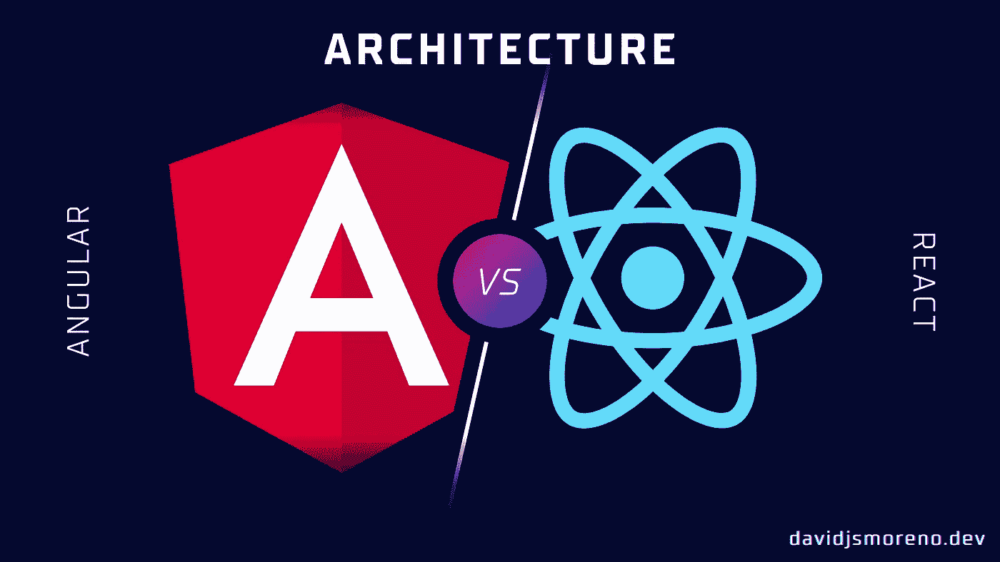
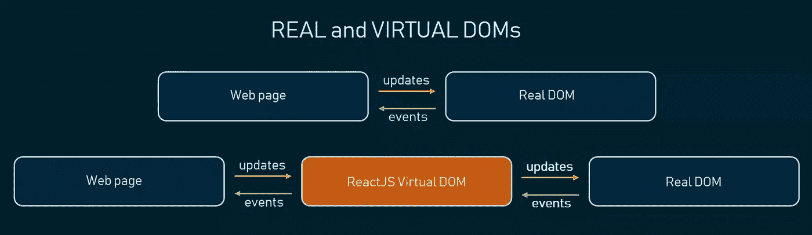
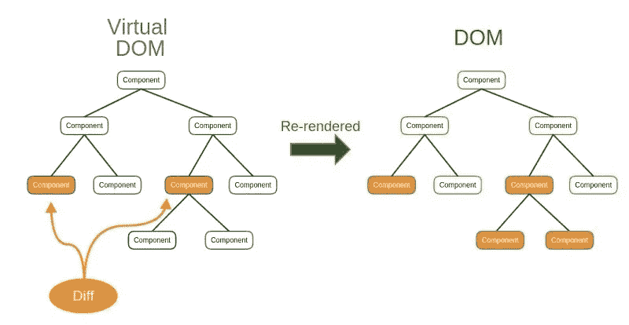

# 面向 Angular 开发人员的 React 速成班:React 架构

> 原文：<https://javascript.plainenglish.io/react-crash-course-for-angular-developers-react-architecture-3353e270dc09?source=collection_archive---------13----------------------->

React Architecture

我最近和一位同事聊天，他是一位角度专家，但他希望学习 React，为他的投资组合增加一个工具。我们讨论了在 Angular 和 React 中做同样事情的类似方法，于是产生了这篇文章的想法:**为 Angular 开发人员开设 React 速成班怎么样？**最后是前端或者 UI 开发，大部分知识是可以转移的。

我们将把课程分成几个主题，从角度来看事情是如何完成的，然后再从另一个角度来看。

这是一门强化涡轮速成课程，这意味着我将假设你熟悉许多 Web 开发概念，但如果不熟悉，我将在每章末尾添加参考链接，让我们开始吧。

# 反应建筑。

> 一个用于构建用户界面的 **JavaScript** [库](http://freecodecamp.org/news/is-react-a-library-or-a-framework/)([官方网站](http://reactjs.org) ) *。*

Real vs virtual DOM, by [altexsoft](https://www.altexsoft.com/blog/engineering/the-good-and-the-bad-of-reactjs-and-react-native/)

React 和 Angular 之间的一个主要区别是，后者提供了许多现成的东西:路由器、HTTP 请求客户端、管道、指令等。

但是 React 的主要职责是允许你构建和呈现你的 IU 组件，它使用一个叫做虚拟 DOM 和协调算法的数据结构来实现。

# React 是如何工作的？

## 虚拟 DOM 与协调算法

虚拟 DOM 是一种模拟真实 DOM 的数据结构，只有一点不同:

> 虚拟 DOM 对象与真实 DOM 对象具有相同的属性，但是它缺乏真实对象的能力来直接改变屏幕上的内容。

问题是更新真正的 DOM 的操作通常在内存中是昂贵的。

当您在 React 中更新组件[状态](https://en.wikipedia.org/wiki/State_(computer_science))时，这些更改将应用于虚拟 DOM，这时协调算法(或区分算法)将比较虚拟 DOM 和真实 DOM 之间的更改。

**最后，它将只对那些对象应用和更新更改，并且只对真实 DOM 中的那些对象。**

**如果你熟悉 Git，你可以认为 DOM 是你的主分支，虚拟 DOM 是你的开发分支，协调算法是你的拉取请求，**这并不完全相同，但它是一个心理模型，使你更容易理解这个概念。

Virtual DOM and the reconciliation algorithm, by [brainhub](https://brainhub.eu/library/what-is-react)

> React 只能更新 DOM 中必要的部分。React 在性能上的口碑很大程度上来自于这个创新，[Codecademy](https://www.codecademy.com/article/react-virtual-dom) 。

此外，这抽象出了属性操作、事件处理和手动 DOM 更新，否则您将不得不使用它们来构建您的应用程序。

# 下一章:React 与 Angular 中的组件(下周)

目前，React 的架构已经足够了，在本课程的稍后部分，我们将重新审视它，用更多的东西扩展它，如 React 光纤和其他有趣的东西。

在下一章中，我们将检查 React 和 Angular 组件之间的并行差异:基础、本地状态管理、组件生命周期和基本样式。

**如果想知道本课程下一章何时发布，请在**[**davidjsmoreno . dev**](https://davidjsmoreno.dev/)**订阅我的简讯。**

# 了解更多信息

*   [虚拟 DOM 和内部](https://reactjs.org/docs/faq-internals.html)
*   [反应:虚拟 DOM](https://www.codecademy.com/article/react-virtual-dom)
*   [反应纤维架构](https://github.com/acdlite/react-fiber-architecture)
*   [React 是库还是框架？这就是为什么它如此重要](https://www.freecodecamp.org/news/is-react-a-library-or-a-framework/)
*   [什么是 React？技术领导者需要知道的一切](https://brainhub.eu/library/what-is-react)
*   [反应的好与坏，反应的本原](https://www.altexsoft.com/blog/engineering/the-good-and-the-bad-of-reactjs-and-react-native/)
*   [客户端架构](https://twitter.com/apollographql/status/1255907988210057217/photo/1)

*更多内容请看*[***plain English . io***](https://plainenglish.io/)*。报名参加我们的* [***免费周报***](http://newsletter.plainenglish.io/) *。关注我们关于*[***Twitter***](https://twitter.com/inPlainEngHQ)[***LinkedIn***](https://www.linkedin.com/company/inplainenglish/)*[***YouTube***](https://www.youtube.com/channel/UCtipWUghju290NWcn8jhyAw)***，以及****[***不和***](https://discord.gg/GtDtUAvyhW) *对成长黑客感兴趣？检查* [***电路***](https://circuit.ooo/) ***。*****