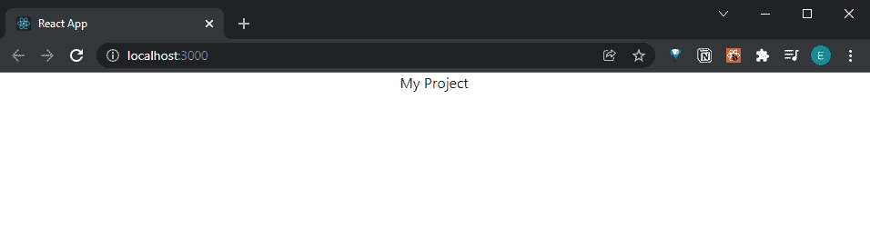

# React 速成班—你好 React

> 原文：<https://javascript.plainenglish.io/react-crash-course-hello-react-bb23fe493d4d?source=collection_archive---------10----------------------->

## 第 2 部分:建立一个“Hello World”React 项目


Photo by [Lautaro Andreani](https://unsplash.com/@lautaroandreani?utm_source=medium&utm_medium=referral) on [Unsplash](https://unsplash.com?utm_source=medium&utm_medium=referral)

*Live dev 笔记贯穿以下教程由* [*丹尼斯艾维*](https://www.youtube.com/channel/UCTZRcDjjkVajGL6wd76UnGg)*——*[*React JS 速成班*](https://www.youtube.com/watch?v=6fM3ueN9nYM)

> 在第 2 部分中，我们用有用的扩展设置了我们的工作环境程序，并组装了一个基本的“Hello World”React 项目。

你也可以参考我的 Github repo:

[](https://github.com/emilyyleung/notesapp/tree/Part-2/Hello-World) [## GitHub-Emily leung/notes app at Part-2/Hello-World

### 在 GitHub 上创建一个帐户，为 Emily leung/notes app 的开发做出贡献。

github.com](https://github.com/emilyyleung/notesapp/tree/Part-2/Hello-World) 

# 我们需要什么工具？

出于本速成系列课程的目的，使用下面列出的相同工具来构建 React 应用程序可能是值得的。你也许可以在你选择的文本编辑器中找到替代插件。

## 1 — Node.js(软件)

[最新稳定版本(LTS)](https://nodejs.org/en/)——在我的例子中是版本 16.13.1


## 2 — Visual Studio 代码(软件)

[最新的稳定版本](https://code.visualstudio.com/)——在我的例子中是版本 1.63.2

## 3-ES7 React/Redux/graph QL/React-原生片段(插件)

为构建组件提供样板代码


## 4-自动重命名标签(插件)

重命名 HTML / XML 标记的开始或结束


## 5-更漂亮(插件)

代码格式化程序。我推荐看这个视频来正确设置它。


# 创建我们的第一个 React 项目

本教程还假设您熟悉使用终端在 Node.js 中安装包。

> *在 Visual Studio 代码中打开终端，使用快捷键:* `*ctrl + shift + ~*`

这里，我们需要安装 React 和 react-dom 的最新版本(我目前使用的是 17.0.2 版本)。如果您能够使用下面的命令创建一个带有`npx`的 React 应用程序，那么您不需要运行这个命令

```
npm i react react-dom
```

将终端指向所需的项目位置，运行以下命令:

```
npx create-react-app notesapp
```

这将创建我们的项目，我们称之为“notesapp”。此外，它将创建一个独立的文件夹，所以我们不需要先创建一个项目文件夹。

> 另一件要注意的事情是，因为项目文件夹是通过 create-react-app 创建的，所以您需要在 Github 上创建一个单独的 repo，然后添加一个 git remote，以便将您的更改推送到 repo 中。


按照终端中的建议，我们可以使用以下命令启动开发服务器:

```
npm start
```

浏览器将打开以下 URL:

```
http://localhost:3000/
```

随着我们继续构建项目，我们不需要刷新页面，因为开发服务器提供了热重装功能。任何更改，一旦保存，将自动出现在浏览器中。


如终端输出中所述，我们还可以使用以下命令构建 React 应用程序:

```
npm run build
```

具体来说，在构建过程中，它将捆绑所有的项目文件，并将它们转换成静态资产。这将为我们提供一个可以托管/部署的应用程序的优化版本。

# React 项目内部有什么？

本地服务器启动并运行后，让我们看看在我们的项目中创建了什么。


## `node_modules`文件夹

*   我们安装的所有节点包都存储在那里

## `public`文件夹

*   这是模板将要存在的地方(`index.html`)
*   在`index.html`的内部有一个`<div>`，带一个`id`的“根”。这将是发生页面交换的元素
*   图像和徽标等静态资产存储在这里

## `package.json`文件

*   它是整个项目的设置配置文件
*   列出项目中需要的所有 Node.js 包
*   可以配置自定义脚本来运行命令
*   也可以通过运行命令
    `npm init -y`在没有 React 的情况下创建该文件

## `src`文件夹

*   我们将在其中工作的主文件夹(组件和页面位于此处)
*   `App.js`是 React 应用程序的核心文件

# 清理项目文件

我们将要构建的 notes 应用程序非常简单。因此，我们可以删除一些不必要的文件，以保持代码的整洁，同时专注于重要的东西。

让我们从替换`App.js`的内容开始，只返回一个带有字符串“我的项目”的`<div>`。我们还将删除第一行中的徽标导入。

> **记住:**class 属性必须标记为`className`(因为 JavaScript 已经使用了`class`关键字)

```
// notesapp > src > App.js

import './App.css';

function App() {
  return (
    <div className="App">
      My Project
    </div>
  );
}

export default App;
```



接下来，我们将删除以下文件:

```
// notesapp > src > setupTests.js
// notesapp > src > reportWebVitals.js
// notesapp > src > App.test.js
// notesapp > src > index.css
// notesapp > src > logo.svg
```

这样做会导致浏览器中出现错误。


我们可以通过删除`index.js`中的以下行来解决这个问题

*   `index.css`导入
*   `reportWebVitals`导入
*   `reportWebVitals`功能

```
// notesapp > src > index.jsimport React from 'react';
import ReactDOM from 'react-dom';
import App from './App';ReactDOM.render(
  <React.StrictMode>
    <App />
  </React.StrictMode>,
  document.getElementById('root')
);
```


然后，最重要的是，我们将删除`App.css`中的所有内容，这样就不会对我们的应用程序应用任何样式。


Basic React project setup

*更多内容看* [*说白了。报名参加我们的*](http://plainenglish.io/) [*免费每周简讯*](http://newsletter.plainenglish.io/) *。在我们的* [*社区*](https://discord.gg/GtDtUAvyhW) *获得独家写作机会和建议。*