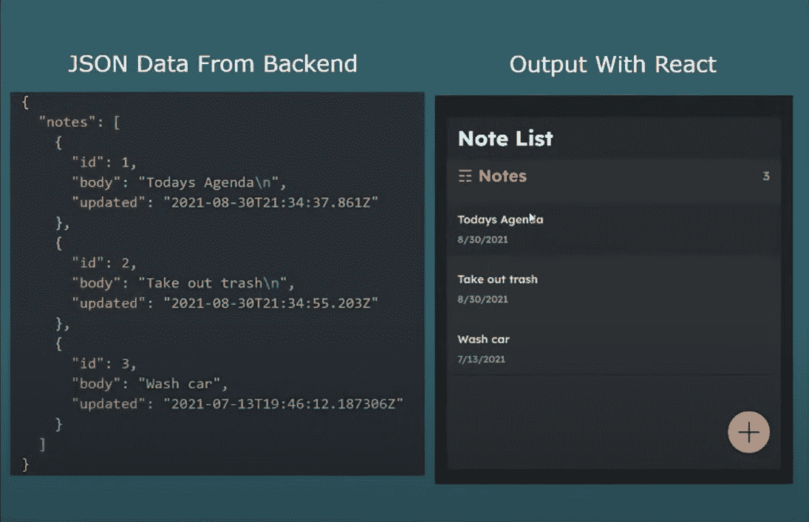
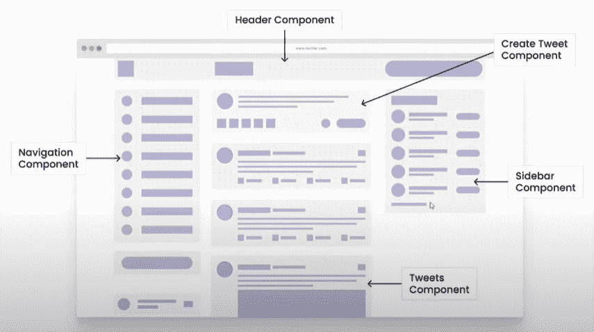
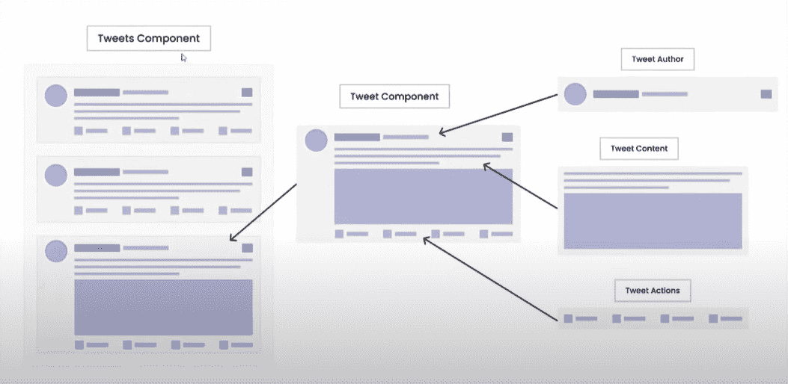
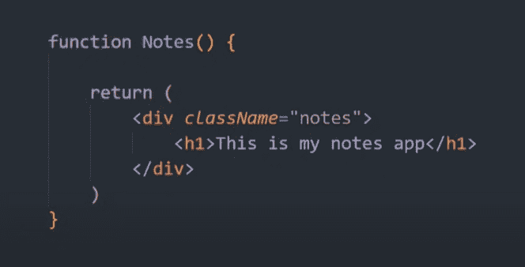
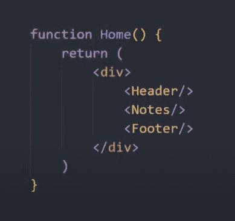
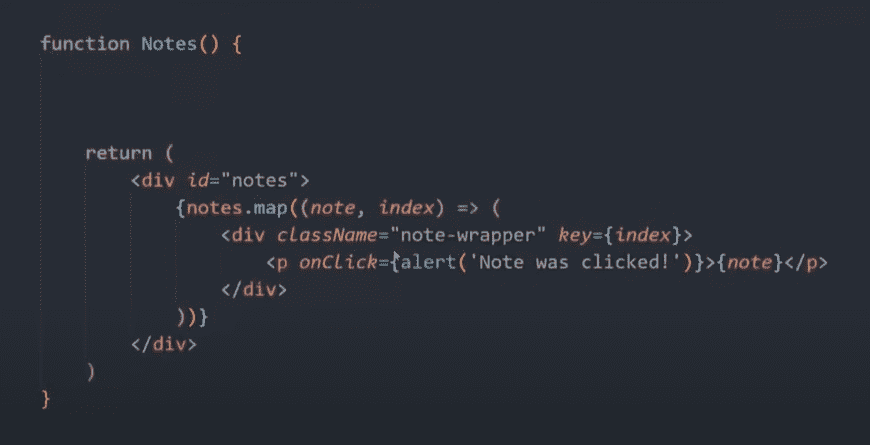
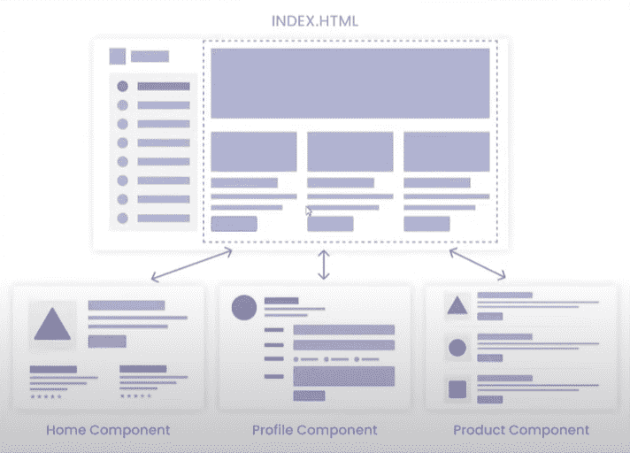

# 反应速成班——工作原理

> 原文：<https://javascript.plainenglish.io/react-crash-course-how-it-works-3b9a6ee04d9d?source=collection_archive---------3----------------------->

## 第 1 部分:React 简介

Photo by [Lautaro Andreani](https://unsplash.com/@lautaroandreani?utm_source=medium&utm_medium=referral) on [Unsplash](https://unsplash.com?utm_source=medium&utm_medium=referral)

*Live dev 笔记由* [*丹尼斯·艾维*](https://www.youtube.com/channel/UCTZRcDjjkVajGL6wd76UnGg)*——*[*React JS 速成班*](https://www.youtube.com/watch?v=6fM3ueN9nYM)

> 在第 1 部分中，我们通过理解 React 的工作原理以及它与没有框架构建的应用程序的比较，来研究 React 的强大之处。

# 什么是反应？

React 是一个用于构建用户界面的前端框架。它是一套工具，预先定义了我们如何构建用户界面的结构，使我们更容易在更大的项目和团队中工作。

它由脸书于 2011 年构建，于 2013 年发布，与 Angular(由谷歌构建)等其他前端框架相比。同样，Vue.js 和 Svelte 也被认为是竞争对手。

React 是一个很好的学习选择，因为有大量的支持可用，并且被认为是行业标准(当申请工作时)。它由脸书的一些世界顶级工程师建造和使用。Airbnb、网飞和 Dropbox 等公司也使用 React。

由于 React 是一个前端框架，所以它不会干扰后端。事实上，他们一起工作会更好。后端通常处理服务器端的一切，无论是数据库、业务逻辑、API 等。前端框架将用于连接到后端，并呈现出数据。

上图(左图)显示了存储在后端的数据。它不一定要存储为 JSON，但这就是数据从后端提取到前端的方式。前端将使用 fetch 或 axios 之类的东西发出 HTTP 请求来获取这个 JSON 数据。前端将负责与 API 的交互，当然也负责呈现数据(右图)。

如果没有前端框架，网站通常使用 HTML、CSS 和 JavaScript 创建。我们将使用 DOM(文档对象模型)并通过它与网站进行交互。前端的任何交互或更新都需要用 JavaScript 编写，这对于简单的应用程序来说很好。然而，随着应用程序逻辑变得越来越复杂，前端框架会非常有用。

前端框架建立了结构，并向我们展示了如何以一种标准化的格式将东西拼凑起来。这也可以减少 JavaScript 代码的数量。

# React 中的组件是什么？

组件是每个 React 应用程序的基础。我们不再使用 HTML、CSS 和 JavaScript 来编写应用程序，而是用组件来构建一切。每个组件都有自己的 HTML 和 JavaScript 代码，它们一起保存在自己的文件中，使得构建应用程序的过程更加简洁。

让我们以 Twitter 为例来看看。在这里，我们可以想象应用程序可以由以下组件组成:

*   标题组件
*   导航组件
*   创建推文组件
*   侧栏组件
*   Tweets 组件

所有这些组件现在都可以放入父组件(即页面组件)中。分别构建这些组件并把它们放在一个页面上的过程与我们习惯的略有不同。

组件也可以嵌套。以 Feed 组件为例，它可以由 Tweet 组件组成，而 Tweet 组件本身又由 Tweet 作者组件、Tweet 内容组件和 Tweet 操作组件组成。

组件只是一个 JavaScript 类或函数，它返回一些用 JSX (JavaScript XML)编写的 HTML 代码。让我们通过一个例子来了解它是如何工作的。

假设在我们的 notes 应用程序中，我们将 Notes 组件创建为一个函数(我们也可以使用类来创建它)。在我们的函数中，我们可以包含某种逻辑，比如在返回 HTML 之前获取一些数据。然后导出该函数，可以将其导入到另一个组件或页面中。

一个页面可能看起来像下面这样，我们再次使用一个函数来定义一个 Home 组件。在其中，我们嵌套了其他组件，如页眉、注释和页脚组件。

我们返回的所有代码都不是 HTML，尽管从技术上来说这就是我们要返回的。它实际上是 JSX，这是一种用于将我们的 HTML 代码与 JavaScript 绑定的语言。

# 使用 JSX 时，有一些事项需要注意:

*   class 属性必须标记为`className`(因为 JavaScript 已经使用了`class`关键字)
*   我们可以用花括号在 HTML 里面写 JavaScript
*   我们可以将变量直接传入 HTML，同样使用花括号
*   由于浏览器在技术上不能读取 JSX，它需要被编译成 HTML 和 JavaScript 才能被托管

# 如何创建单页应用程序

让我们首先来看看一个普通的多页面应用程序是如何工作的。

通常，用户会请求转到主页，服务器端会在主页上查找模板并返回带有一些数据的模板。如果用户点击 profile 页面(假设该应用程序有用户帐户)，它将向后端发送另一个请求，以获取与用户配置文件相关的配置文件模板和数据。因此，我们可以有效地处理多个页面，这需要为每个独特的页面构建一个模板。

然而，React 通常用于构建“单页应用程序”。这个术语可能会令人困惑，所以丹尼斯·艾维更喜欢称之为“单模板应用”。

这基本上意味着应用程序由一个模板组成— `index.html`。当用户浏览网站时，他们会点击链接，把你带到网站的不同部分。即使网站的外观看起来不同，模板也不会改变，但是页面组件(用虚线突出显示)正在被换出。这样做意味着页面永远不会重新加载，体验也快了很多，像喜欢和通知这样的元素可以被更新和实时查看。

*更多内容请看*[*plain English . io*](http://plainenglish.io/)*。报名参加我们的* [*免费每周简讯*](http://newsletter.plainenglish.io/) *。在我们的* [*社区*](https://discord.gg/GtDtUAvyhW) *获得独家写作机会和建议。*