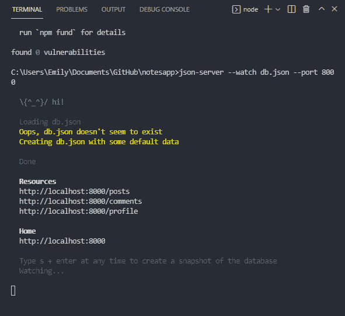
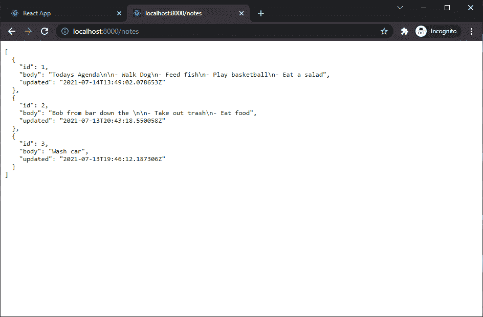

# React 速成班— JSON 服务器

> 原文：<https://javascript.plainenglish.io/react-crash-course-json-server-8f58dc44c271?source=collection_archive---------11----------------------->

## 第 6 部分:用模拟后端原型化 React 应用程序


Photo by [Lautaro Andreani](https://unsplash.com/@lautaroandreani?utm_source=medium&utm_medium=referral) on [Unsplash](https://unsplash.com?utm_source=medium&utm_medium=referral)

*Live dev 笔记由*[*Dennis Ivy*](https://www.youtube.com/channel/UCTZRcDjjkVajGL6wd76UnGg)*——*[*React JS 速成班*](https://www.youtube.com/watch?v=6fM3ueN9nYM)

> 在第 6 部分中，我们将研究如何为我们的 notes 构建一个快速模拟服务器。我们将为原型请求创建一个伪 API，类似于后端服务器，而不是从零开始构建 API。

你也可以参考我的 Github repo:

[](https://github.com/emilyyleung/notesapp/tree/Part-6/JSON-Server) [## GitHub-Emily leung/notes app at Part-6/JSON-Server

### 在 GitHub 上创建一个帐户，为 Emily leung/notes app 的开发做出贡献。

github.com](https://github.com/emilyyleung/notesapp/tree/Part-6/JSON-Server) 

# 安装`json-server`

通常，后端服务器是使用 NodeJS 和 ExpressJS 或者 Python 和 Django 构建的。然而，从头开始设置一个 API 的时间可能会很长，因此，我们将使用`json-server`包创建一个快速的虚拟 API 系统来测试我们的应用程序。

要安装`json-server`包:

```
npm install -g json-server
```

# 启动快速服务器

`json-server`读取和写入一个用于表示数据库的 JSON 文件。我们可以选择使用文本编辑器创建这个 JSON 文件，或者运行相同的命令为我们创建文件(同时提供服务)。

```
json-server --watch db.json
```

# 定制我们的服务器

默认情况下，服务器将在端口 3000 上运行，但是由于我们的 React 项目当前正在使用这个端口，我们可以使用`--port`标志分配一个新端口。

```
json-server --watch db.json **--port 8000**
```



此外，默认情况下，JSON 文件将在项目的最高级别父文件夹中创建。如果您想在子文件夹中创建它，**首先确认该文件夹已经被创建**。然后将目录添加到文件的路径中。

```
json-server --watch **./data/db.json** --port 8000
```

# 如何发出请求和访问数据

由`json-server`提供的基本 JSON 让我们了解了它是如何工作的。

```
{
  "posts": [
    {
      "id": 1,
      "title": "json-server",
      "author": "typicode"
    }
  ],
  "comments": [
    {
      "id": 1,
      "body": "some comment",
      "postId": 1
    }
  ],
  "profile": {
    "name": "typicode"
  }
}
```

为了测试模拟 API 的工作情况，我们可以打开浏览器并访问以下路径:

```
# Access all posts
**http://localhost:8000/posts**

# Access a single post by id
**http://localhost:8000/posts/1**
```

# 使用我们自己的数据

让我们用我们自己的数据代替这些数据。

```
{
  "notes": [
    {
      "id": 1,
      "body": "Todays Agenda\n\n- Walk Dog\n- Feed fish\n- Play basketball\n- Eat a salad",
      "updated": "2021-07-14T13:49:02.078653Z"
    },
    {
        "id": 2,
        "body": "Bob from bar down the \n\n- Take out trash\n- Eat food",
        "updated": "2021-07-13T20:43:18.550058Z"
    },
    {
        "id": 3,
        "body": "Wash car",
        "updated": "2021-07-13T19:46:12.187306Z"
    }
  ]
}
```



# 自动化服务器启动

我们可以将这个命令存储在我们的`package.json`文件的一个脚本中，而不是每次我们想要启动服务器时都运行这个冗长的命令。

```
// package.json{
 ...
 "scripts": {
  ...
    **"server": "json-server --watch db.json --port 8000"**
 }
 ...
}
```

从现在开始，我们只需要运行下面的命令来启动和运行我们的模拟服务器:

```
npm run server
```

*更多内容请看*[***plain English . io***](http://plainenglish.io/)*。报名参加我们的* [***免费周报***](http://newsletter.plainenglish.io/) *。在我们的* [***社区***](https://discord.gg/GtDtUAvyhW) *获得独家获得写作机会和建议。*