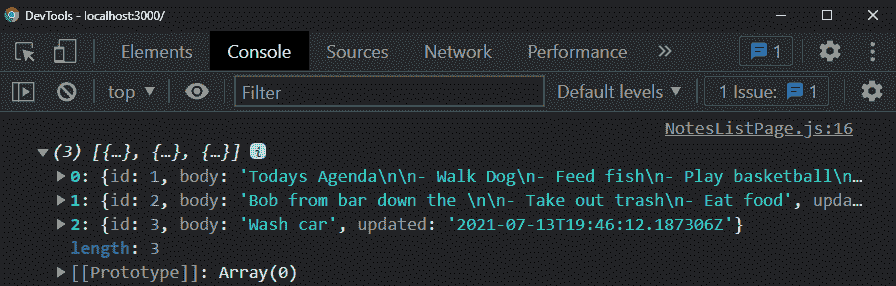
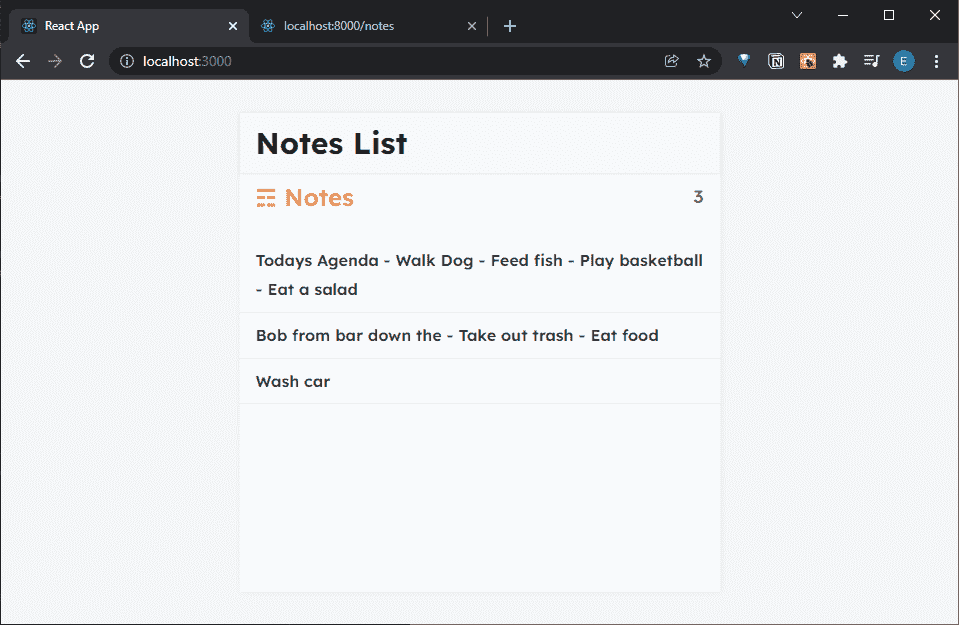
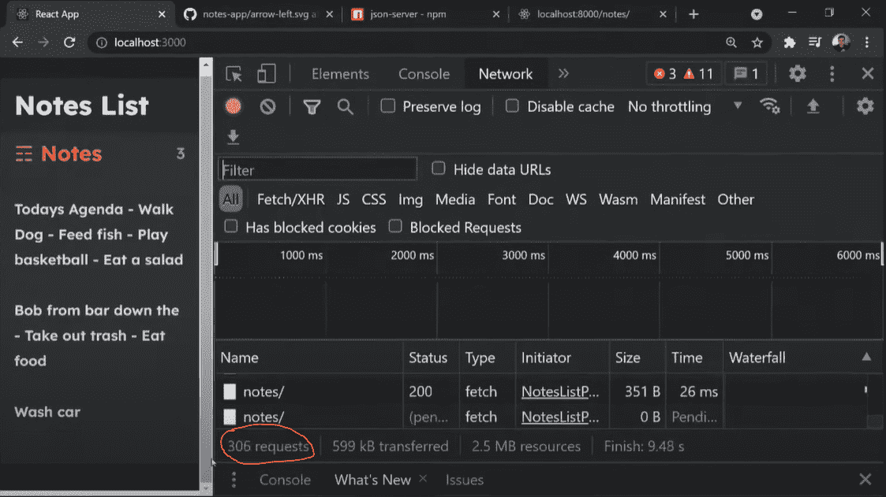

# React 速成班—使用 Fetch 进行 API 调用

> 原文：<https://javascript.plainenglish.io/react-crash-course-making-api-calls-with-fetch-d4d0547527ad?source=collection_archive---------12----------------------->

## 第 8 部分:将数据从后端拉入 React 应用程序


Photo by [Lautaro Andreani](https://unsplash.com/@lautaroandreani?utm_source=medium&utm_medium=referral) on [Unsplash](https://unsplash.com?utm_source=medium&utm_medium=referral)

*Live dev 笔记贯穿以下教程由* [*丹尼斯·艾维*](https://www.youtube.com/channel/UCTZRcDjjkVajGL6wd76UnGg)*——*[*React JS 速成班*](https://www.youtube.com/watch?v=6fM3ueN9nYM)

> 在第 8 部分中，我们通过使用`async`和`await`函数的 fetch，使用 API 调用从模拟后端服务器获取数据。然后通过`useEffect`,我们将在呈现笔记时实现最佳实践。

你也可以参考我的 Github repo:

[](https://github.com/emilyyleung/notesapp/tree/Part-8/Fetch-Data) [## GitHub-Emily leung/notes app at Part-8/Fetch-Data

### 在 GitHub 上创建一个帐户，为 Emily leung/notes app 的开发做出贡献。

github.com](https://github.com/emilyyleung/notesapp/tree/Part-8/Fetch-Data) 

既然我们已经设置了`NotesListPage`和`NotePage`组件的初始状态，我们需要从后端服务器检索数据。为此，我们可以运行`useEffect`来调用一个定制函数，该函数获取这些信息并在初始加载时呈现出来。

> *记住在第二个参数中传递一个空数组，这样* `*useEffect*` *只在初始加载时运行。*

在`NotesListPage.js`中，我们将从 react 导入`useEffect`并调用函数。

```
// notesapp > src > pages > NotesListPage.jsimport { useEffect, **useState** } from 'react'
import ListItem from '../components/ListItem'
const NotesListPage = () => { let [notes, setNotes] = useState([]) **useEffect(() => {** **}, [])** return (
        <div className='notes'>
            <div className='notes-header'>
                <h2 className='notes-title'>&#9782; Notes</h2>
                <p className='notes-count'>{notes.length}</p>
            </div>
            <div className='notes-list'>
                {notes.map((note, index) => 
                    <ListItem key={index} note={note}/>
                )}
            </div>
        </div>
    )
}export default NotesListPage
```

# 自定义`getNotes`功能

接下来，我们将创建我们的`getNotes`函数，它将使用`async`和`await`获取数据

> *为了能够在* `*useEffect*` *内部使用* `*async*` *和* `*await*` *，函数必须编写得更深一层——即封装在另一个函数如* `*getNotes*`内部

实现`async`和`await`的目的是确保当`fetch`运行时，函数的下一部分能够使用该数据(在任何其他事情发生之前首先保证一个响应对象)。然后，函数的下一部分能够继续，我们将解析响应对象(JSON 数据)并对其进行控制。

在`useEffect`之外编写了函数，我们将看不到任何结果。对于加载时触发的`getNotes`函数，我们必须调用`useEffect`内部的函数

```
// notesapp > src > pages > NotesListPage.jsimport { useEffect, useState } from 'react'
import ListItem from '../components/ListItem'const NotesListPage = () => { let [notes, setNotes] = useState([]) useEffect(() => {
        **getNotes()**
    }, []) **let getNotes = async () => {
        let response = await fetch('http://localhost:8000/notes/')
        let data = await response.json()
        console.log(data)
    }** return (
        <div className='notes'>
            <div className='notes-header'>
                <h2 className='notes-title'>&#9782; Notes</h2>
                <p className='notes-count'>{notes.length}</p>
            </div>
            <div className='notes-list'>
                {notes.map((note, index) => 
                    <ListItem key={index} note={note}/>
                )}
            </div>
        </div>
    )
}export default NotesListPage
```

我们现在可以在控制台中看到我们的响应。



# 在组件中呈现提取的数据

要呈现这些数据，只需在`getNotes`函数中运行`setNotes`即可。除此之外，我们还需要传递我们提取的数据。这将有效地用注释的内容更新初始的空数组。

> ***注意:*** *状态是可变的(因为我们可以更新它)，而道具不是*

```
// notesapp > src > pages > NotesListPage.jsimport { useEffect, useState } from 'react'
import ListItem from '../components/ListItem'const NotesListPage = () => { let [notes, setNotes] = useState([]) useEffect(() => {
        getNotes()
    }, []) let getNotes = async () => {
        let response = await fetch('<http://localhost:8000/notes/>')
        let data = await response.json()
        **setNotes(data)**
    } return (
        <div className='notes'>
            <div className='notes-header'>
                <h2 className='notes-title'>&#9782; Notes</h2>
                <p className='notes-count'>{notes.length}</p>
            </div>
            <div className='notes-list'>
                {notes.map((note, index) => 
                    <ListItem key={index} note={note}/>
                )}
            </div>
        </div>
    )
}export default NotesListPage
```

现在，我们可以在主页上看到我们所有的笔记。



# 一个普通的 pittfall 与`useEffect`

如果您在调用`useEffect`内部的函数时忘记添加依赖项的空数组，那么运行`getNotes`函数的调用次数将会是无穷无尽的...

```
// Notice how there's no second argument. **Please avoid this!**useEffect(() => {
    getNotes()
})
```

我们可以在“网络”选项卡下看到它的效果，它将继续获取。正在发生的是当通过`useEffect`调用`getNotes`时，它将设置状态。但是因为状态已经更新(并且没有分配依赖关系)，它将再次触发`useEffect`。这将无限期地持续下去。

最终，出现这种情况是因为我们没有告诉它`getNotes`应该在何时启动(即仅在第一次加载时)。



# 获取单个页面的注释

与主页类似，我们将通过 API 获取每个笔记。

> ***注意:****`*notes*`*的初始化应该在组件的顶层完成，永远不要在* `*useEffect*`内部完成*

*就像`NotesListPage`一样，我们将执行以下操作:*

*   *从 react 导入`useEffect`*
*   *在我们的注释初始化之后调用`useEffect`,但是这只会在`noteId`改变时触发(即依赖)*
*   *创建将使用`async`、`await`和`fetch`的`getNote`功能。这一次，获取数据的 URL 将需要一个由`noteId`决定的动态路径。我们可以使用模板文字(即反斜线)来做到这一点*

```
*// notesapp > src > pages > NotePage.jsimport { useState, **useEffect** } from 'react'
import { Link } from 'react-router-dom'
import { ReactComponent as ArrowLeft } from '../assets/arrow-left.svg'const NotePage = ({match}) => {
    let noteId = match.params.id
    let [note, setNote] = useState(null) **useEffect(() => {
        getNote()
    }, [noteId])** **let getNote = async () => {
        let response = await fetch(`http://localhost:8000/notes/${noteId}`)
        let data = await response.json()
        setNote(data)
    }** return (
        <div className='note'>
            <div className='note-header'>
                <h3>
                    <Link to="/">
                        <ArrowLeft/>
                    </Link>
                </h3>
            </div>

            <textarea value={note?.body}></textarea> </div>
    )
}export default NotePage*
```

*既然我们能够从数据库中检索笔记，下一篇文章将研究更新我们的笔记并将这些更改保存回服务器。*

**更多内容请看*[***plain English . io***](http://plainenglish.io/)*。报名参加我们的* [***免费周报***](http://newsletter.plainenglish.io/) *。在我们的* [***社区***](https://discord.gg/GtDtUAvyhW) *获得独家获得写作机会和建议。**