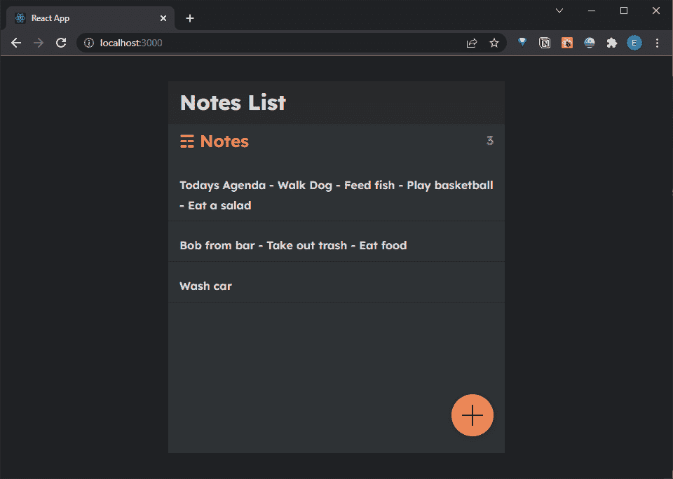
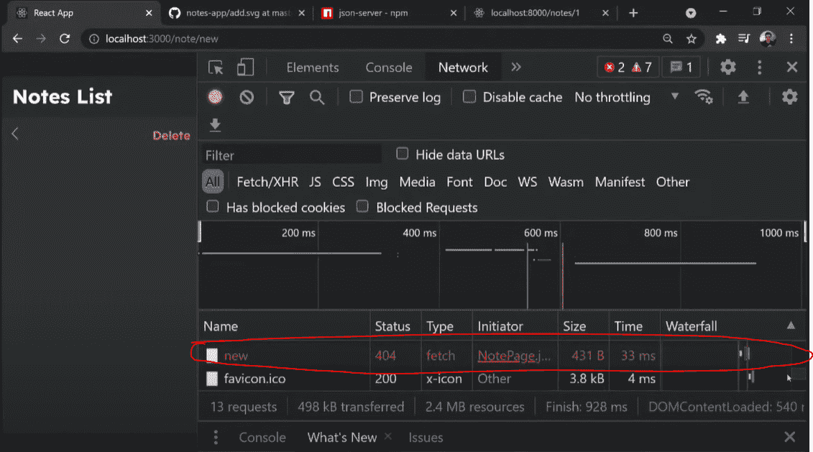

# React 速成班—发布和删除方法

> 原文：<https://javascript.plainenglish.io/react-crash-course-post-and-delete-methods-675f95dffe0f?source=collection_archive---------7----------------------->

## 第 10 部分:在 React 应用程序中调用 fetch 来更新后端


Photo by [Lautaro Andreani](https://unsplash.com/@lautaroandreani?utm_source=medium&utm_medium=referral) on [Unsplash](https://unsplash.com?utm_source=medium&utm_medium=referral)

*Live dev 笔记由* [*丹尼斯·艾维*](https://www.youtube.com/channel/UCTZRcDjjkVajGL6wd76UnGg)*——*[*React JS 速成班*](https://www.youtube.com/watch?v=6fM3ueN9nYM)

> 在第 10 部分中，我们将添加删除和创建注释功能，这两个功能将分别使用 delete 和 POST 方法。在这个过程中，我们将在 React 组件中构建更多的 HTML 元素来运行这些功能。

你也可以参考我的 Github repo:

[](https://github.com/emilyyleung/notesapp/tree/Part-10/POST-and-DELETE-Methods) [## GitHub-Emily leung/notes app at Part-10/POST-and-DELETE-Methods

### 在 GitHub 上创建一个帐户，为 Emily leung/notes app 的开发做出贡献。

github.com](https://github.com/emilyyleung/notesapp/tree/Part-10/POST-and-DELETE-Methods) 

# 删除注释

为了删除注释，我们将在`<h3>`标签下的`NotePage`组件中添加一个按钮元素。我们将赋予它一个`onClick`属性来运行我们将要创建的`deleteNote`函数。

```
// notesapp > src > pages > NotePage.jsreturn (
 <div className='note'>
  <div className='note-header'>
   <h3>
     <ArrowLeft onClick={handleSubmit} />
   </h3>
   **<button onClick={deleteNote}>Delete</button>**
  </div>
  <textarea
   onChange={(e) => {
    setNote({ ...note, body: e.target.value });
   }}
   value={note?.body}
  ></textarea>
 </div>
);
```

除了我们用`DELETE`替换了`PUT`之外，`deleteNote`函数看起来与我们的`updateNote`函数非常相似。一旦发出获取请求，我们还将包括历史重定向方法。

> *由于注释的内容没有改变(但被完全删除)，请求中不需要* `*body*` *属性。*

```
// notesapp > src > pages > NotePage.jslet deleteNote = async () => {
 await fetch(`[http://localhost:8000/notes/${noteId}`](http://localhost:8000/notes/${noteId}`), {
  method: "DELETE",
 });
 history.push("/");
};
```

# 空白票据移除

该应用程序还被设计为在注释内容为空时删除注释。我们可以在退出笔记时测试这一点。

```
// notesapp > src > pages > NotePage.jslet handleSubmit = async () => {
 **if (!note.body) {
  await deleteNote();
 }**
 await updateNote();
 history.push("/");
};
```

# 创建便笺

为了创建一个新的注释，我们将在 components 文件夹中包含一个 add button 组件。

```
notesapp
├── public
│   └── index.html
└── src
    ├── assets
    │    ├── arrow-left.svg
    │    └── data.js
    ├── pages
    │    ├── NotePage.js
    │    └── NotesListPage.js
    ├── components
    │    ├── Header.js
    │    ├── ListItem.js
    │    └── **AddButton.js // Create new component**
    ├── App.css
    ├── App.js
    └── index.js
```

`AddButton`组件的工作方式类似于我们的`ListItem`组件，我们将使用来自`react-router-dom`的`Link`组件。按钮将发送到`/note/new`。它将使用来自 [Mumble UI](https://mumbleui.com/icons) 的另一个 SVG，因此我们需要导入 SVG 文件作为它自己的 ReactComponent。

> *注意:AddButton 组件只是将用户重定向到一个自定义路线，而不是创建一个新的注释*

```
// notesapp > src > components > AddButton.jsimport { Link } from "react-router-dom";
import { ReactComponent as AddIcon } from "../assets/add.svg";const AddButton = () => {
 return (
  <Link to='/note/new' className='floating-button'>
   <AddIcon />
  </Link>
 );
};
export default AddButton;
```

准备好组件后，让我们将其导入`NotesListPage`

```
// notesapp > src > pages > NotesListPage.jsimport AddButton from '../components/AddButton'
```

然后将`AddButton`组件包含在父 div 最底部的 JSX 中。

```
// notesapp > src > pages > NotesListPage.jsreturn (
    <div className='notes'>
        <div className='notes-header'>
            <h2 className='notes-title'>&#9782; Notes</h2>
            <p className='notes-count'>{notes.length}</p>
        </div>
        <div className='notes-list'>
            {notes.map((note, index) => 
                <ListItem key={index} note={note}/>
            )}
        </div> **<AddButton/>**
    </div>
)
```



为了指示应用程序创建一个新的便笺，我们将添加一个`createNote`处理程序向我们的后端发送一个`POST`请求。当用户在新便笺中单击后退箭头时，该处理程序被触发。

默认情况下，note 对象将拥有包含我们的注释内容的`body`键，但是`updated`属性将被添加到当前日期时间对象中。`id`将在保存时创建。

```
// notesapp > src > pages > NotePage.jslet createNote = async () => {
 await fetch("[http://localhost:8000/notes/](http://localhost:8000/notes/)", {
  method: "POST",
  headers: {
   "Content-Type": "application/json",
  },
  body: JSON.stringify({ ...note, updated: new Date() }),
 });
};
```

当用户返回主页时,`handleSubmit`函数需要知道如何处理该便笺。

因此，在对当前便笺运行正确的函数之前，返回箭头处理程序函数需要测试一些场景:

*   如果注释不是新的并且没有注释内容→删除注释
*   如果注释的 ID 为“新”并且内容不为空→创建注释
*   如果注释没有“新”ID→更新注释

```
// notesapp > src > pages > NotePage.jslet handleSubmit = () => { ** if (noteId !== 'new' && !note.body) {
        await deleteNote()
    } else if (noteId === 'new' && note !== null) {
        await createNote()
    } else if (noteId !== 'new') {
        await updateNote()
    }** history.push('/')
}
```

# 隐藏错误

创建新笔记时需要理解的一点是，通过将用户重定向到`http://localhost:8000/notes/new`，我们实际上是在试图搜索数据库中不存在的笔记。因此，每次都会返回一个错误(尽管我们在应用程序中看不到它)。



我们可以在`getNote`函数中抛出这个错误，通过检查`noteId`值来确定我们是否运行 fetch 请求。

```
// notesapp > src > pages > NotePage.jslet getNote = async () => {
  **if (noteId === 'new') return;**
  let response = await fetch(`http://localhost:8000/notes/${noteId}/`);
  let data = await response.json();
  setNote(data);
}
```

> *此外，当我们创建一个新便笺但没有填写任何内容并点击返回箭头时，仍然会创建一个空便笺。通过修复这个隐藏的错误，我们也解决了这个问题——因为* `*setNote*` *函数不会被触发。*

# 条件按钮

我们可以添加的另一个特性是，当我们创建一个新的注释时，我们可以有条件地指定按钮的文本来显示“done”(如果注释是新的)或“delete”(如果它是一个现有的注释)。最重要的是，我们要确保按钮也运行正确的功能。使用三元运算测试`noteId`的值是可能的

您还应该注意到，删除注释按钮将直接运行`deleteNote`功能。这使得应用程序不必做任何不必要的检查。

```
// notesapp > src > pages > NotePage.jsreturn (
    <div className='note'>
        <div className='note-header'>
            <h3>
                <Link to="/">
                    <ArrowLeft onClick={handleSubmit}/>
                </Link>
            </h3> **{noteId !== 'new' ? (
                <button onClick={deleteNote}>Delete</button>    
            ) : (
                <button onClick={handleSubmit}>Done</button>
            )}**

        </div>

        <textarea onChange={(e) => {setNote({...note, body:e.target.value})}} value={note?.body}></textarea> </div>
)
```

下一篇文章将研究如何添加有用的细节，比如缩短标题和包含一个格式良好的日期。

*更多内容请看*[***plain English . io***](https://plainenglish.io/)*。报名参加我们的* [***免费周报***](http://newsletter.plainenglish.io/) *。关注我们关于*[***Twitter***](https://twitter.com/inPlainEngHQ)*和*[***LinkedIn***](https://www.linkedin.com/company/inplainenglish/)*。加入我们的* [***社区不和谐***](https://discord.gg/GtDtUAvyhW) *。*