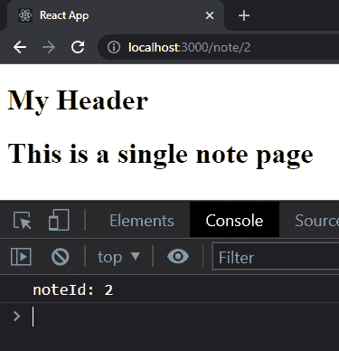

# React 速成班— React 路由器

> 原文：<https://javascript.plainenglish.io/react-crash-course-react-router-391add340d91?source=collection_archive---------12----------------------->

## 第 4 部分:用路线和链接构建页面


Photo by [Lautaro Andreani](https://unsplash.com/@lautaroandreani?utm_source=medium&utm_medium=referral) on [Unsplash](https://unsplash.com?utm_source=medium&utm_medium=referral)

*Live dev 笔记由* [*丹尼斯·艾维*](https://www.youtube.com/channel/UCTZRcDjjkVajGL6wd76UnGg)*——*[*React JS 速成班*](https://www.youtube.com/watch?v=6fM3ueN9nYM)

> 在第 4 部分中，我们用另一个页面组件扩展了该应用程序，专门用于创建链接以动态生成每个注释的详细页面。

你也可以参考我的 Github repo:

[](https://github.com/emilyyleung/notesapp/tree/Part-4/React-Router) [## GitHub-Emily leung/notes app at Part-4/React-Router

### 在 GitHub 上创建一个帐户，为 Emily leung/notes app 的开发做出贡献。

github.com](https://github.com/emilyyleung/notesapp/tree/Part-4/React-Router) 

# 创建子页组件

到目前为止，我们只使用`NotesListPage`组件创建了一个页面视图来列出所有当前的笔记。然而，如果我们想要创建另一个页面组件来进行交换，我们将需要使用一个叫做 React 路由器的东西。

> 由于这是一个单页应用程序，因此没有创建任何模板或页面。相反，我们只是简单地切换所呈现的组件，这可以使用 React Router 来实现。

创建一个名为`NotePage.js`的新页面组件，它位于`pages`文件夹中。`NotePage`的目的是在自己的页面上显示每个单独的笔记。

```
notesapp
├── public
│   └── index.html
└── src
    ├── assets
    │    └── data.js
    ├── pages
    │    ├── NotePage.js // New file
    │    └── NotesListPage.js
    ├── components
    │    ├── Header.js
    │    └── Body.js
    ├── App.css
    ├── App.js
    └── index.js
```

在`NotePage`中，我们将使用快捷键`rafce + tab`返回一个通用组件，然后在`<div>`中添加一个字符串，以便在渲染时识别它。

```
// notesapp > src > pages > NotePage.jsconst NotePage = () => {
    return (
        <div>
            <h1>This is a single note page</h1>
        </div>
    )
}export default NotePage
```

根据上一篇文章，将页面导入到`App.js`并将其引入到`App`组件是有意义的。让我们开始吧。

```
// notesapp > src > App.jsimport './App.css';
import Header from './components/Header'
import NotesListPage from './pages/NotesListPage'
**import NotePage from './pages/NotePage'**function App() {
  return (
    <div className="App">
      <Header />
      <NotesListPage />
      **<NotePage />**
    </div>
  );
}export default App;export default App;
```


但是你会意识到两个页面会出现在同一个视图中(如上图所示)。相反，我们想要做的是在两个页面之间切换— `NotesListPage`和`NotePage`

# 安装 React 路由器

出于本教程的目的，我们将使用版本`5.2.1`。React 路由器的最新版本需要完全不同的设置，这超出了本教程的范围。

```
npm install react-router-dom@5.2.1
```

一旦安装完毕，我们需要导入别名为`Router`的`BrowserRouter`，以及从`react-router-dom`导入`App.js`中的`Route`

```
// notesapp > src > App.jsimport { BrowserRouter as Router, Route } from "react-router-dom";
```

# 创建路线

要使用 React Router，整个应用程序组件必须用一个`<Router>`元素包装。

```
// notesapp > src > App.jsimport { BrowserRouter as Router, Route } from "react-router-dom";
import './App.css';
import Header from './components/Header'
import NotesListPage from './pages/NotesListPage'
import NotePage from './pages/NotePage'function App() {
  return (
    **<Router>**
      <div className="App">
        <Header />
        <NotesListPage />
      </div>
    **</Router>**
  );
}export default App;
```

路由器将控制我们将看到哪些组件。因此，每个页面组件将被视为一个“路由”。任何不是用`<Route>`组件创建的东西(比如`Header`)都会出现在应用程序中。

```
// notesapp > src > App.jsimport "./App.css";
import Header from "./components/Header";
import NotesListPage from "./pages/NotesListPage";
import NotePage from "./pages/NotePage";
import { BrowserRouter as Router, Route } from "react-router-dom";function App() {
 return (
  <Router>
   <div className='App'>
    <Header />
    **<Route path='/' exact component={NotesListPage} />**
    <NotePage />
   </div>
  </Router>
 );
}export default App;
```

当我们使用`Route`组件时，您会注意到我们添加了页面组件`NotesListPage`作为组件参数，还包括了`/`的确切路径。

声明`exact`的原因是为了确保任何在开头包含`/`的额外路线将被呈现到它们正确的页面组件，而不是主页，因为这是第一个匹配。

现在让我们添加将通过`[http://localhost:3000/note](http://localhost:3000/note)`访问的`NotePage`

```
// notesapp > src > App.jsimport { BrowserRouter as Router, Route } from "react-router-dom";
import "./App.css";
import Header from "./components/Header";
import NotesListPage from "./pages/NotesListPage";
import NotePage from "./pages/NotePage";function App() {
 return (
  <Router>
   <div className='App'>
    <Header />
    <Route path='/' exact component={NotesListPage} />
    **<Route path='/note' component={NotePage} />**
   </div>
  </Router>
 );
}export default App;
```

当我们转到每条路线时，我们会看到单独的页面:

*   http://localhost:3000/ —主页
*   http://localhost:3000/note-单个便笺页面

# 动态路线

到目前为止，我们已经创建了两条路线:`/`和`/note`。这两者总是会返回各自的内容。

然而，我们不想为每一个独特的音符创建单独的路线。最好创建一个动态路由，它将返回特定于我们单击的笔记的数据。我们可以通过一个声明的参数将注释的`id`传递给 route 来实现这一点。在这种情况下，我们称之为`:id`

> *自定义参数必须以* `*:*` *开头，但可以指定任何名称代替【id】*

```
// notesapp > src > App.jsimport { BrowserRouter as Router, Route } from "react-router-dom";
import "./App.css";
import Header from "./components/Header";
import NotesListPage from "./pages/NotesListPage";
import NotePage from "./pages/NotePage";function App() {
 return (
  <Router>
   <div className='App'>
    <Header />
    <Route path='/' exact component={NotesListPage} />
    <Route **path='/note/:id'** component={NotePage} />
   </div>
  </Router>
 );
}export default App;
```

现在，当我们转到`/note`时，只会出现标题。但是如果我们添加一个类似`/note/test`的子路由，它将返回`NotePage`内容。

此外，由于我们使用了路由器，我们还可以通过我们的`NotePage`组件中的 props 提取关于路由的信息。让我们看看通过记录我们的道具可以得到什么。

```
// notesapp > src > pages > NotePage.jsconst NotePage = (**props**) => {
    **console.log("PROPS:", props)**
    return (
        <div>
            <h1>This is a single note page</h1>
        </div>
    )
}export default NotePage
```

路由器给了我们关于网址的信息。我们将使用的是`match`,因为它提供了我们将用来查询数据库的页面的`id`。


具体来说，在`match`中，我们想要使用存储在`params`中的内容


我们要访问的东西是`params` → `id`

```
// notesapp > src > pages > NotePage.jsconst NotePage = (props) => {
    console.log("PROPS:", props)
    **console.log("PROPS:", props.match.params.id)**
    return (
        <div>
            <h1>This is a single note page</h1>
        </div>
    )
}export default NotePage
```

同样，让我们用析构来清理我们的代码

```
// notesapp > src > pages > NotePage.jsconst NotePage = **({match})** => {
    **let noteId = match.params.id
    console.log("noteId:", noteId)**
    return (
        <div>
            <h1>This is a single note page</h1>
        </div>
    )
}export default NotePage
```



现在我们可以跳转到`id`的每一个笔记，让我们设置链接去每一个页面。为此，让我们跳回`ListItem.js`

在其中，我们将从`react-router-dom`导入`Link`标签，它相当于`<a>`标签。`Link`标签需要一个`to`属性，我们将通过模板文字(即反勾号)为其分配一个动态值

```
// notesapp > src > components > ListItem.jsimport { Link } from 'react-router-dom'const ListItem = ({note}) => {
    return (
        **<Link to={`/note/${note.id}`}>**
            <h3>{note.body}</h3>
        **</Link>**
    )
}export default ListItem
```


现在我们已经让每个`Link`进入了正确的路线，我们需要将注释内容返回到每个页面。为此，我们需要将数据导入到`NotePage.js`

有了对笔记数据的访问，我们可以使用普通的 JavaScript 来基于`noteId`找到笔记

> ***注意:*** *我们已经确保了* `*noteId*` *变量被转换为一个数字，因为过滤器工作时要找到的* `*id*` *是一个数字，而不是字符串*

```
// notesapp > src > pages > NotePage.jsimport notes from '../assets/data'const NotePage = ({match}) => {
    **let noteId = match.params.id** **let note = notes.find(note => note.id === Number(noteId));** console.log("noteId:", noteId)
    return (
        <div>
            **<p>{note.body}</p>**
        </div>
    )
}export default NotePage
```


# 处理不存在的笔记

为了抛出不存在的注释的错误，我们将添加一个问号(也称为可选链接)来返回一个`undefined`值，即一个空值，因此只有`Header`会出现。

```
// notesapp > src > pages > NotePage.jsimport notes from '../assets/data'const NotePage = ({match}) => {
    let noteId = match.params.id let note = notes.find(note => note.id === Number(noteId)); console.log("noteId:", noteId)
    return (
        <div>
            **<p>{note?.body}</p>**
        </div>
    )
}export default NotePage
```

*更多内容请看*[***plain English . io***](http://plainenglish.io/)*。报名参加我们的* [***免费每周简讯***](http://newsletter.plainenglish.io/) *。在我们的* [***社区***](https://discord.gg/GtDtUAvyhW) *获得独家获得写作机会和建议。*