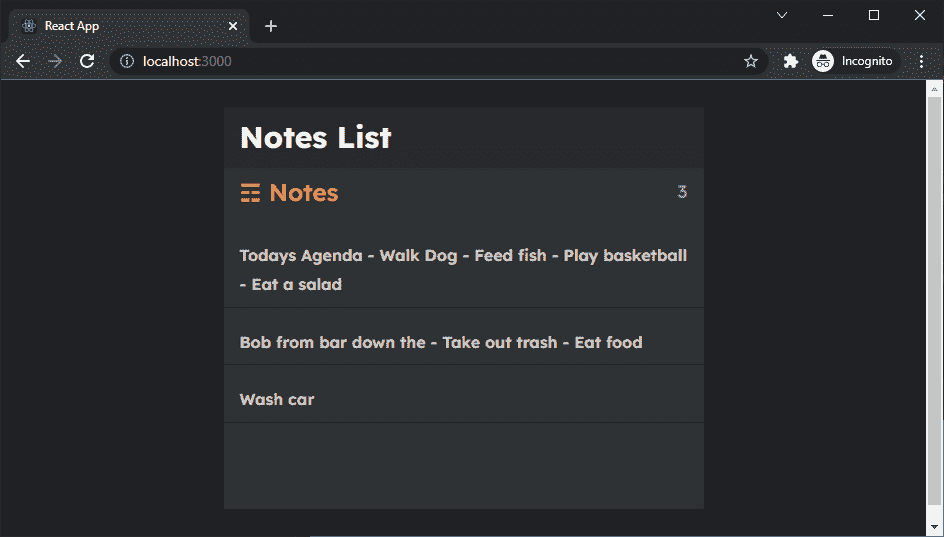

# React 速成班—设计应用程序

> 原文：<https://javascript.plainenglish.io/react-crash-course-styling-the-application-daf31a0ebb9d?source=collection_archive---------17----------------------->

## 第 5 部分:向 React 应用程序添加 CSS 样式


Photo by [Lautaro Andreani](https://unsplash.com/@lautaroandreani?utm_source=medium&utm_medium=referral) on [Unsplash](https://unsplash.com?utm_source=medium&utm_medium=referral)

*Live dev 笔记贯穿以下教程由* [*丹尼斯*](https://www.youtube.com/channel/UCTZRcDjjkVajGL6wd76UnGg)*——*[*React JS 速成班*](https://www.youtube.com/watch?v=6fM3ueN9nYM)

> 在第 5 部分中，我们将 CSS 添加到应用程序中，使设计更加生动。在这个过程中，我们将进行一些重构，添加额外的元素，并了解如何将资产作为 React 组件导入。

你也可以参考我的 Github repo:

[](https://github.com/emilyyleung/notesapp/tree/Part-5/Styling-the-Application) [## GitHub-Emily leung/notes app at Part-5/应用程序样式

### 在 GitHub 上创建一个帐户，为 Emily leung/notes app 的开发做出贡献。

github.com](https://github.com/emilyyleung/notesapp/tree/Part-5/Styling-the-Application) 

# 更新 App.css

下面我们将使用的 CSS 是由 Shahriar Parvez Shuvo 创建的，可以在这里找到:

[https://github . com/diva nov 11/notes-app/blob/master/src/app . CSS](https://github.com/divanov11/notes-app/blob/master/src/App.css)

我们首先将这个文件的内容复制到`App.css`

```
notesapp
├── public
│   └── index.html
└── src
    ├── assets
    │    └── data.js
    ├── pages
    │    ├── NotePage.js
    │    └── NotesListPage.js
    ├── components
    │    ├── Header.js
    │    └── ListItem.js
    ├── **App.css // Copy CSS into here**
    ├── App.js
    └── index.js
```

一旦`App.css`被保存，应用程序将自动选择一些样式。但正是从这里开始，我们需要通过分配类来填补空白，以使应用程序的其余部分遵循其预期的设计。


Initial change when adding the styling provided by Shahriar

# 造型 App.js

我们将从`App.js`开始，添加另一个带有类`container`的包装 div，并用小写文本更新`App`类。

> **记住:**class 属性必须标记为`className`(因为 JavaScript 已经使用了`class`关键字)

```
// notesapp > src > App.jsimport {
  BrowserRouter as Router,
  Route,
} from 'react-router-dom'import './App.css';
import Header from './components/Header'
import NotesListPage from './pages/NotesListPage'
import NotePage from './pages/NotePage'function App() {
  return (
    <Router>
      **<div className='container'>**
        <div **className='app'**>
          <Header />
          <Route path="/" exact component={NotesListPage} />
          <Route path="/note/:id" exact component={NotePage} />
        </div>
      **</div>**
    </Router>
  );
}export default App;
```


# 造型`NotesListPage.js`

跳转到`NotesListPage`，我们将执行以下操作:

*   给父节点`<div>`分配一个`notes`的类
*   在`notes-list`之上添加一个新的`<div>`，其类别为`notes-header`。在其中，我们将包含一个带有标题的`<h2>`标签和一个带有动态计数器的`<p>`标签，以告诉我们列表中当前有多少个笔记

```
// notesapp > src > pages > NotesListPage.js

import notes from '../assets/data'
import ListItem from '../components/ListItem'

const NotesListPage = () => {
    return (
        **<div className='notes'>**
            **<div className='notes-header'>
                <h2 className='notes-title'>&#9782; Notes</h2>
                <p className='notes-count'>{notes.length}</p>
            </div>**
            <div className='notes-list'>
                {notes.map((note, index) => 
                    <ListItem key={index} note={note}/>
                )}
            </div>
        **</div>**
    )
}

export default NotesListPage
```


# 造型`ListItem.js`

我们将用另一个 div 包装注释体，并为它分配一个类`note-list-item`

```
// notesapp > src > components > ListItem.jsimport { Link } from 'react-router-dom'const ListItem = ({note}) => {
    return (
        <Link to={`/note/${note.id}`}>
            **<div className='notes-list-item'>**
                <h3>{note.body}</h3>
            **</div>**
        </Link>
    )
}export default ListItem
```


# 深色模式

CSS 的作者编写了一个可以在亮暗模式之间切换的功能。默认情况下，应用程序将应用光照模式。

要设置它使用黑暗模式的颜色，我们需要做的就是在`App.js`中的`container`类旁边分配`dark`

```
// notesapp > src > App.jsimport {
  BrowserRouter as Router,
  Route,
} from 'react-router-dom'import './App.css';
import Header from './components/Header'
import NotesListPage from './pages/NotesListPage'
import NotePage from './pages/NotePage'function App() {
  return (
    <Router>
      **<div className='container dark'>**
        <div className='app'>
          <Header />
          <Route path="/" exact component={NotesListPage} />
          <Route path="/note/:id" exact component={NotePage} />
        </div>
      </div>
    </Router>
  );
}export default App;
```


# 造型`NotePage.js`

我们将通过执行以下操作来引入返回箭头:

*   从[mumbui](https://mumbleui.com/icons)下载 SVG 格式的箭头
*   将 SVG 保存到资产文件夹中

```
notesapp
├── public
│   └── index.html
└── src
    ├── assets
    │    ├── **arrow-left.svg // Downloaded from Mumble UI**
    │    └── data.js
    ├── pages
    │    ├── NotePage.js
    │    └── NotesListPage.js
    ├── components
    │    ├── Header.js
    │    └── ListItem.js
    ├── App.css
    ├── App.js
    └── index.js
```

在我们将 SVG 引入 UI 之前，我们将使用以下内容更新页面组件:

*   给父`<div>`添加一个`note`类
*   在注释主体上方，我们将为标题添加另一个`<div>`,并为其分配一个类`note-header`
*   在`note-header`中，我们将创建一个`<h3>`标签，并在其中添加一个`<Link>`标签来创建主页的返回链接(确保从`react-router-dom`导入`Link`组件)

然后使用返回箭头 SVG:

*   将 SVG 作为 React 组件导入
*   用`<Link>`包装 SVG，并将其相对路径分配给主页

```
// notesapp > src > pages > NotePage.js

import React from 'react'
import notes from '../assets/data'
**import { Link } from 'react-router-dom'**
**import { ReactComponent as ArrowLeft } from '../assets/arrow-left.svg'**

const NotePage = ({match}) => {
    let noteId = match.params.id
    let note = notes.find(note => note.id === Number(noteId));

    return (
        **<div className='note'>**
            **<div className='note-header'>**
                **<h3>
                    <Link to="/">
                        <ArrowLeft/>
                    </Link>
                </h3>**
            **</div>**
            <p>{note?.body}</p>
        </div>
    )
}

export default NotePage
```

为了使内容接近可编辑，我们将替换用于存放注释正文内容的`<p>`标签，并使用一个`<textarea>`标签来代替它。此外，注释的内容应该存储在`<textarea>`元素的`value`属性中。

```
// notesapp > src > pages > NotePage.js

import React from 'react'
import notes from '../assets/data'
import { Link } from 'react-router-dom'
import { ReactComponent as ArrowLeft } from '../assets/arrow-left.svg'

const NotePage = ({match}) => {
    let noteId = match.params.id
    let note = notes.find(note => note.id === Number(noteId));

    return (
        <div className='note'>
            <div className='note-header'>
                <h3>
                    <Link to="/">
                        <ArrowLeft/>
                    </Link>
                </h3>
            </div>

            **<textarea value={note?.body}></textarea>**

        </div>
    )
}

export default NotePage
```


现在，当我们试图对文本区域进行更改时，我们将在控制台中看到一个错误。我们将在以后解决这个问题(第 9 条中的[)。](/react-crash-course-updating-with-the-put-method-5414c67f5182?sk=89fb1ab770a1a7d18feabfd9307e896d)


# 造型`Header.js`

最后，我们将通过以下方式完成造型:

*   给父类一个`app-header`和
*   用“注释列表”替换标题文本

```
// notesapp > src > components > Header.jsconst Header = () => {
 return (
  **<div className='app-header'>**
   **<h1>Notes List</h1>**
  **</div>**
 );
};export default Header;
```



*更多内容请看*[***plain English . io***](http://plainenglish.io/)*。报名参加我们的* [***免费周报***](http://newsletter.plainenglish.io/) *。在我们的* [***社区***](https://discord.gg/GtDtUAvyhW) *获得独家获得写作机会和建议。*