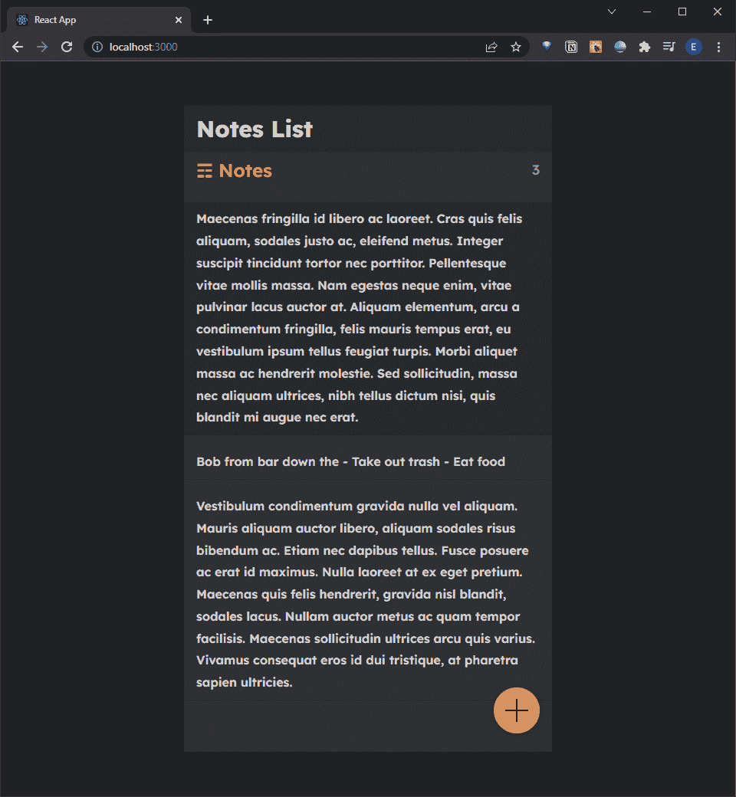
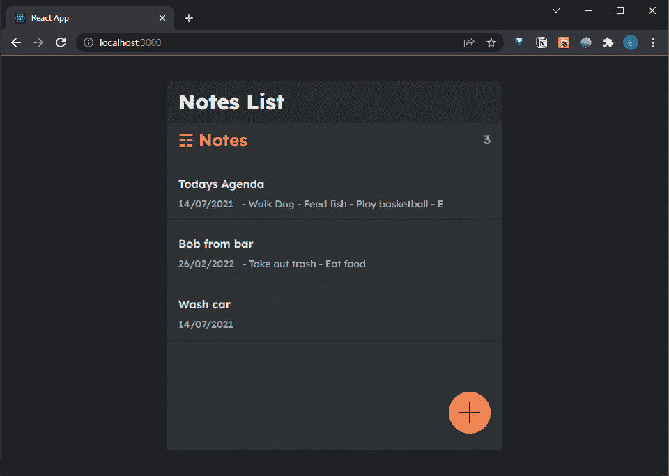

# React 速成班—基于文本的实用函数

> 原文：<https://javascript.plainenglish.io/react-crash-course-text-based-utility-functions-8fa0026fc455?source=collection_archive---------19----------------------->

## 第 11 部分:使用定制实用函数格式化 React 组件中的内容


Photo by [Lautaro Andreani](https://unsplash.com/@lautaroandreani?utm_source=unsplash&utm_medium=referral&utm_content=creditCopyText) on [Unsplash](https://unsplash.com/@lautaroandreani?utm_source=unsplash&utm_medium=referral&utm_content=creditCopyText)

*Live dev 笔记由*[*Dennis Ivy*](https://www.youtube.com/channel/UCTZRcDjjkVajGL6wd76UnGg)*——*[*React JS 速成班*](https://www.youtube.com/watch?v=6fM3ueN9nYM)

> 在第 11 部分中，我们将在 ListItem 和 NotesListPage 组件中创建一些基于文本的实用函数来返回注释的标题。我们还将添加一些有用的细节，比如格式良好的日期，以及笔记标题和内容的预览。

你也可以参考我的 Github repo:

[](https://github.com/emilyyleung/notesapp/tree/Part-11/Utility-Functions) [## GitHub-Emily leung/notes app at Part-11/实用程序-功能

### 在 GitHub 上创建一个帐户，为 Emily leung/notes app 的开发做出贡献。

github.com](https://github.com/emilyyleung/notesapp/tree/Part-11/Utility-Functions) 

# 提取笔记的标题

到目前为止，我们一直在弹奏非常简单、简短的音符。但是当我们开始写非常长的段落和列表时会发生什么呢？

这只是一个只有 3 个音符的例子…



为了保持设计简单，我们将假设注释正文的第一行将被视为注释的标题。这意味着我们需要创建一个返回标题的实用函数和另一个返回正文内容的实用函数。

我们将从在我们的`ListItem`中创建`getTitle`实用函数开始，它将从注释对象中提取`body`属性，并按每一个新行分割内容。第一行将减少到最多 45 个字符，以保持显示时的一致性。

然后我们将调用`<h3>`标签中的`getTitle`函数，并给它我们的 note 对象来返回我们的新标题。

```
// notesapp > src > components > ListItem.jsimport { Link } from 'react-router-dom'**let getTitle = (note) => {
    const title = note.body.split('\n')[0]** **if (title.length > 45) {
        return title.slice(0,45)
    }** **return title
}**const ListItem = ({note}) => {
    return (
        <Link to={`/note/${note.id}`}>
            <div className='notes-list-item'>
                **<h3>{getTitle(note)}</h3>**
            </div>
        </Link>
    )
}export default ListItem
```

> 注意，我们的`getTitle`函数不是写在组件内部的。这是因为，与我们到目前为止编写的所有其他函数不同，它不需要任何上下文属性或函数(比如`setNote`函数)。

# 提取笔记的日期

类似于`getTitle`，我们将创建另一个实用函数来提取笔记的日期，并将其重新格式化，以便于人们阅读。在这种情况下，就像应用`toLocaleDateString`方法一样简单——该方法用于根据用户的位置返回简化的日期。

```
// notesapp > src > components > ListItem.jslet getDate = (note) => {
    return new Date(note.updated).toLocaleDateString()
}
```

> 注意，我们已经提供了注释的`updated`值作为一个新的 Date 对象的参数。这是因为，默认情况下，该属性存储在数据库中时会转换为字符串。因此，要应用 **toLocaleDateString** 方法，我们必须将它重新构造成一个日期对象。

随着`getDate`函数的创建，我们将把它添加到我们的 JSX 中。

```
// notesapp > src > components > ListItem.jsreturn (
    <Link to={`/note/${note.id}`}>
        <div className='notes-list-item'>
            <h3>{getTitle(note)}</h3>
            **<p><span>{getDate(note)}</span></p>**
        </div>
    </Link>
)
```


# 提取笔记的内容预览

我们将创建的最后一个细节是`getContent`函数，它将获取我们的 note 对象的`body`属性，并返回除标题之外的所有内容。

我们将首先通过新的行字符分割`body`(确保删除第一行，因为它被认为是标题)。接下来，我们将把剩余的内容连接成一个，用空格替换新的行字符，并测试长度是否大于 45——如果是，只返回前 45 个字符。

```
// notesapp > src > components > ListItem.jslet getContent = (note) => {
    let content = note.body.split('\n')
    content.shift()
    content = content.join('\n')
    content = content.replaceAll('\n', ' ') if (content.length > 45) {
        return content.slice(0,45)
    } return content}
```

最后，我们将在简化的日期旁边添加`getContent`函数。

```
// notesapp > src > components > ListItem.jsreturn (
    <Link to={`/note/${note.id}`}>
        <div className='notes-list-item'>
            <h3>{getTitle(note)}</h3>
            <p><span>{getDate(note)}</span>**{getContent(note)}**</p>
        </div>
    </Link>
)
```



完成这些后，我们就可以在 Netlify 上部署应用程序了！

感谢您的阅读。

*更多内容看* [***说白了。报名参加我们的***](https://plainenglish.io/) **[***免费周报***](http://newsletter.plainenglish.io/) *。关注我们关于*[***Twitter***](https://twitter.com/inPlainEngHQ)*和*[***LinkedIn***](https://www.linkedin.com/company/inplainenglish/)*。加入我们的* [***社区***](https://discord.gg/GtDtUAvyhW) *。***