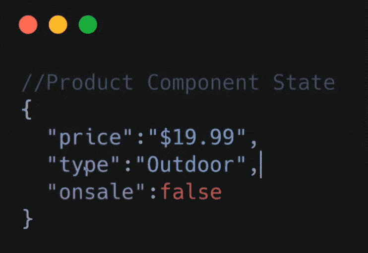
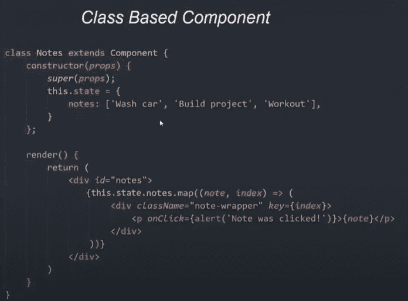
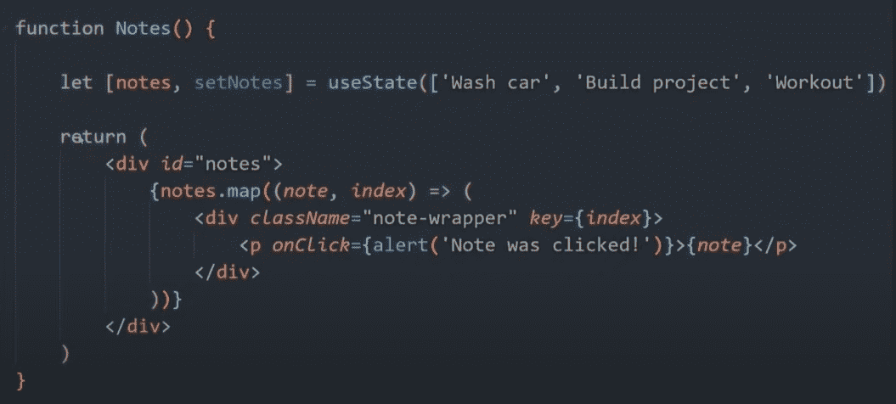
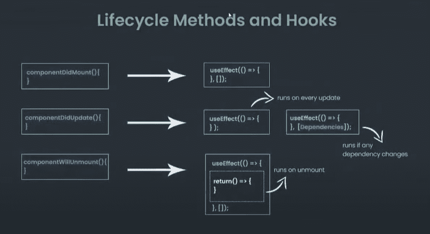
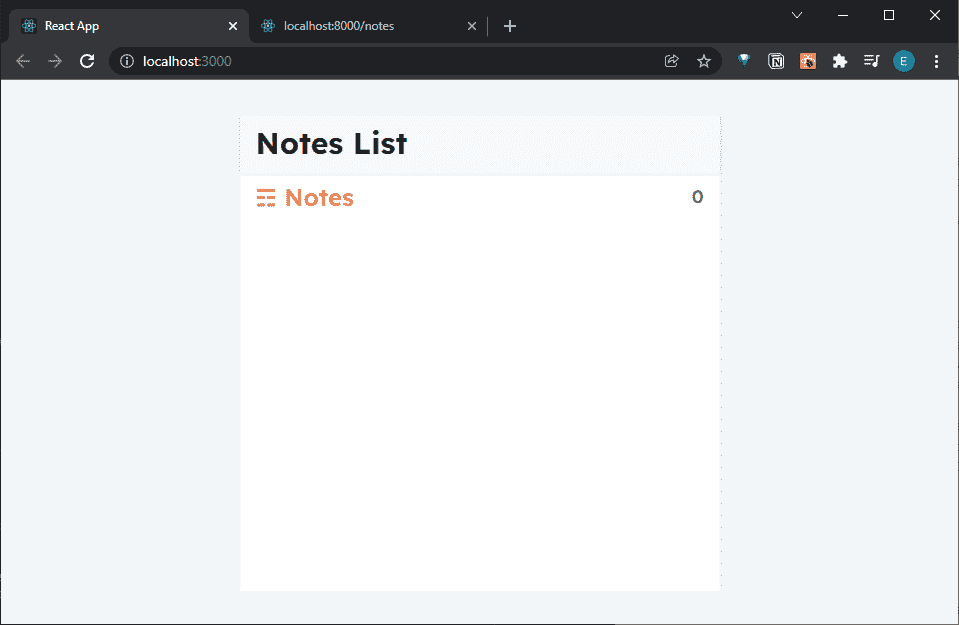

# React 速成班—了解状态和生命周期方法

> 原文：<https://javascript.plainenglish.io/react-crash-course-understanding-state-and-lifecycle-methods-df81842a419b?source=collection_archive---------13----------------------->

## 第 7 部分:为状态和生命周期方法构建基础


Photo by [Lautaro Andreani](https://unsplash.com/@lautaroandreani?utm_source=medium&utm_medium=referral) on [Unsplash](https://unsplash.com?utm_source=medium&utm_medium=referral)

*Live dev 笔记由* [*丹尼斯·艾维*](https://www.youtube.com/channel/UCTZRcDjjkVajGL6wd76UnGg)*——*[*React JS 速成班*](https://www.youtube.com/watch?v=6fM3ueN9nYM)

> 在第 7 部分中，我们看一下 React 状态和生命周期方法如何工作。通过比较基于类和基于函数的组件，我们将理解为什么选择后者而不是前者。

你也可以参考我的 Github repo:

[](https://github.com/emilyyleung/notesapp/tree/Part-7/State-and-Lifecycle-Methods) [## GitHub-Emily leung/notes app at Part-7/状态和生命周期方法

### 在 GitHub 上创建一个帐户，为 Emily leung/notes app 的开发做出贡献。

github.com](https://github.com/emilyyleung/notesapp/tree/Part-7/State-and-Lifecycle-Methods) 

React 中的状态等同于思考:

*   人的状态→坐着或站着
*   主题的状态→暗或亮
*   模态的状态→打开或关闭

这同样适用于反应，因为状态是关于可以随时间改变的事物的信息或数据。每个 React 组件都可以有自己的状态，这实际上是一个 JavaScript 对象。

举个例子，下面是一个电子商务网站中代表产品的组件的状态——可以用在组件的呈现中。



# 基于类的组件

React 组件可以用基于类的组件构建，这是一个在 React 内部构建类的过程。这个方法仍然可以实现，但这是一种不同的方式，并且需要使用像构造函数方法和`setState()`函数(用于修改状态)这样的东西。

使用这个过程意味着我们将使用构造函数方法并添加状态，比如一个注释列表。通常，注释列表将来自调用 API，然后将其呈现出来。

```
this.state = {
    notes: ['Wash car', 'Build project', 'Workout'],
}
```

简单地说，基于类的组件将构造组件，更新状态，然后使用状态数据遍历并创建注释。



# 基于功能的组件

另一方面，我们有基于功能的组件，它们更加无缝，但也不是那么具有描述性。状态对象仍然存在，但是我们使用一个叫做 React Hooks 的东西来更新我们的状态。

> *看起来基于函数的组件也被 React 团队* [*所支持*](https://reactjs.org/docs/hooks-intro.html) *用于基于类的组件之上。*

React 钩子是一组允许我们修改、设置和处理状态的函数。我们将在这个项目中使用的两个钩子是内置的。

# 理解钩子:使用状态

我们将使用的两个钩子之一是`useState`。这是一个简单的函数，它接受一个设置状态值的可选参数，即一个音符数组。



看上面的例子，我们可以看到`notes`的第一个参数是我们存储数组(或对象)的变量。第二个参数`setNotes`是我们的 setter 方法。当我们想要更新`notes`状态时，我们将调用这个函数。

# 生命周期方法和挂钩

如果您熟悉基于类的组件，箭头左边蓝色列出的生命周期方法应该会让您对正在发生的事情有更好的理解。



## React 有 3 种主要的生命周期方法:

*   **componentDidMount** —当组件首次挂载时触发
*   **componentDidUpdate**——当发生变化或状态更新时触发——例如调用更多数据或在我们的组件内部做一些事情
*   **component will unmount**——当一个组件从 DOM 中被拆除时被触发

对于基于功能的组件，不再需要这三种生命周期方法。我们将使用`useEffect`钩子，这是一个考虑到所有这三种情况的函数。

# componentDidMount → useEffect

为了复制这个函数，我们将设置`useEffect`并在其中添加一个函数，以及添加一组依赖项的选项。当组件挂载时，`useEffect`会触发。这通常用于快速获取用于呈现页面、简档或注释的数据。

```
useEffect(() => {}, [])
```

# componentDidUpdate → useEffect

依赖项的空数组意味着`useEffect`只在第一次加载时运行。然而，当组件发生更新时，`useEffect`也可以触发。

当没有为第二个参数(代表依赖项)提供任何内容时，`useEffect`将在每次更新时运行。此外，我们可以添加依赖关系，当更新时，就会触发`useEffect`

```
**// Runs of every Uupdate, or...**
useEffect(() => {})**// ... runs if any dependencies change**
useEffect(() => {}, [Dependencies])
```

# 组件将卸载→使用效果

要复制这个功能，我们只需要提供一个拆卸功能。这就像在`useEffect`函数中添加一个返回方法一样简单。

```
useEffect(() => {

  return() => {}}, [])
```

# 设置基于功能的组件

我们将从移除项目中的`data.js`开始。因为我们有模拟后端服务器存储我们的笔记，所以从现在开始我们可以使用`fetch`或`axios`与`db.json`交互。

在`NotesListPage.js`中，我们将移除`data.js`导入，并通过导入基于`useState`功能的组件来替换它。

接下来，我们将调用`useState`作为我们的`notes`变量。记住，必须用第二个参数来析构它，以便我们能够更新状态。现在，它将返回一个空数组。

```
// notesapp > src > pages > NotesListPage.js

**import { useState } from 'react'**
import ListItem from '../components/ListItem'

const NotesListPage = () => {

    **let [notes, setNotes] = useState([])**

    return (
        <div className='notes'>
            <div className='notes-header'>
                <h2 className='notes-title'>&#9782; Notes</h2>
                <p className='notes-count'>{notes.length}</p>
            </div>
            <div className='notes-list'>
                {notes.map((note, index) => 
                    <ListItem key={index} note={note}/>
                )}
            </div>
        </div>
    )
}

export default NotesListPage
```



然后，类似地，在`NotePage.js`中，我们将执行以下操作:

*   导入`useState`功能组件
*   移除`data.js`导入
*   用带有两个参数的`useState`函数替换`note`——返回一个空值

```
// notesapp > src > pages > NotePage.js**import { useState } from 'react'**
import { Link } from 'react-router-dom'
import { ReactComponent as ArrowLeft } from '../assets/arrow-left.svg'const NotePage = ({match}) => {
    let noteId = match.params.id **let [note, setNote] = useState(null)** return (
        <div className='note'>
            <div className='note-header'>
                <h3>
                    <Link to="/">
                        <ArrowLeft/>
                    </Link>
                </h3>
            </div>
            <textarea value={note?.body}></textarea>
        </div>
    )
}export default NotePage
```

下一篇文章将研究如何调用我们的 JSON 服务器并检索笔记。

*更多内容看* [***说白了。报名参加我们的***](http://plainenglish.io/) **[***免费周报***](http://newsletter.plainenglish.io/) *。在我们的* [***社区不和谐***](https://discord.gg/GtDtUAvyhW) *获得独家获取写作机会和建议。***