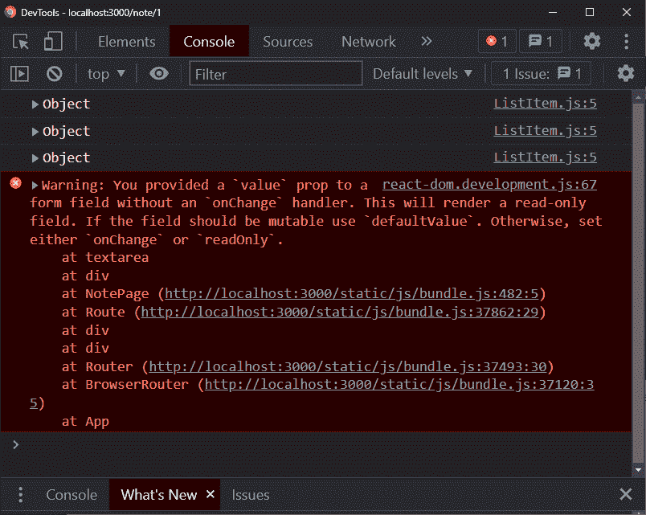
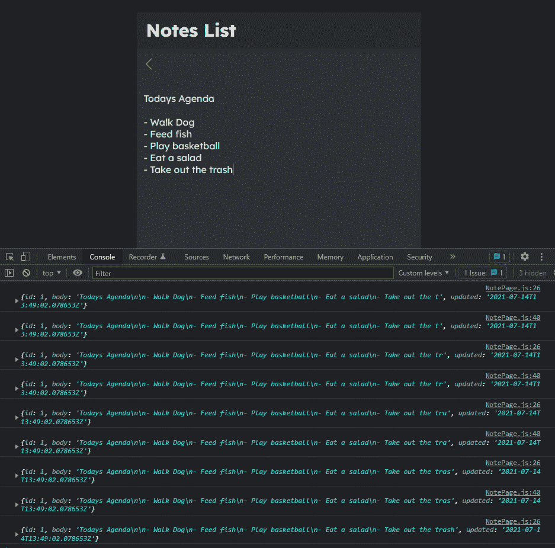

# React 速成班-使用 PUT 方法更新

> 原文：<https://javascript.plainenglish.io/react-crash-course-updating-with-the-put-method-5414c67f5182?source=collection_archive---------3----------------------->

## 第 9 部分:在 React 应用程序中调用 fetch 来更新后端


Photo by [Lautaro Andreani](https://unsplash.com/@lautaroandreani?utm_source=medium&utm_medium=referral) on [Unsplash](https://unsplash.com?utm_source=medium&utm_medium=referral)

*Live dev 笔记由*[*Dennis Ivy*](https://www.youtube.com/channel/UCTZRcDjjkVajGL6wd76UnGg)*——*[*React JS 速成班*](https://www.youtube.com/watch?v=6fM3ueN9nYM)

> 在第 9 部分中，我们将更新笔记的内容，将其保存回我们的模拟后端服务器，通过 React 路由器的历史属性重定向用户，以及解决我们的文本区域中的 onChange 错误(第 5 部分中提到的

你也可以参考我的 Github repo:

[](https://github.com/emilyyleung/notesapp/tree/Part-9/PUT-Method) [## GitHub-Emily leung/notes app at Part-9/PUT-Method

### 在 GitHub 上创建一个帐户，为 Emily leung/notes app 的开发做出贡献。

github.com](https://github.com/emilyyleung/notesapp/tree/Part-9/PUT-Method) 

# 处理`OnChange`错误

首先，让我们回到在[第 5 部分](/react-crash-course-styling-the-application-daf31a0ebb9d?sk=2ef5781ad6e7b4f907ec325fae65f77a)中看到的`onChange`错误(如下所示)



在试图编辑文本区域时，每次按键都会触发`onChange`事件——但是在我们的例子中，因为我们没有包含这个方法，所以它返回一个错误，阻止我们进行任何更改。

为了解决这个问题，我们将把它所需的`onChange`属性分配给 textarea，并设置它在发生变化时触发`setNote`函数。为了查看实际发生了什么，让我们同时记录我们编辑过的 note 对象。

```
// notesapp > src > pages > NotePage.js<textarea
    **onChange={(e) => {
     setNote({ ...note, body: e.target.value })****; console.log(note);** **}}**
    value={note?.body}
></textarea>
```

您将在上面的代码片段中看到，我们使用 spread 操作符来帮助我们在每次按键时更新音符对象的状态。具体来说，我们在 textarea 中输入的任何要更新的内容都会存储到`body`属性中——同时保持现有的`id`和`updated`属性不变。使用我们的控制台时，这种变化最容易理解。



> ***注意:*** *使用* `*setNote*` *函数意味着我们有效地覆盖和替换了原来存在的内容(整个 Note 对象)，而不是用更多的文本追加内容。因此，我们需要使用 spread 操作符来返回触发 onChange 事件之前的内容。*

# 使用`PUT`方法更新注释

目前，我们在 textarea 中编辑的注释内容只存在于 React 组件中，还没有保存回我们的模拟后端服务器。这意味着，如果我们刷新页面，值将恢复到原来在我们后端的值，或者在本例中，恢复到我们的`db.json`文件。

我们可以通过 fetch 更新使用`PUT`方法所做的更改。应用程序的设计意图表明，只有当我们单击返回箭头按钮时，注释才应该被保存——而不是在文本区域之外单击。这样做也意味着我们可以实现一个点击时调用的`handleSubmit`函数。

让我们从将`onClick`属性添加到返回箭头开始，并传递我们将在组件创建之前创建的`handleSubmit`函数。在它里面，我们将记录一个值来测试它是否工作。

```
// notesapp > src > pages > NotePage.jsimport { useState, useEffect } from 'react'
import { Link } from 'react-router-dom'
import { ReactComponent as ArrowLeft } from '../assets/arrow-left.svg'const NotePage = ({match}) => {
    let noteId = match.params.id
    let [note, setNote] = useState(null) useEffect(() => {
        getNote()
    }, [noteId]) let getNote = async () => {
        let response = await fetch(`[http://localhost:8000/notes/${noteId}`](http://localhost:8000/notes/${noteId}`))
        let data = await response.json()
        setNote(data)
    } **let handleSubmit = () => {
        console.log("click")
    }** return (
        <div className='note'>
            <div className='note-header'>
                <h3>
                    <Link to="/">
                        **<ArrowLeft onClick={handleSubmit}/>**
                    </Link>
                </h3>
            </div>

            <textarea onChange={(e) => {setNote({...note, body:e.target.value})}} value={note?.body}></textarea> </div>
    )
}export default NotePage
```

这样，让我们进行一个 fetch 调用来更新一个名为`updateNote`的异步函数的后端，并在我们的`handleSubmit`处理程序中调用它。

```
// notesapp > src > pages > NotePage.jslet updateNote = async () => {
 await fetch(`[http://localhost:8000/notes/${noteId}`](http://localhost:8000/notes/${noteId}`), {
  method: "PUT",
  headers: {
   "Content-Type": "application/json",
  },
  body: JSON.stringify({ ...note, updated: new Date() }),
 });
};let handleSubmit = () => {
 updateNote();
};
```

这个函数内部发生的事情是，它基于`noteId`定位特定的音符。一旦它获取了注释，就应该更新由`PUT`方法声明的内容，其中注释的内容由最后一个`onChange`值组成。此外，它还用当前日期更新了`updated`属性。

现在，当我们对文本区域进行一些更改时，单击后退箭头将调用`handleSubmit`，它运行`updateNote`并将用户重定向到主页。当我们返回到同一个笔记时，我们将看到那些编辑过的更改出现——但是这次内容是从我们的后端获取和显示的。

# 访问`history`属性

React Router 自带`history`属性，构建在 HTML5 历史 API 之上。我们特别想使用它的`push`方法，在笔记保存到后端后，将用户重定向回`NotesListPage`。

> *你可能会想为什么这是必要的，因为我们已经有了一个* `*Link*` *组件将我们重定向回主页。这将在文章的最后得到证明。*

要使用 history 属性，我们需要通过析构在组件中访问它，因为它是 props 对象的一部分。

```
// notesapp > src > pages > NotePage.jsconst NotePage = ({ match, history }) => {...}
```

接下来，在`updateNote`运行之后，我们将调用`handleSubmit`中的`push`方法，并将它指定为重定向路径的根。

```
// notesapp > src > pages > NotePage.jslet handleSubmit = () => {
 updateNote();
 **history.push("/");**
};
```

在跟随教程的过程中，我注意到因为我们使用了`history`，这意味着我们不再需要通过`to`属性重定向用户。但是，由于这个属性是`Link`组件的一个需求，我们可以完全删除这个组件。

```
// notesapp > src > pages > NotePage.jsreturn (
 <div className='note'>
  <div className='note-header'>
   **<h3>
    <ArrowLeft onClick={handleSubmit} />
   </h3>**
  </div>
  <textarea
   onChange={(e) => {
    setNote({ ...note, body: e.target.value });
   }}
   value={note?.body}
  ></textarea>
 </div>
);
```

现在，当用户编辑一条注释并点击返回箭头按钮时，正文内容被保存到`db.json`，然后它们将返回到`NotesListPage`

当他们点击返回笔记时，他们将看到已存储在`db.json`中的更新笔记

# 修复实时更新问题

我发现的另一个问题是，当我使用箭头链接返回到`NotesListPage`时，标题并没有立即更新。只有当我再次返回并退出以便注册更改时，更改才会出现。

经过一些研究，我发现通过将`handleSubmit`转换为异步函数，将`updateNote`转换为使用“await”(因为异步函数应该通过“await”调用)。这意味着当我点击返回箭头键时，我可以看到更改的注释出现在`NotesListPage`中。

> *回到使用历史属性的原因——通过在* `*handleSubmit*` *函数中实现，意味着我们可以控制操作的顺序。由此，笔记首先被保存到后端，然后当用户被重定向回主页时，返回的笔记列表保证是最新的。*

```
// notesapp > src > pages > NotePage.jsimport { useState, useEffect } from "react";
import { ReactComponent as ArrowLeft } from "../assets/arrow-left.svg";const NotePage = ({ match, history }) => {
 let noteId = match.params.id;
 let [note, setNote] = useState(null); useEffect(() => {
  getNote();
 }, [noteId]); let getNote = async () => {
  let response = await fetch(`[http://localhost:8000/notes/${noteId}`](http://localhost:8000/notes/${noteId}`));
  let data = await response.json();
  setNote(data);
 }; let updateNote = async () => {
  await fetch(`[http://localhost:8000/notes/${noteId}`](http://localhost:8000/notes/${noteId}`), {
   method: "PUT",
   headers: {
    "Content-Type": "application/json",
   },
   body: JSON.stringify({ ...note, updated: new Date() }),
  });
 }; **let handleSubmit = async () => {
  await updateNote();
  history.push("/");
 };** return (
  <div className='note'>
   <div className='note-header'>
    <h3>
     <ArrowLeft onClick={handleSubmit} />
    </h3>
   </div>
   <textarea
    onChange={(e) => {
     setNote({ ...note, body: e.target.value });
    }}
    value={note?.body}
   ></textarea>
  </div>
 );
};export default NotePage;
```

下一篇文章将介绍如何创建和删除笔记。

*更多内容请看*[***plain English . io***](https://plainenglish.io/)*。报名参加我们的* [***免费周报***](http://newsletter.plainenglish.io/) *。关注我们关于*[***Twitter***](https://twitter.com/inPlainEngHQ)*和*[***LinkedIn***](https://www.linkedin.com/company/inplainenglish/)*。加入我们的* [***社区不和谐***](https://discord.gg/GtDtUAvyhW) *。*