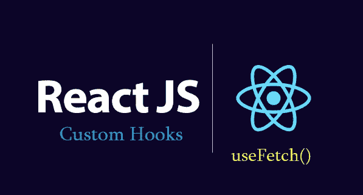
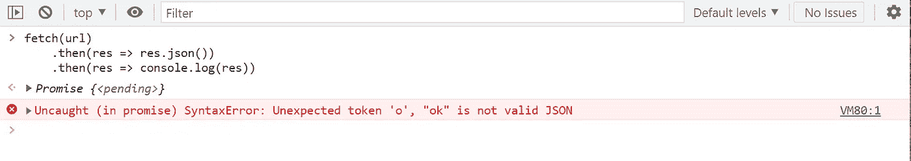

# 反应:创建使用获取自定义钩子

> 原文：<https://javascript.plainenglish.io/react-creating-usefetch-custom-hook-d123ebfd5ff?source=collection_archive---------2----------------------->

## 一个关于在 React 中创建自定义钩子以在所有组件中使用 Fetch 的教程。

从 16.8 版开始，React Hooks 被正式添加到 React.js 中。除了内置的钩子之外，我们可以定义自己的钩子来使用状态和其他 reactor 特性，而无需编写一个类。



Create useFetch cutom hook

当您有需要由多个组件使用的组件逻辑时，我们可以将该逻辑提取到自定义钩子。例如，如果需要在不同的组件中从服务器获取数据，则必须在每个组件中写入 fetch 函数，然后添加一个状态来处理加载和错误状态。我们可以创建一个自定义钩子并在任何地方重用它，而不是在每个组件中放入 fetch。

自定义挂钩以“**use”**前缀开头。例如:`useFetch`。

## 第一步

让我们创建一个新文件:`useFetch.js`

在`app.js`我们正在进口我们的`useFetch`鱼钩，并像使用任何其他鱼钩一样使用它。这是我们传入 URL 以获取数据的地方。现在，我们可以在任何组件中重用这个自定义钩子来从任何 URL 获取数据。

## 第 2 步:添加加载/错误状态

我们还可以添加额外的`loading` 和`error`参数来指示数据是否正在获取以及是否发生错误。

用法:

## 第 3 步:提取有什么“问题”？

让我们再看看这个代码块:

一切似乎都很好，可能会出什么问题？这个代码块你可以在几乎所有的文章和视频教程中找到。但我想在这里强调两点。如果:

**首先:服务器返回无效的 JSON 字符串**

*`*json()*``[*Response*](https://developer.mozilla.org/en-US/docs/Web/API/Response)`*接口的*方法接收* `[*Response*](https://developer.mozilla.org/en-US/docs/Web/API/Response)` *数据流并读取直至完成。它返回一个承诺，将解析正文的结果解析为* `[*JSON*](https://developer.mozilla.org/en-US/docs/Web/JavaScript/Reference/Global_Objects/JSON)` *。***

*在第(1)行，我们使用 **json()** 函数解析响应，但是如果服务器返回一个字符串而不是 json 字符串，这个块将会抛出一个错误。假设我们的服务器只返回**“OK”**文本作为响应。*

```
*res.status(200).send('OK')*
```

*在这种情况下，我们将获得成功状态，但是我们的获取将抛出一个错误:*

**

*Invalid JSON string*

***第二:捕捉服务器错误***

*如果服务器返回 **4xx** 或 **5xx** 状态(例如 404、500)，我们仍然会转到`then`块而不是`catch` 块。因为这就是获取请求的工作方式。*

**当出现网络错误时，Fetch 承诺仅拒绝一个 TypeError。因为 4xx 和 5xx 响应不是网络错误，所以没有什么可捕捉的。**

***解决这些错误***

*对于**第一点，**我们可以添加一个 try/catch 块(对于`async/await`和`catch`块，用于处理 Promise 中的错误),如果出现错误，我们可以从响应中返回文本值。*

***注:**我们这里用`clone` 是因为`json` 或者`text` 只能用一次。否则，它将抛出一个错误:*

```
*TypeError: Failed to execute 'text' on 'Response': body stream already read at eval*
```

*对于**第二点**(处理服务器错误)，我们需要检查响应状态(`res.ok`可以是`true` 或`false`)。*

*密码*

## *最后的步骤*

*   *用 async/await 替换我们的 promise 链*
*   *添加类型脚本*
*   ***添加重取选项***
*   ***有条件地获取(不仅在组件安装上)***

*再次调用定制钩子的唯一方法是在钩子的`useEffect`中添加依赖关系，并从组件中改变它。*

***示例:**假设我们需要在每次点击按钮时获取数据。点击按钮时，我们可以更改**切换**值，该值用作 useFetch 挂钩中的依赖项，数据将被再次提取。*

*现在一切似乎都很好，但是如果我们需要通过点击按钮来加载数据，而不是在**组件安装**上加载数据，该怎么办？如果我们试图像下面这样添加条件，它将抛出一个错误。这是因为钩子不能在条件下使用。这个代码不对↓*

```
*const [needToLoad, setNeedToLoad] = useState(false);
 let data;
  if(needToLoad){
     const resp =  useFetch(url, null);
     data = resp.data
  } else {
    data = []
}
....
 <h2>Fetch data on Component load</h2>
 <button onClick={() =>  setNeedToLoad(prev => !prev)}>
   change
</button>
{data[0]?.title}*
```

*我们会得到这个错误:*

```
*Rendered more hooks than during the previous render.*
```

*为了解决这个问题，我们可以将条件放在自定义挂钩中，而不是放在组件中。如果提供了`refetch`并且值为`null` —不需要加载数据。*

# *例子*

*   *服务器返回一个字符串而不是 JSON。 [Stackblitz 演示](https://stackblitz.com/edit/useeffect-extended-hook?file=TextBlock.tsx)*

*   *点击按钮重新提取数据。 [Stackblitz 演示](https://stackblitz.com/edit/useeffect-extended-hook?file=App.tsx)*

*   *点击按钮而不是安装组件时发出获取请求。这里我们需要将`param`设置为`null`,这将阻止组件安装请求的发送。*

*   *提出发布/上传请求*

*就是这样。此外，我们还可以从自定义钩子添加返回状态代码和错误消息。*

*你可以在这里找到**源代码** [，在这里](https://github.com/armenstepanyan/js-tips/blob/master/examples/react-useFetch-custom-hook.md)找到 **StackBlitz** 示例[。](https://stackblitz.com/edit/useeffect-extended-hook?file=App.tsx)*

**更多内容看* [***说白了。报名参加我们的***](https://plainenglish.io/) **[***免费周报***](http://newsletter.plainenglish.io/) *。关注我们关于*[***Twitter***](https://twitter.com/inPlainEngHQ)，[***LinkedIn***](https://www.linkedin.com/company/inplainenglish/)*，*[***YouTube***](https://www.youtube.com/channel/UCtipWUghju290NWcn8jhyAw)*，以及* [***不和***](https://discord.gg/GtDtUAvyhW) *。****