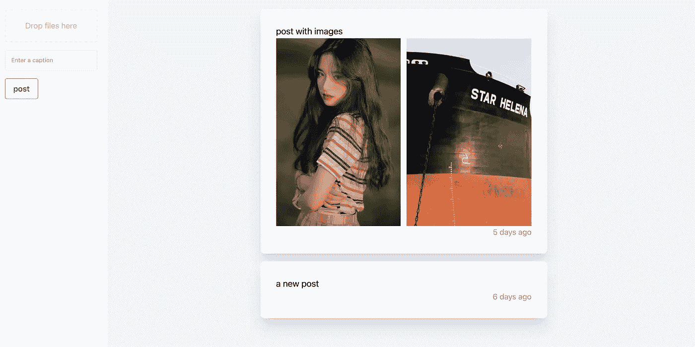
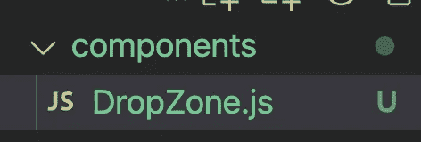
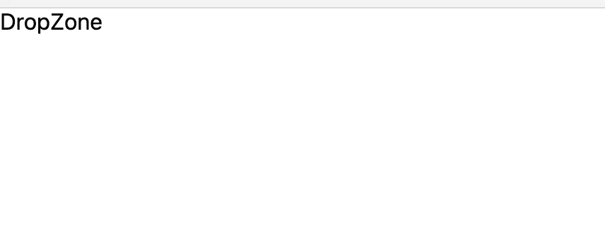

# 创建一个 Dropzone，供用户使用 React 上传图像

> 原文：<https://javascript.plainenglish.io/react-dropzone-and-upload-images-part-1-create-project-b6ca063ae5d0?source=collection_archive---------17----------------------->

## 第 1 部分:创建 dropzone，这样用户可以拖动一些图片并上传到 Firestore 存储。



在这一部分中，我们开始创建项目并创建 dropzone 组件。

通过[加入频道](https://www.youtube.com/channel/UCu4-4FnutvSHVo9WHvq80Ww/join)，你将可以无限制地访问 YouTube 频道中的所有源代码，并免费学习 Udemy 课程。

要创建项目，请键入:

```
yarn create next-app
```

然后我们输入名称“learn-dropzone”

## 创建组件 Dropzone



DropZone.js 内部:

```
import React from 'react'const DropZone = () => {return (<div>DropZone</div>)}export default DropZone
```

在 index.js 中导入 DropZone 组件:

```
import DropZone from '../components/DropZone'export default function Home() {return (<div><DropZone/></div>)}
```



如果你喜欢这个故事，你可能也喜欢中等会员。一个月才 5 美元(一杯咖啡的价格！)但是它会在支持你最喜欢的作家的同时，给你无限的接触故事的机会。如果你注册使用[这个链接](https://ckmobile.medium.com/membership)，我会赚一小笔佣金。谢谢！

# 关注我们: [YouTube](https://www.youtube.com/channel/UCu4-4FnutvSHVo9WHvq80Ww?sub_confirmation=1) ， [Medium](https://ckmobile.medium.com/) ， [Udemy](https://www.udemy.com/user/cyruschan2/) ， [Linkedin](https://www.linkedin.com/company/ckmobi/) ， [Twitter](https://twitter.com/ckmobilejavasc1) ， [Instagram](https://www.instagram.com/ckmobile8050) ， [Gumroad](https://app.gumroad.com/ckmobile) ， [Quora](https://ckmobile.quora.com/) ， [Telegram](https://t.me/ckmobi)

加入分支机构赚钱

[](https://ckmobile.gumroad.com/affiliates) [## Gumroad

### 申请成为会员很容易。填写下表，让 Ckmobile 知道您将如何推广他们的…

ckmobile.gumroad.com](https://ckmobile.gumroad.com/affiliates) 

*更多内容请看*[***plain English . io***](https://plainenglish.io/)*。报名参加我们的* [***免费周报***](http://newsletter.plainenglish.io/) *。关注我们关于*[***Twitter***](https://twitter.com/inPlainEngHQ)*和**[***LinkedIn***](https://www.linkedin.com/company/inplainenglish/)*。加入我们的* [***社区***](https://discord.gg/GtDtUAvyhW) *。**