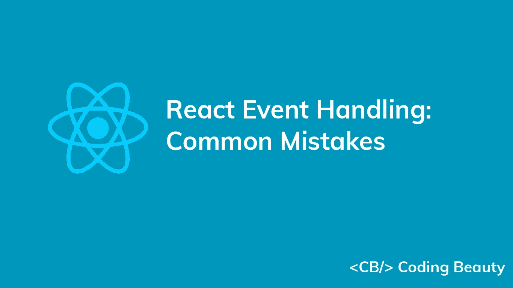
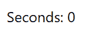

# 在 React 中处理事件时要避免的 3 个常见错误

> 原文：<https://javascript.plainenglish.io/react-event-handling-common-mistakes-a8e8ee947e?source=collection_archive---------4----------------------->



在 React 应用程序中，事件监听器或观察器在特定事件发生时执行特定的操作。虽然在 React 中创建事件侦听器非常容易，但是您需要避免一些常见的陷阱，以防止令人困惑的错误。这些错误是初学者最常犯的，但是作为一个相当有经验的开发人员，它们成为您调试会话的原因并不罕见。

在这篇文章中，我们将探讨一些常见的错误，以及你应该怎么做。

# 1.访问状态变量而不处理更新

看看这个简单的 React 应用程序。它本质上是一个基本的秒表应用程序，从零开始无限计数。

`JavaScript`

```
import { useState, useEffect } from 'react';

export default function App() {
  const [time, setTime] = useState(0);
  useEffect(() => {
    const timer = setInterval(() => {
      setTime(time + 1);
    }, 1000);
    return () => {
      window.clearInterval(timer);
    }
  }, []);
  return (
    <div>
      Seconds: {time}
    </div>
  );
}
```

然而，当我们运行这个应用程序时，结果并不是我们所期望的:



发生这种情况是因为由`setInterval()`回调/闭包引用的时间状态变量引用了在定义闭包时新鲜的陈旧状态。

闭包只能访问第一次渲染中的`time`变量(其值为`0`)，但不能访问后续渲染中的新`time`值。JavaScript closure 从定义变量的地方记住变量。

这个问题也是由于`setInterval()`闭包在组件中只定义了一次。

第一次渲染的`time`变量将总是有一个值`0`，因为 React 不会在调用`setState`时直接改变状态变量，而是创建一个包含新状态的新变量。所以当调用`setInterval`闭包时，它只会将状态更新为`1`。

以下是一些避免这种错误和防止意外问题的方法。

# 1.将功能传递给`setState`

避免这种错误的一种方法是向状态更新函数(`setState`)传递一个回调，而不是直接传递一个值。React 将确保回调总是接收最新的状态，避免访问可能包含旧状态的状态变量。它会将状态设置为回调返回的值。

下面是我们如何在示例中应用这一点:

`JavaScript`

```
import { useState, useEffect } from 'react';

export default function App() {
  const [time, setTime] = useState(0);
  useEffect(() => {
    const timer = setInterval(() => {
      // 👇 Pass callback
      setTime((prevTime) => prevTime + 1);
    }, 1000);
    return () => {
      window.clearInterval(timer);
    }
  }, []);
  return (
    <div>
      Seconds: {time}
    </div>
  );
}
```


现在，每次`setInterval()`回调运行时,`time`状态都会增加 1，就像它应该做的那样。

# 2.事件侦听器重新注册

另一个解决方案是每次状态改变时用新的回调来重新注册事件侦听器，这样回调总是从封闭范围访问新的状态。

我们通过将状态变量传递给`useEffect`的 dependencies 数组来实现这一点:

`JavaScript`

```
import { useState, useEffect } from 'react';

export default function App() {
  const [time, setTime] = useState(0);

  useEffect(() => {
    const timer = setInterval(() => {
      setTime(time + 1);
    }, 1000);

    return () => {
      window.clearInterval(timer);
    }
  }, [time]);

  return (
    <div>
      Seconds: {time}
    </div>
  );
}
```

每次`time`状态改变时，访问新鲜状态的新回调被注册到`setInterval()`。调用`setTime()`时，最新的`time`状态加 1，增加状态值。

# 2.多次注册事件处理程序

这是新接触反应钩子和功能组件的开发人员经常犯的错误。如果对 React 中的重新呈现过程没有基本的了解，您可能会尝试像这样注册事件侦听器:

`JavaScript`

```
import { useState } from 'react';

export default function App() {
  const [time, setTime] = useState(0);

  setInterval(() => {
    setTime((prevTime) => prevTime + 1);
  }, 1000);

  return (
    <div>
      Seconds: {time}
    </div>
  );
}
```

或者你可以像这样把它放在一个`useEffect`钩子里:

`JavaScript`

```
import { useState } from 'react';

export default function App() {
  const [time, setTime] = useState(0);

  useEffect(() => {
    setInterval(() => {
      setTime((prevTime) => prevTime + 1);
    }, 1000);
  });

  return (
    <div>
      Seconds: {time}
    </div>
  );
}
```

如果你*对这个有一个基本的了解，你应该已经能猜到这会给网页带来什么。*

发生什么事了？

正在发生的是，在一个功能组件中，每当组件重新呈现时，钩子之外和返回的 JSX 标记之外的代码都被执行。

下面是时间线中发生的事情的基本分类:

1.  **第一个**渲染:**监听器 1** 已注册
2.  **监听器 1** 注册后 1 秒:`time`状态更新，导致另一次重新渲染)
3.  **第二**渲染:**听者二**注册。
4.  **监听器 1** 在重新渲染后从未被注销，所以…
5.  上次**监听器 1** 调用后 1 秒:状态更新
6.  **第三**渲染:**监听器 3** 注册。
7.  **监听器 2** 在重新渲染后从未被注销，所以…
8.  **监听器 2** 注册后 1 秒:状态更新
9.  **第四个**渲染:**监听器 4** 注册。
10.  上次**监听器 1** 调用后 1 秒:状态更新
11.  **第五**渲染:**听者 5** 注册。
12.  上次**监听器 2** 调用后 1 秒:状态更新
13.  **第六**渲染:**监听器 6** 注册。
14.  **监听器 3** 在重新渲染后从未被注销，所以…
15.  **监听器**3 注册后 1 秒:状态更新。
16.  **第 7 个**渲染:**监听器 7** 注册…

最终，随着成百上千(甚至上百万)的回调被创建，事情失去了控制，每个回调在一秒钟内的不同时间运行，将`time`递增 1。

本文的第一个例子已经解决了这个问题——将事件监听器放在`useEffect`钩子中，并确保传递一个空的依赖数组(`[]`)作为第二个参数。

`JavaScript`

```
import { useEffect, useState } from 'react';

export default function App() {
  const [time, setTime] = useState(0);

  useEffect(() => {
    setInterval(() => {
      setTime((prevTime) => prevTime + 1);
    }, 1000);
  }, []);

  return (
    <div>
      Seconds: {time}
    </div>
  );
}
```

`useEffect`在第一次渲染后以及依赖数组中的任何值改变时运行，所以传递一个空数组使它只在第一次渲染时运行。

现在时间在稳步增加，但正如你在演示中看到的，它增加了 2 秒，而不是我们第一个例子中的 1 秒。这是因为在 React 18 严格模式下，所有组件都要挂载、卸载，然后再挂载。所以`useEffect`即使在一个空的依赖数组中也运行了两次，创建了两个监听器，它们每秒通过`1`更新时间。

我们可以通过关闭严格模式来解决这个问题，但是我们将在下一节中看到一个更好的方法。

# 3.组件卸载时不注销事件处理程序。

这里发生的是内存泄漏。我们应该确保当组件卸载时，任何创建的事件监听器都是未注册的。因此，当 React 18 严格模式强制卸载组件时，第一个区间监听器在组件再次挂载时注册第二个监听器之前被注销。只有第二个监听器会被留下，时间会每秒钟正确更新—到`1`。

您可以在组件卸载时执行一个操作，方法是将函数`useEffect`选择性地返回。所以我们使用`clearInterval`在那里注销区间监听器。

`JavaScript`

```
import { useEffect, useState } from 'react';

export default function App() {
  const [time, setTime] = useState(0);
  useEffect(() => {
    console.log('here');
    const timer = setInterval(() => {
      setTime((prevTime) => prevTime + 1);
    }, 1000);
    // 👇 Unregister interval listener
    return () => {
      clearInterval(timer);
    }
  }, []);
  return (
    <div>
      Seconds: {time}
    </div>
  );
}
```

`useEffect`的清理功能在每次重新渲染 后运行 [**，而不仅仅是在组件卸载时。这可以防止当一个可观察属性改变值而组件中的观察者没有取消订阅之前的可观察值时发生的内存泄漏。**](https://reactjs.org/docs/hooks-effect.html#explanation-why-effects-run-on-each-update)

# 结论

在 React 中创建事件侦听器非常简单，您只需要知道这些注意事项，这样就可以避免意外错误和令人沮丧的调试。避免访问过时的状态变量，不要注册超过需要的事件侦听器，并且在组件卸载时总是取消注册事件侦听器。

*原载于*【codingbeautydev.com】

# *JavaScript 做的每一件疯狂的事情*

*一本关于 JavaScript 微妙的警告和鲜为人知的部分的迷人指南。*

**

*[**报名**](https://cbdev.link/d3c4eb) 立即免费领取一份。*