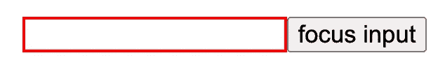
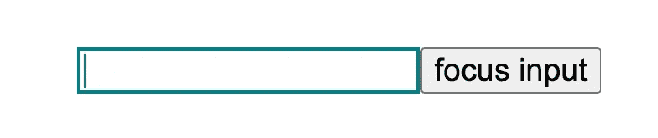
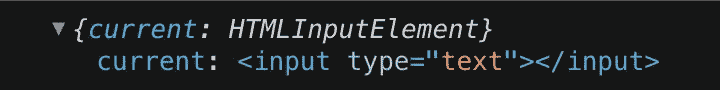
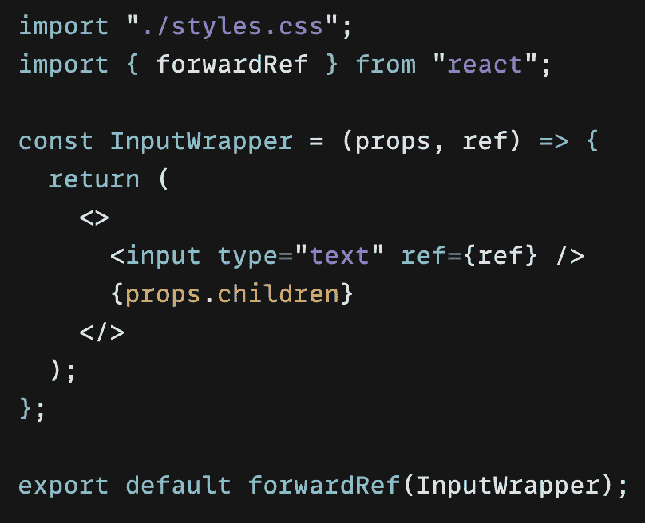
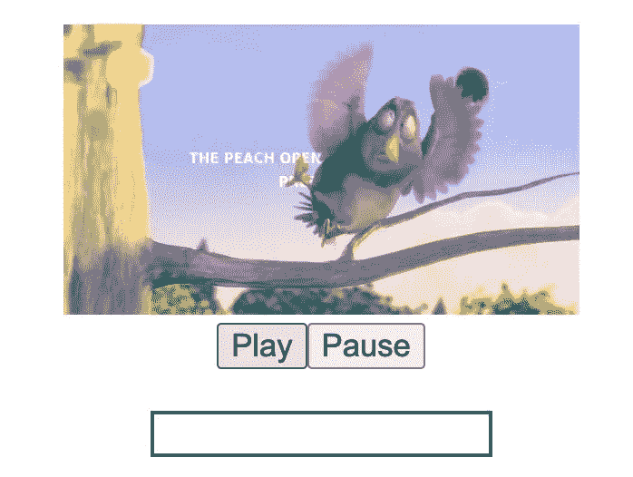

# 使用引用对功能组件进行反应

> 原文：<https://javascript.plainenglish.io/react-functional-components-using-refs-a5ad1d2817d4?source=collection_archive---------2----------------------->

## forwardRef 和 useImperativeHandle 的示例


逆境中成长 — grow in adversity

我一直不清楚 *ref* 和 *forwardRef* ，在做了一些研究后，我想写一篇文章，用两个小例子来记录这个学习过程。

现在我们开门见山吧！

在 React 的典型数据流中，**道具**是父子组件交互的唯一方式，要修改一个孩子，你用新的道具重新渲染。

当然，如 [React 官网](https://reactjs.org/docs/getting-started.html)所述，除了 React 典型的数据流，在某些情况下(例如，聚焦一个 DOM 元素等。)为了修改子组件，我们可能需要另一种方式: **Ref** 方式。Refs 提供了一种访问 DOM 节点或 React 元素的方法。

**由于本文使用了功能组件，所以我将重点介绍它们。*

让我们从第一个例子开始，这样我们可以更好地理解。

**例一:焦点输入**



cursor focused on input when a user clicks a button

假设我们有一个输入字段，当用户开始输入或点击按钮时，我们希望光标聚焦在它上面。更有意义的是只修改**输入字段**，而不是改变状态(通过 *props* )导致组件重新渲染，这可以通过创建一个引用来完成。

我们可以使用 *useRef()* 钩子来创建一个 Ref，它返回一个可变对象，其 **current** 属性设置为我们传递给钩子的初始值，并在 DOM 元素<输入>上使用它:

```
const inputRef = **useRef**(null);<input ref={**inputRef**} type=”text” />inputRef.current.focus() => focus input
```



console.log(inputRef)

非常简单，当用户开始输入时，输入字段会获得焦点，但是假设由于某种原因，当用户单击按钮时，这个输入字段也应该获得焦点，我们的输入字段位于名为 **InputWrapper** 的 react 子组件中。

也许我们会试着这样做:

```
const **Input****Wrapper** = ({ref,...}) => <><input ref={**ref**} .../>...</>export default function **App**() {
   const **inputRef** = useRef(null);
   const focusInput = () => inputRef.current.focus();
   return (
     // This will **NOT** work!💥
     <**Input****Wrapper** ref={**inputRef**}>
        <button onClick={focusInput}>...</button>
     </**Input****Wrapper>**   
)}}
```

👉这是行不通的，因为默认情况下，引用只在本地 HTML 元素中起作用，我们不能提供一个引用给 React 组件(在我们的例子中是 **InputWrapper)** ，而且由于函数组件没有实例，我们也不能在它上面使用`ref`属性，这意味着:

> 常规函数或类组件不接收`ref`参数，ref 在 **props** 中也不可用。

所以我们需要将我们的 InputWrapper 传递给 *forwardRef* ，它接收 props 和传递给功能组件的 refs，并返回 JSX。它的元素。

```
const InputWrapper = forwardRef((props, ref) => {…})
```


create and pass ref to InputWrapper inside App component


button event handler inside App which triggers focus



forwarding ref to input DOM element

通过这样做，我们告诉 React 这个组件可以接受一个 ref，我们的第二个参数`InputWrapper`将是传入的 ref。👉当我们用`forwardRef`调用定义一个组件时，第二个`ref`参数**只有**存在。

**引用转发在类组件*上也是可能的

**例二:播放/暂停视频和焦点输入**



using useImperativeHandle for multiple refs

在本例中，我们有一个视频播放器和两个按钮**播放/暂停**视频，我们还希望在单击播放按钮时**聚焦**下面的输入字段，这意味着我们将有多个引用(视频、输入)。

如何转发多个引用？

🦋第一种解决方案:我们可以创建 refs 并把它们传递给一个对象，然后使用与上面例子中相同的逻辑。

父应用程序:

```
export default function **App**() {
       const **videoRef** = useRef();
       const **focusRef** = useRef();const focusInput = () => inputRef.current.focus();
       const handlePlay = () => {
           videoRef.current.play();
           focusRef.current.focus();
       };
       const handlePause = () => {
           videoRef.current.pause();
       };return (
      <**VideoWrapper** **ref={{ videoRef, focusRef }}**> // 👉 pass refs
         <button onClick={handlePlay}>Play</button>
         <button onClick={handlePause}>Pause</button>
      </**VideoWrapper**>
   )
```

子视频包装:

```
function VideoWrapper(props, ref) {
      **const { videoRef, focusRef } = ref; // 👉** destructure refs
      return (
       <> 
          <video
             ref={**videoRef**}
             width="..."
             height="..."
             controls
             src={"..."}
          />
          {props.children}
          <input ref={**focusRef**} ... />
        </>
      );
export default **forwardRef**(VideoWrapper);
```

🦋第二种解决方案:使用 React 钩子`useImperativeHandle`

> useImperativeHandle 定制使用 ref 时暴露给父组件的实例值，应该与 **forwardRef** 一起使用。

这听起来可能令人困惑，让我们首先更新组件:

在应用程序内部创建一个 ref，并将其传递给 VideoWrapper:

```
export default function App() {
 **const ref = useRef(null);**     const handlePlay = () => {
        ref.current.**playVideo**(); // 👉 exposed method ref.current.**focusThisInput**();
      };
     const handlePause = () => ref.current.**pauseMe**();
   return (
     <**VideoWrapper** **ref={ref}**> // 👉 pass ref
        <button onClick={handlePlay}>Play</button>
        <button onClick={handlePause}>Pause</button>
     </**VideoWrapper**>
  )}
```

在 VideoWrapper 组件内部，我们可以用**useImperativeHandle**Hook 确定哪些属性将在 ref 上公开(你可以随意称呼它们: *playVideo* 、 *focusThisInput、pauseMe* 等。)

```
import { forwardRef, useImperativeHandle, useRef } from "react";function VideoWrapper(props, ref) {
    const **videoRef** = useRef();
    const **inputRef** = useRef(); **useImperativeHandle**(**ref**, () => ({
        👇 *you can call them whatever you like
*         **playVideo**: () => { 
             videoRef.current.play();
       },
         **pauseMe**: () => {
             videoRef.current.pause();
       },
         **focusThisInput**: () => {
             inputRef.current.focus();
       }
   }),[]); return (
      <>
          <video
             ref={**videoRef**}
             width="..."
             height="..."
             controls
             src={"..."}
          />
           {props.children}
          <input ref={**inputRef**} .../>
      </>
  );
}
export default **forwardRef**(VideoWrapper);
```

上面的代码是什么意思？我们在`useImperativeHandle`钩子内部添加方法，然后它们将被其父级公开和使用。🙌

如上面的例子所示，我们可以使用钩子 *forwardRef* 访问 React 功能子组件的底层 DOM 元素，我们可以处理多个引用，甚至可以通过使用 *useImperativeHandle 将引用传递给其子组件来修改父组件可以访问的引用。*

💡注意: *useImperativeHandle* 启用命令式代码，这违背了 React 的声明性本质，这使得 React 非常独特。因为这个原因，除非绝对需要，一般建议避免这个钩子。

你可以在这里看到结果并尝试一下[。](https://codesandbox.io/s/ref-fowardref-2ocgbh?file=/src/App.js:1226-1250)

就是这样！我相信有更好的方法和解决方案，这里我只是想分享我到目前为止学到的东西，希望你对这些例子感兴趣。感谢您的宝贵时间！⏰

如果你也对我的其他文章感兴趣，这里有一些链接:

[](/create-a-simple-express-server-node-js-for-react-application-e2b2bd0c7e93) [## 为 React 应用程序创建一个简单的 Express 服务器(Node.js)

### 关于如何创建一个简单的 Express 服务器(Node.js)、将其连接到 React 应用程序以及解决错误的教程…

javascript.plainenglish.io](/create-a-simple-express-server-node-js-for-react-application-e2b2bd0c7e93) [](/use-session-storage-to-persist-state-within-a-react-component-206867ef2269) [## 使用会话存储来保持 React 组件中的状态

### 当页面会话结束时，sessionStorage 中的数据将被清除。

javascript.plainenglish.io](/use-session-storage-to-persist-state-within-a-react-component-206867ef2269) [](https://medium.com/geekculture/hide-and-replace-sticky-element-on-scrolling-in-a-react-way-8bc3f04e2a81) [## 以反应方式隐藏和替换滚动时的粘性元素

### —棘手但有趣🍡

medium.com](https://medium.com/geekculture/hide-and-replace-sticky-element-on-scrolling-in-a-react-way-8bc3f04e2a81) [](https://enlear.academy/create-responsive-iframe-embed-in-a-react-way-f52075bf3b04) [## 创建以反应方式嵌入的响应 iframe

### —令人惊讶的是，YouTube 没有相应的嵌入代码🦄，我们来玩 css 吧…

enlear .学院](https://enlear.academy/create-responsive-iframe-embed-in-a-react-way-f52075bf3b04) [](/create-a-simple-react-custom-hook-fc733d7b977a) [## 创建一个简单的 React 自定义挂钩

### 关于如何创建一个简单的 React 自定义钩子的教程

javascript.plainenglish.io](/create-a-simple-react-custom-hook-fc733d7b977a) 

*更多内容请看*[***plain English . io***](https://plainenglish.io/)*。报名参加我们的* [***免费周报***](http://newsletter.plainenglish.io/) *。关注我们关于*[***Twitter***](https://twitter.com/inPlainEngHQ)[***LinkedIn***](https://www.linkedin.com/company/inplainenglish/)*[***YouTube***](https://www.youtube.com/channel/UCtipWUghju290NWcn8jhyAw)*[***不和***](https://discord.gg/GtDtUAvyhW) *。对增长黑客感兴趣？检查* [***电路***](https://circuit.ooo/) *。***