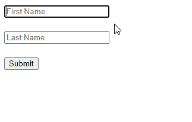

# 如何在 React 中获取表单提交时输入的值

> 原文：<https://javascript.plainenglish.io/react-get-form-input-value-on-submit-28e31411761b?source=collection_archive---------13----------------------->


要在提交时获取表单输入的值:

1.  创建一个状态变量来存储输入的值。
2.  在输入上设置一个`onChange`事件处理程序，以便在输入值改变时更新状态变量。
3.  在`form`元素上设置一个`onSubmit`事件处理程序。
4.  在`onSubmit`事件处理程序中访问输入字段的值。

例如:

`App.js`

```
import { useState } from 'react';export default function App() {
  const [firstName, setFirstName] = useState('');
  const [lastName, setLastName] = useState('');
  const [message, setMessage] = useState(''); const handleSubmit = (event) => {
    event.preventDefault(); setMessage(`Hello ${firstName} ${lastName}!`);
    setFirstName('');
    setLastName('');
  }; return (
    <form onSubmit={handleSubmit}>
      <input
        type="text"
        id="firstName"
        name="firstName"
        value={firstName}
        placeholder="First Name"
        onChange={(event) =>
          setFirstName(event.target.value)
        }
      /> <br />
      <br /> <input
        type="text"
        id="lastName"
        name="lastName"
        value={lastName}
        placeholder="Last Name"
        onChange={(event) => {
          setLastName(event.target.value);
        }}
      /> <br />
      <br /> <button type="submit">Submit</button> <br />
      <br /> <h2>{message}</h2>
    </form>
  );
}
```



使用`useState()`钩子，我们创建一个状态变量来存储每个输入字段的当前值。我们还创建了另一个状态变量(`message`)，它将在用户提交表单后用输入字段的值进行更新。

我们在每个输入字段上设置了一个内联的`onChange`事件处理程序，以便每当输入字段发生变化时调用该处理程序。在每个处理程序中，我们使用处理程序接收的`Event`对象的`target`属性来访问`input`元素对象。该对象的`value`属性包含输入值，因此我们将其传递给状态更新函数来更新该特定输入的值。

表单中的`button`元素有一个`submit`的`type`，所以每次用户点击它，都会触发提交事件。我们在表单上设置了一个`onSubmit`事件处理程序来监听这个事件。在这个处理程序中，我们在`Event`对象上调用`preventDefault()`，以防止表单提交时页面刷新。

为了在表单提交后获取事件处理程序中的输入值，我们只需访问`firstName`和`lastName`状态变量。

# 用`event.target`获取表单提交的输入值

我们还可以在提交时用`Event`对象的`target`属性获取表单输入的值。这在我们没有用状态变量跟踪输入值的情况下是有用的，例如，不受控制的输入。

`App.js`

```
import { useState } from 'react';export default function App() {
  const [message, setMessage] = useState(''); const handleSubmit = (event) => {
    event.preventDefault(); const firstName = event.target.firstName.value;
    const lastName = event.target.lastName.value;
    setMessage(`Hello ${firstName} ${lastName}!`); event.target.reset();
  }; return (
    <form onSubmit={handleSubmit}>
      <input
        type="text"
        id="firstName"
        name="firstName"
        placeholder="First Name"
      /> <br />
      <br /> <input
        type="text"
        id="lastName"
        name="lastName"
        placeholder="Last Name"
      /> <br />
      <br /> <button type="submit">Submit</button> <br />
      <br /> <h2>{message}</h2>
    </form>
  );
}
```

在`onSubmit`事件处理程序中，`Event`对象的`target`属性返回表单元素对象(类型为`HTMLFormElement`)。

因为我们在`input`元素上设置了`name`属性，所以表单元素对象将包含一个返回`input`元素对象的同名属性，也就是说，在`input`元素上将`name`设置为`firstName`之后，我们可以通过`form`元素对象上的`firstName`属性来访问这个`input`的元素对象。

在获得每个输入的值并显示消息后，我们调用表单元素对象上的`reset()`方法来恢复表单输入元素的默认值。在这个例子中，我们就是这样清除输入字段中的文本的，因为它们不受状态变量的控制。

# 通过引用获取表单提交的输入值

我们还可以使用一个组件 ref 来获取提交时不受控制的表单输入的值。

`App.js`

```
import { useState, useRef } from 'react';export default function App() {
  const [message, setMessage] = useState('');
  const firstNameRef = useRef(undefined);
  const lastNameRef = useRef(undefined); const handleSubmit = (event) => {
    event.preventDefault(); const firstName = firstNameRef.current.value;
    const lastName = lastNameRef.current.value; setMessage(`Hello ${firstName} ${lastName}!`); event.target.reset();
  }; return (
    <form onSubmit={handleSubmit}>
      <input
        type="text"
        id="firstName"
        name="firstName"
        placeholder="First Name"
        ref={firstNameRef}
      /> <br />
      <br /> <input
        type="text"
        id="lastName"
        name="lastName"
        placeholder="Last Name"
        ref={lastNameRef}
      /> <br />
      <br /> <button type="submit">Submit</button> <br />
      <br /> <h2>{message}</h2>
    </form>
  );
}
```

受控输入中的数据由 React state 处理，但是对于非受控输入，它由 DOM 本身处理。这就是为什么上面这个例子中的`input`没有设置`value` prop 或`onChange`事件处理程序。相反，我们使用 React ref 来访问输入字段的值。当输入中的文本发生变化时，DOM 会更新这个值。

对于每个`input`，我们用`useRef()`钩子创建一个 ref 对象，并将其设置为`input`的`ref`道具。这样做将 ref 对象的`current`属性设置为表示`input`元素的 DOM 对象。

`useRef()`返回一个可变的引用对象，当一个组件被更新时，它的值不会改变。此外，修改这个对象的`current`属性的值不会导致重新渲染。这与从`useState()`返回的`setState`更新功能相反。

尽管 React 文档建议使用受控组件，但非受控组件也有一些优势。如果表单非常简单，不需要即时验证，并且只需要在提交表单时访问值，那么您可能更喜欢使用它们。

*原载于*[*codingbeautydev.com*](https://cbdev.link/1d307c)

# JavaScript 做的每一件疯狂的事情

一本关于 JavaScript 微妙的警告和鲜为人知的部分的迷人指南。


[**报名**](https://cbdev.link/d3c4eb) 立即免费领取一份。

*更多内容看* [***说白了就是***](https://plainenglish.io/) *。报名参加我们的* [***免费周报***](http://newsletter.plainenglish.io/) *。关注我们关于* [***推特***](https://twitter.com/inPlainEngHQ) ， [***领英***](https://www.linkedin.com/company/inplainenglish/) ***，***[***YouTube***](https://www.youtube.com/channel/UCtipWUghju290NWcn8jhyAw)***，以及****[***不和***](https://discord.gg/GtDtUAvyhW) *对成长黑客感兴趣？检查出* [***电路***](https://circuit.ooo/) ***。****