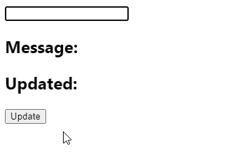
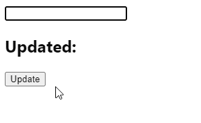

# 如何在 React 中点击一个按钮获得输入的值

> 原文：<https://javascript.plainenglish.io/react-get-input-value-on-button-click-aceb59fb6217?source=collection_archive---------2----------------------->

## 在 React 中点击按钮时，如何轻松获取输入字段值的指南。


要在 React 中获取按钮单击的输入值:

1.  创建一个状态变量来存储输入字段的值。
2.  在输入上设置一个`onChange`事件处理程序，以便在输入字段值改变时更新状态变量。
3.  在按钮元素上设置一个`onClick`事件处理程序。
4.  访问事件处理程序中的状态变量。

例如:

`App.js`

```
import { useState } from 'react';export default function App() {
  const [message, setMessage] = useState(''); const [updated, setUpdated] = useState(message); const handleChange = (event) => {
    setMessage(event.target.value);
  }; const handleClick = () => {
    // 👇 "message" stores input field value
    setUpdated(message);
  }; return (
    <div>
      <input
        type="text"
        id="message"
        name="message"
        onChange={handleChange}
        value={message}
      /> <h2>Message: {message}</h2> <h2>Updated: {updated}</h2> <button onClick={handleClick}>Update</button>
    </div>
  );
}
```



使用`useState()`钩子，我们创建一个状态变量(`message`)来存储输入字段的当前值。我们还创建了另一个状态变量(`updated`)，当按钮被点击时，它将被输入字段值更新。

我们在输入字段上设置了一个`onChange`事件处理程序，以便在输入值改变时调用这个处理程序。在处理程序中，我们使用`event.target`属性来访问表示`input`元素的对象。这个对象的`value`属性包含输入值，所以我们将它传递给`setMessage()`来更新`message`，这反映在页面上。

在设置了受控输入之后，我们现在可以在`handleChange`处理程序之外使用`message`来访问输入字段的当前值。

因此，在我们对`button`设置的`onClick`事件处理程序中，我们使用`setUpdated(message)`用当前输入字段值更新`updated`变量。

# 获取按钮点击时非受控输入的值

要在 React 中获取按钮单击时不受控制的输入的值:

1.  为输入字段创建一个引用
2.  在`button`上设置一个`onClick`事件处理程序。
3.  使用 ref 对象访问事件处理程序中的当前输入值。

例如:

`App.js`

```
import { useRef, useState } from 'react';export default function App() {
  const inputRef = useRef(null); const [updated, setUpdated] = useState(''); const handleClick = () => {
    // 👇 "inputRef.current.value" is input value
    setUpdated(inputRef.current.value);
  }; return (
    <div>
      <input
        ref={inputRef}
        type="text"
        id="message"
        name="message"
      /> <h2>Updated: {updated}</h2> <button onClick={handleClick}>Update</button>
    </div>
  );
}
```



受控输入中的数据由 React state 处理，而非受控输入中的数据由 DOM 本身处理。这就是为什么上面例子中的`input`没有设置`value`道具或`onChange`事件处理程序。相反，我们使用 React ref 访问输入字段值。当输入中的文本发生变化时，DOM 会更新这个值。

我们用`useRef()`钩子创建一个 ref 对象，并将其设置为`input`的`ref`道具。这样做将 ref 对象的`current`属性设置为表示`input`元素的 DOM 对象。

`useRef()`返回一个可变的 ref 对象，该对象在组件更新时不改变值。此外，修改该对象的`current`属性值不会导致重新渲染。这与从`useState()`返回的`setState`更新功能相反。

尽管 React 文档建议使用受控组件，但非受控组件也有一些优势。如果表单非常简单，不需要即时验证，并且只需要在提交表单时访问值，那么您可能更喜欢使用它们。

*最初发表于*[*codingbeautydev.com*](https://cbdev.link/7a9289)

# ES13 中 11 个惊人的新 JavaScript 特性

本指南将带您快速了解 ECMAScript 13 中添加的所有最新功能。这些强大的新特性将会用更短、更富于表现力的代码来更新您的 JavaScript。


[**报名**](https://cbdev.link/900477) 立即免费领取一份。