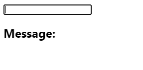

# 如何在 React 中获得输入值的变化

> 原文：<https://javascript.plainenglish.io/react-get-input-value-on-change-16dcd6619caf?source=collection_archive---------3----------------------->

## 这是一个关于如何在 React 中轻松获取输入字段值的教程。


要在 React 中更改时获取输入值，请在输入上设置一个`onChange`事件处理程序，然后使用传递给处理程序的`Event`对象的`target.value`属性来获取输入值。

例如:

`App.js`

```
import { useState } from 'react';export default function App() {
  const [message, setMessage] = useState(''); const handleChange = (event) => {
    // 👇 Get input value from "event"
    setMessage(event.target.value);
  }; return (
    <div>
      <input
        type="text"
        id="message"
        name="message"
        onChange={handleChange}
      /> <h2>Message: {message}</h2>
    </div>
  );
}
```



这里我们创建一个状态变量(`message`)来跟踪输入值。通过设置一个`onChange`事件处理程序，每当输入字段中的文本发生变化时，就会调用处理函数。

将使用包含数据并允许与事件相关的动作的[事件](https://developer.mozilla.org/en-US/docs/Web/API/Event)对象调用处理函数。这个对象的[目标](https://developer.mozilla.org/en-US/docs/Web/API/Event/target)属性让我们可以访问表示输入元素的对象。

这个 input element 对象有一个`value`属性，它返回当前输入字段中的文本。所以我们调用带有这个属性的`setMessage()`函数作为参数，用输入值更新`message`变量，这反映在 DOM 更新后的页面上。

*最初发表于*[*codingbeautydev.com*](https://cbdev.link/3e63cc)

# JavaScript 做的每一件疯狂的事情

一本关于 JavaScript 微妙的警告和鲜为人知的部分的迷人指南。


[**报名**](https://cbdev.link/d3c4eb) 立即免费领取一份。