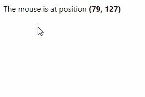
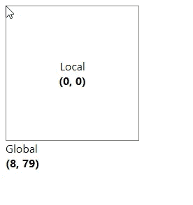

# 如何获得鼠标在 React 中的位置

> 原文：<https://javascript.plainenglish.io/react-get-mouse-position-d900c9fe09cd?source=collection_archive---------10----------------------->


要获得鼠标在 React 中的位置，需要向`window`对象添加一个`mousemove`事件处理程序，并访问`MouseEvent`对象的`clientX`和`clientY`属性，以分别获得鼠标的 X 和 Y 坐标。

例如:

`App.js`

```
import { useEffect, useState } from 'react';export default function App() {
  const [mousePos, setMousePos] = useState({}); useEffect(() => {
    const handleMouseMove = (event) => {
      setMousePos({ x: event.clientX, y: event.clientY });
    }; window.addEventListener('mousemove', handleMouseMove); return () => {
      window.removeEventListener(
        'mousemove',
        handleMouseMove
      );
    };
  }, []); return (
    <div>
      The mouse is at position{' '}
      <b>
        ({mousePos.x}, {mousePos.y})
      </b>
    </div>
  );
}
```



The current mouse position is displayed.

当鼠标停留在一个元素上时，该元素触发`mousemove`事件。更准确地说，当鼠标移动并且光标的热点在元素的边界内时，它被触发。

我们将事件监听器附加到`window`对象，以便每当鼠标移动到页面上的任何位置时触发事件。

我们向 [useEffect](https://reactjs.org/docs/hooks-effect.html) 钩子传递了一个空的依赖数组，因为我们只想为`mousemove`事件添加一个处理程序——当组件挂载时。

在 cleanup 函数中，我们使用`removeEventListener()`方法删除之前添加的事件监听器，并防止组件卸载时出现内存泄漏。

`mousemove`事件监听器接收一个[鼠标事件](https://developer.mozilla.org/en-US/docs/Web/API/MouseEvent)对象，用于访问信息和执行与事件相关的动作。我们使用该对象的`clientX`和`clientY`属性来分别获取鼠标在应用程序视窗中 X 坐标和 Y 坐标上的位置。

# 获取相对于 React 中元素的鼠标位置

在前面的例子中，我们能够获得鼠标在全局坐标中的位置。

在全局坐标中，位置`(0,0)`在网页的左上角，位置`(Xmax, Ymax)`在右下角。

相反，我们可能希望获得元素区域内的鼠标位置。

要获得相对于 React 中元素的鼠标位置，在元素上设置一个`onMouseMove`事件处理程序，然后使用传递给事件处理程序的`MouseEvent`对象的属性计算本地 X 和 Y 位置。

例如:

`App.js`

```
import { useEffect } from 'react';
import { useState } from 'react';export default function App() {
  const [globalMousePos, setGlobalMousePos] = useState({});
  const [localMousePos, setLocalMousePos] = useState({}); const handleMouseMove = (event) => {
    // 👇 Get mouse position relative to element
    const localX = event.clientX - event.target.offsetLeft;
    const localY = event.clientY - event.target.offsetTop; setLocalMousePos({ x: localX, y: localY });
  }; useEffect(() => {
    const handleMouseMove = (event) => {
      setGlobalMousePos({
        x: event.clientX,
        y: event.clientY,
      });
    }; window.addEventListener('mousemove', handleMouseMove); return () => {
      window.removeEventListener(
        'mousemove',
        handleMouseMove
      );
    };
  }, []); return (
    <div>
      <div
        style={{
          border: '1px solid gray',
          display: 'inline-block',
          padding: '75px',
          textAlign: 'center',
        }}
        onMouseMove={handleMouseMove}
      >
        Local
        <br />
        <b>
          ({localMousePos.x}, {localMousePos.y})
        </b>
      </div>
      <br />
      Global
      <br />
      <b>
        ({globalMousePos.x}, {globalMousePos.y})
      </b>
    </div>
  );
}
```

现在产生的 X 和 Y 坐标将相对于元素。例如，位置`(0,0)`将位于元素的左上角，而不是页面的左上角:



The mouse position relative to an element is displayed.

我们从`MouseEvent`对象的`clientX`属性中减去元素的`offsetLeft`属性，得到相对于元素的 X 位置。

类似地，为了获得 Y 位置，我们从`MouseEvent`对象的`clientY`属性中减去元素的`offsetTop`属性。

```
const handleMouseMove = (event) => {
  // Calculate position within bounds of element
  const localX = event.clientX - event.target.offsetLeft;
  const localY = event.clientY - event.target.offsetTop; setLocalMousePos({ x: localX, y: localY });
};
```

[offsetLeft](https://developer.mozilla.org/en-US/docs/Web/API/HTMLElement/offsetLeft) 属性返回元素左侧位置与其父元素左侧位置之间的像素数。

同样， [offsetTop](https://developer.mozilla.org/en-US/docs/Web/API/HTMLElement/offsetTop) 属性返回元素顶部位置与其父元素顶部位置之间的像素数。

*原载于*[*codingbeautydev.com*](https://cbdev.link/896b8a)

# JavaScript 做的每一件疯狂的事情

一本关于 JavaScript 微妙的警告和鲜为人知的部分的迷人指南。

[**报名**](https://cbdev.link/d3c4eb) 立即免费领取一份。

*更多内容请看* [***说白了就是***](https://plainenglish.io/) *。报名参加我们的* [***免费每周简讯***](http://newsletter.plainenglish.io/) *。关注我们关于*[***Twitter***](https://twitter.com/inPlainEngHQ)，[***LinkedIn***](https://www.linkedin.com/company/inplainenglish/)***，***[*YouTube*](https://www.youtube.com/channel/UCtipWUghju290NWcn8jhyAw)***，****[***不和*****](https://discord.gg/GtDtUAvyhW)*