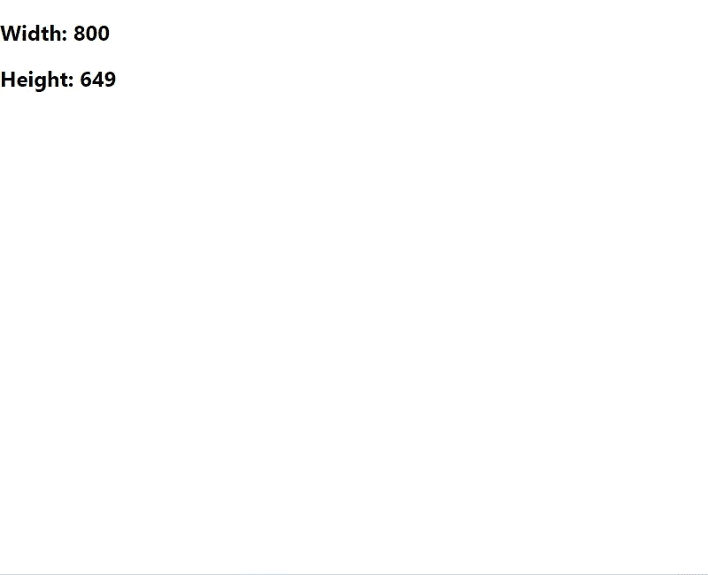
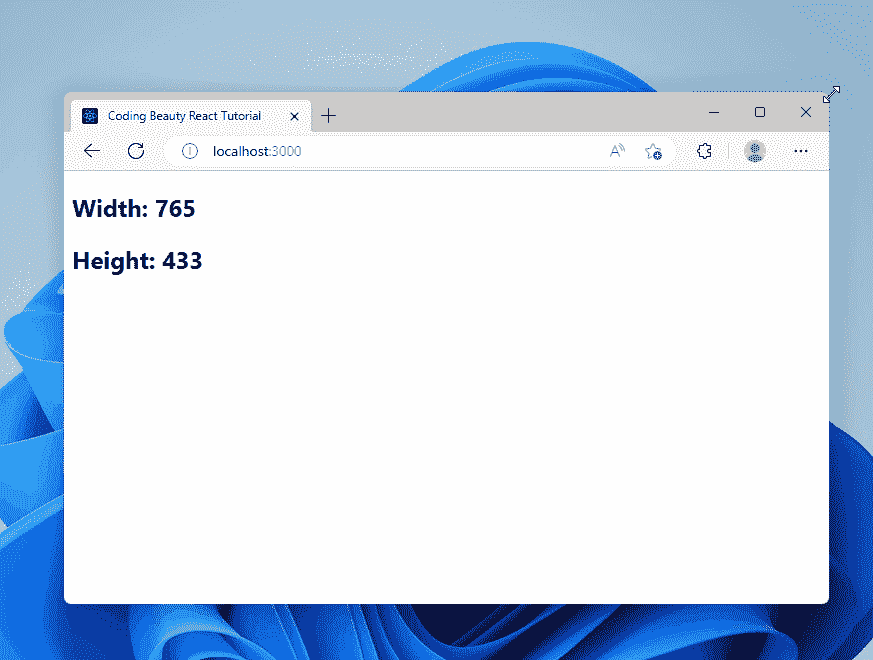

# 如何在 React 中获得窗口的宽度和高度

> 原文：<https://javascript.plainenglish.io/react-get-window-width-height-d47529f56e2c?source=collection_archive---------6----------------------->


要在 React 中获得窗口的宽度和高度，分别访问窗口对象的`innerWidth`和`innerHeight`属性。

`App.js`

```
import { useRef } from 'react';

export default function App() {
  const windowSize = useRef([window.innerWidth, window.innerHeight]);

  return (
    <div>
      <h2>Width: {windowSize.current[0]}</h2>
      <h2>Height: {windowSize.current[1]}</h2>
    </div>
  );
}
```



Displaying the width and height of the window.

属性以像素为单位返回窗口的内部宽度，包括垂直滚动条的宽度，如果它存在的话。

同样，`[innerHeight](https://developer.mozilla.org/en-US/docs/Web/API/Window/innerHeight)`属性以像素为单位返回窗口的内部高度，包括水平滚动条的高度(如果有)。

# 在 React 中调整窗口的宽度和高度

在前面的例子中，我们只需要获取一次窗口的宽度和高度，我们使用了一个 [ref](https://reactjs.org/docs/refs-and-the-dom.html) 来存储它。

相反，如果您想在调整窗口大小时获取它的宽度和高度，您需要向`window`对象添加一个`resize`事件监听器，并创建一个状态变量来跟踪宽度和高度的变化。

`App.js`

```
import { useState, useEffect } from 'react';

export default function App() {
  const [windowSize, setWindowSize] = useState([
    window.innerWidth,
    window.innerHeight,
  ]);

  useEffect(() => {
    const handleWindowResize = () => {
      setWindowSize([window.innerWidth, window.innerHeight]);
    };

    window.addEventListener('resize', handleWindowResize);

    return () => {
      window.removeEventListener('resize', handleWindowResize);
    };
  });

  return (
    <div>
      <h2>Width: {windowSize[0]}</h2>
      <h2>Height: {windowSize[1]}</h2>
    </div>
  );
}
```



The window’s width and height are updated when it is resized.

我们使用`[useState](https://reactjs.org/docs/hooks-state.html)` React 钩子来创建一个状态变量，每当窗口的高度或宽度改变时，这个变量就会更新。

`useState`钩子返回两个值的数组。第一个是存储状态的变量，第二个是在被调用时更新状态的函数。

当一个组件第一次呈现时，以及当一个或多个指定的依赖关系改变时，钩子被用来执行一个动作。在我们的例子中，动作是用`[addEventListener()](https://developer.mozilla.org/en-US/docs/Web/API/EventTarget/addEventListener)`方法为`resize`钩子添加事件监听器。

我们将一个空的 dependencies 数组传递给`[useEffect](https://reactjs.org/docs/hooks-effect.html)`，这样它在组件的生命周期中只被调用一次，并且 resize 事件侦听器只被注册一次——当组件第一次呈现时。

`App.js`

```
 useEffect(() => {
    const handleWindowResize = () => {
      setWindowSize([window.innerWidth, window.innerHeight]);
    };

    window.addEventListener('resize', handleWindowResize);

    return () => {
      window.removeEventListener('resize', handleWindowResize);
    };
  });
```

在`resize`事件监听器中，我们用新的窗口高度和宽度更新状态变量。

我们在`useEffect`中返回的函数是一个在组件中执行清理操作的函数。我们使用`[removeEventListener()](https://developer.mozilla.org/en-US/docs/Web/API/EventTarget/removeEventListener)`方法删除这个清理函数中的`resize`事件监听器，防止内存泄漏。

**注意** : `useEffect`的清理功能在每次重新渲染 后运行 [**，而不仅仅是在组件卸载时。这可以防止当一个可观察属性改变值而组件中的观察者没有取消订阅之前的可观察值时发生的内存泄漏。**](https://reactjs.org/docs/hooks-effect.html#explanation-why-effects-run-on-each-update)

*原载于*[*codingbeautydev.com*](https://cbdev.link/ef6f8e)

# JavaScript 做的每一件疯狂的事情

一本关于 JavaScript 微妙的警告和鲜为人知的部分的迷人指南。


[**报名**](https://cbdev.link/d3c4eb) 立即免费领取一份。

*更多内容请看*[***plain English . io***](https://plainenglish.io/)*。报名参加我们的* [***免费周报***](http://newsletter.plainenglish.io/) *。关注我们关于*[***Twitter***](https://twitter.com/inPlainEngHQ)[***LinkedIn***](https://www.linkedin.com/company/inplainenglish/)*[***YouTube***](https://www.youtube.com/channel/UCtipWUghju290NWcn8jhyAw)*[***不和***](https://discord.gg/GtDtUAvyhW) *。对增长黑客感兴趣？检查* [***电路***](https://circuit.ooo/) *。***