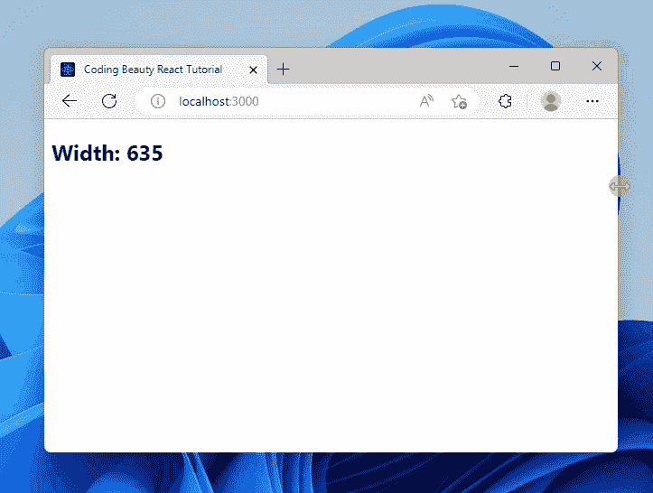
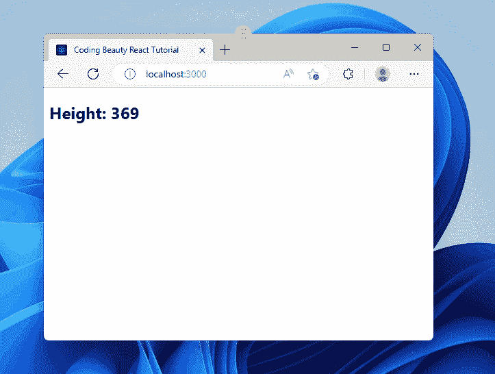

# 如何在 React 中调整窗口的宽度

> 原文：<https://javascript.plainenglish.io/react-get-window-width-on-resize-f50871b93216?source=collection_archive---------6----------------------->


在 React 中调整浏览器窗口的宽度，添加一个`resize`事件监听器到`window`对象，然后访问监听器中的`innerWidth`属性。

例如:

`JavaScript`

```
import { useState, useEffect } from 'react';

export default function App() {
  const [windowWidth, setWindowWidth] = useState(window.innerWidth);
  useEffect(() => {
    const handleWindowResize = () => {
      setWindowWidth(window.innerWidth);
    };
    window.addEventListener('resize', handleWindowResize);
    return () => {
      window.removeEventListener('resize', handleWindowResize);
    };
  });
  return (
    <div>
      <h2>Width: {windowWidth}</h2>
    </div>
  );
}
```



The text is updated with the width of the window when it is resized.

属性以像素为单位返回窗口的内部宽度，包括垂直滚动条的宽度，如果它存在的话。

每当窗口/文档视图的宽度或高度改变时，就会触发`resize`事件。

我们使用`useState` React 钩子来创建一个状态变量，当窗口的宽度改变时，这个变量就会更新。

`[useState](https://reactjs.org/docs/hooks-state.html)`钩子返回两个值的数组。第一个是存储状态的变量，第二个是在被调用时更新状态的函数。

`useEffect`钩子用于在组件第一次呈现时，以及一个或多个指定的依赖关系改变时执行一个动作。在我们的例子中，动作是用`[addEventListener()](https://developer.mozilla.org/en-US/docs/Web/API/EventTarget/addEventListener)`方法为`resize`钩子添加事件监听器。

我们将一个空的依赖数组传递给`[useEffect](https://reactjs.org/docs/hooks-effect.html)`，这样它在组件的生命周期中只被调用一次，并且`resize`事件监听器只被注册一次——当组件第一次呈现时。

`JavaScript`

```
useEffect(() => {
    const handleWindowResize = () => {
      setWindowWidth(window.innerWidth);
    };

    window.addEventListener('resize', handleWindowResize);
    return () => {
      window.removeEventListener('resize', handleWindowResize);
    };
  });
```

在`resize`事件监听器中，我们用新的窗口宽度更新状态变量。

**注意** : `useEffect`的清理功能在每次重新渲染 后运行 [**，而不仅仅是在组件卸载时。这可以防止当一个可观察属性改变值而组件中的观察者没有取消订阅之前的可观察值时发生的内存泄漏。**](https://reactjs.org/docs/hooks-effect.html#explanation-why-effects-run-on-each-update)

# 调整大小时获取窗口高度

我们可以做类似的事情，在调整大小时获取窗口的高度，但是我们将在`resize`事件监听器中使用`window`对象的`innerHeight`属性:

`JavaScript`

```
import { useState, useEffect } from 'react';

export default function App() {
  const [windowHeight, setWindowHeight] = useState(window.innerHeight);
  useEffect(() => {
    const handleWindowResize = () => {
      setWindowHeight(window.innerHeight);
    };
    window.addEventListener('resize', handleWindowResize);
    return () => {
      window.removeEventListener('resize', handleWindowResize);
    };
  });
  return (
    <div>
      <h2>Height: {windowHeight}</h2>
    </div>
  );
}
```



The text is updated with the height of the window when it is resized.

`[innerHeight](https://developer.mozilla.org/en-US/docs/Web/API/Window/innerHeight)`属性以像素为单位返回窗口的内部高度，包括水平滚动条的高度(如果有)。

*原载于*[](https://cbdev.link/59f6a8)

# *JavaScript 做的每一件疯狂的事情*

*一本关于 JavaScript 微妙的警告和鲜为人知的部分的迷人指南。*

**

*[**报名**](https://cbdev.link/d3c4eb) 立即免费领取一份。*

## *更多内容请访问 [PlainEnglish.io](https://plainenglish.io/) 。*

*报名参加我们的 [**免费每周简讯**](http://newsletter.plainenglish.io/) 。关注我们 [**推特**](https://twitter.com/inPlainEngHQ)[**LinkedIn**](https://www.linkedin.com/company/inplainenglish/)**[**YouTube**](https://www.youtube.com/channel/UCtipWUghju290NWcn8jhyAw)**，以及** [**不和谐**](https://discord.gg/GtDtUAvyhW) **。*****

## ***想用内容来扩展你的科技创业吗？检查[电路](https://circuit.ooo/?utm=publication-post-cta)。***

***我们提供免费的专家建议和定制解决方案，帮助您建立对您的技术产品或服务的认知和采用。***