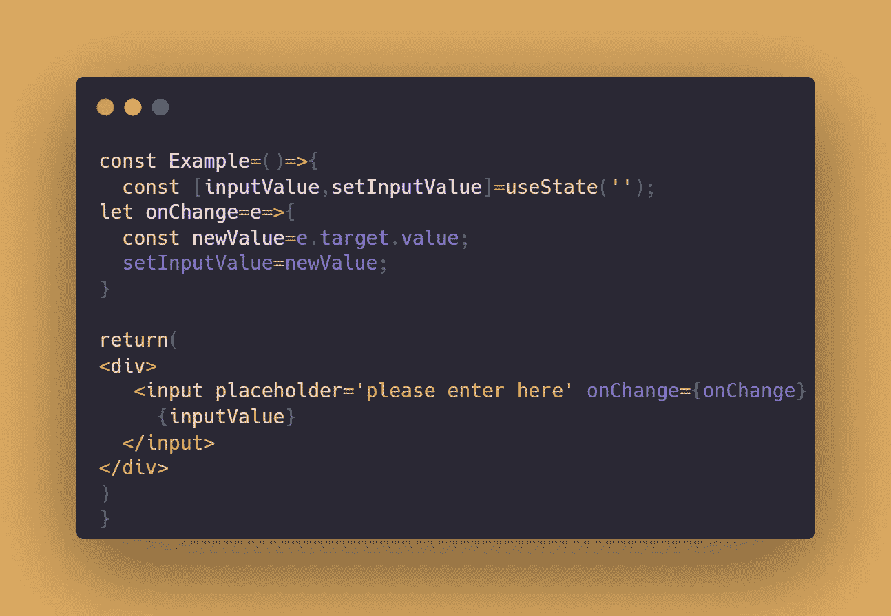
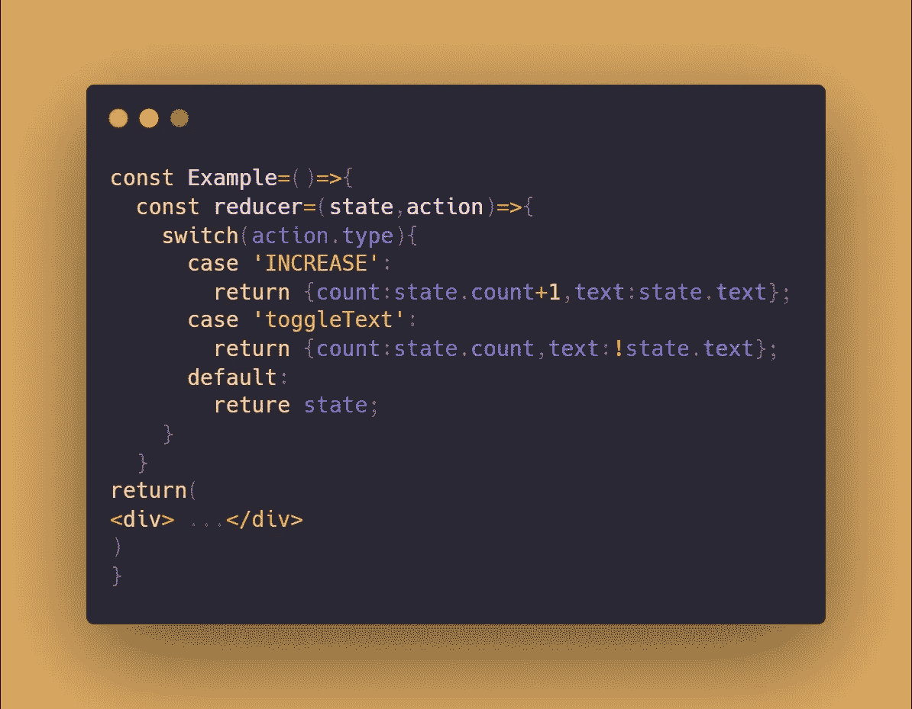
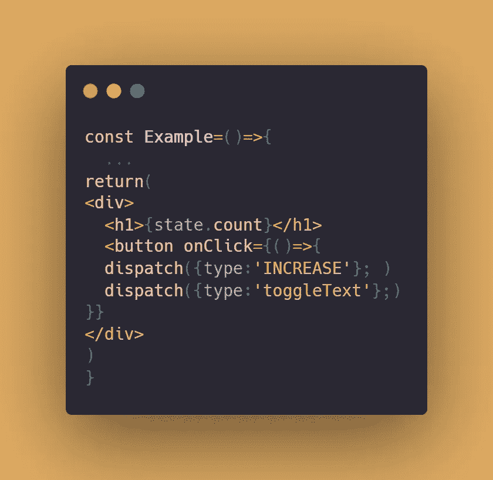
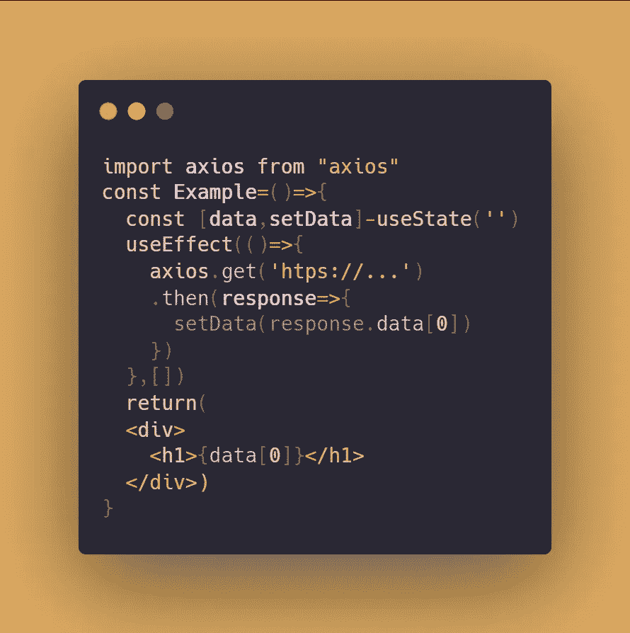
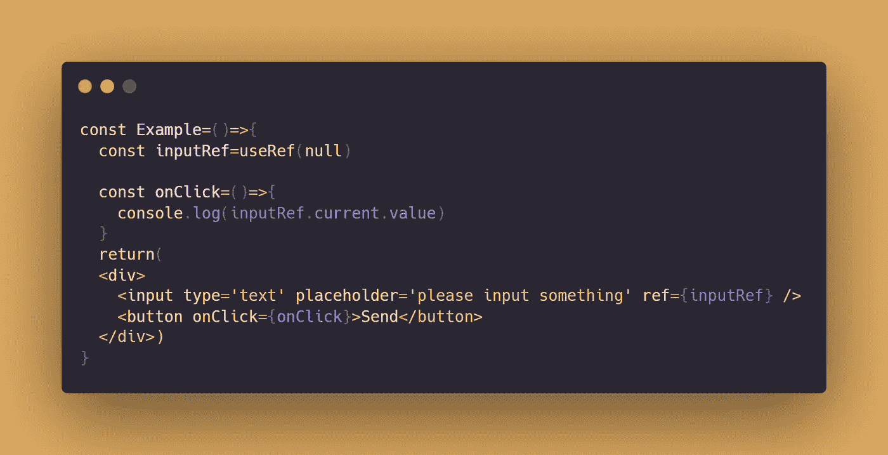
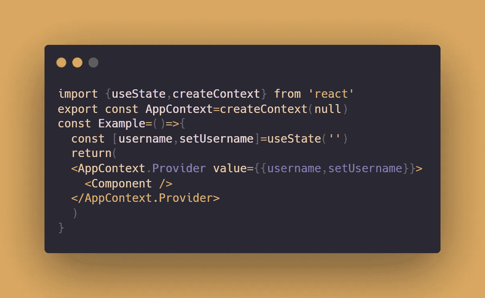
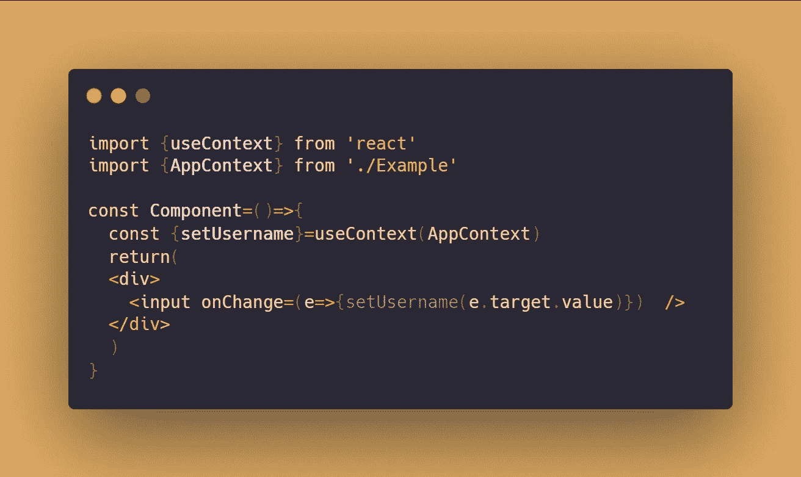
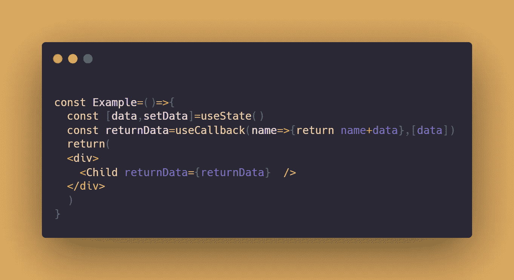

# React Hooks:你需要知道的一切

> 原文：<https://javascript.plainenglish.io/react-hooks-all-you-need-to-know-a014f7bc3eb0?source=collection_archive---------6----------------------->

## 你应该知道的钩子将改变你的发展生活。


Photo by [Vishal Jadhav](https://unsplash.com/@vishu_2star?utm_source=medium&utm_medium=referral) on [Unsplash](https://unsplash.com?utm_source=medium&utm_medium=referral)

经过这么多年对 React 的升级，钩子变得越来越有用，对您的开发之旅越来越必要。目前，React 现在是 16.8 版本。钩子取代了之前频繁使用类的方式。更容易理解复杂的组件并更好地处理状态。

当提到钩子时，最常听到的是 useState 和 useEffect，它们肯定会加快项目的构建。但是，你应该知道其他一些会改变你发展生活的事情。

1.  **使用状态**

存储状态并用 setState()更改它

`const [counter,setCounter]=useState(0);`

计数器的*初始值*为 0

`setCounter(counter+1)`计数器将增加 1，并保持在计数器中。

*例子:*

键入时显示单词



**2。useReducer**

对于更复杂的状态逻辑， `useState` 的替代方式是`useReducer`

用`switch…case`的减少功能`useReducer` 设置状态

`const [state,dispatch]=useReducer(reducer,{count:0,text:showText})`

减速器是随条件改变状态的功能

在计数后写下姓名首字母和文字

当分派状态时，意味着状态改变，然后我们寻找 reducer 函数。



*动作类型*决定状态如何转变。

点击时，我们可以根据不同的类型，用 dispatch 触发 onClick。



如果项目有多个状态，建议使用 useReducer 挂钩

**3。使用效果**

渲染时将调用该操作

例如在页面呈现时获取 API

`useEffect(()=>{…})`调用每次渲染

`useEffect(()=>{…},[])`应用条件调用

例如，每当[？]变化，调用。如果为空[ ]，则调用一次。



**4。useRef**

易于访问和操作 DOM

返回一个“ref”对象

值保存在`refContainer.current`属性中



`useRef(null)`初始设定参考值

记住在输入标签中调用 ref 来连接它们。

点击按钮时，用`.current.value`返回参考值

**5。useLayoutEffect**

`useLayoutEffect`与`useEffect`具有完全相同的签名

不同的是`useLayoutEffect`在 `useEffect`之前运行

`useLayoutEffect`钩子在所有东西渲染之前运行，而`useEffect`在东西显示之后运行

很少使用，但很容易理解其中的区别，并在某些场景中运行

6。useImperativeHandle

> 根据参考定义功能
> 
> `useImperativeHandle`定制使用`ref.`时暴露给父组件的实例值

## 如何操作父组件中的子组件？

*父组件:*

设置`useRef( )`,并将其传递给子组件

*在子组件:*

用 `forwardRef`让裁判传入道具

使用`useImperativeHandle()`设置父母使用的功能

`useImperativeHandle(ref,()=>({function…}))`

文档中的示例:

```
function FancyInput(props, ref) {
  const inputRef = useRef();
  useImperativeHandle(ref, () => ({
    focus: () => {
      inputRef.current.focus();
    }
  }));
  return <input ref={inputRef} ... />;
}
FancyInput = forwardRef(FancyInput);
```

在这个例子中，呈现`<FancyInput ref={inputRef} />`的父组件将能够调用`inputRef.current.focus()`。

**7。使用上下文**



Parent

`createContext`在父组件中，用 `Provider`运行

将父组件中的`value`传递给属性中的子组件



Child

在`AppContext` 中导入以获取设置用户名

`useContext` 在子组件和父组件中操纵状态

8。使用备忘录

*   `useMemo`返回一个记忆值。

`useMemo(function recompute,[data])`:当数据发生变化时，运行该功能

这是存储数据的有效方式

**9。使用回调**

*   `useCallback`返回一个[记忆的](https://en.wikipedia.org/wiki/Memoization)回调。

*在父组件中:*

使用`useMemo`，当状态改变时，功能重新创建。(**值**)

使用`useCallback`，仅重新创建**功能**。



深入了解目前流行使用的挂钩令人惊叹。其他挂钩，如`useDebugValue`、`useDeferredValue`、`useTransition`等等。你可以查看 React [文件](https://reactjs.org/docs/hooks-reference.html)。通常情况下，我在 9 个挂钩中提到的内容可以涵盖您构建更熟练和专业的项目所需的所有内容。

另外，我找到了一个地方[*React Hooks cheat sheet*](https://react-hooks-cheatsheet.com/)进行快速检查，里面有演示。你可以更好的理解每一个钩子。

> 继续做你想做的事。在通往顶峰的路上向我们所有人问好。
> 
> 请跟随并成为我的学习伙伴。和平。✌️

*更多内容看* [***说白了。报名参加我们的***](https://plainenglish.io/) **[***免费周报***](http://newsletter.plainenglish.io/) *。关注我们关于* [***推特***](https://twitter.com/inPlainEngHQ) ， [***领英***](https://www.linkedin.com/company/inplainenglish/) ***，***[***YouTube***](https://www.youtube.com/channel/UCtipWUghju290NWcn8jhyAw)***，以及****[***不和***](https://discord.gg/GtDtUAvyhW)*** *对成长黑客感兴趣？检查出* [***电路***](https://circuit.ooo/) ***。***