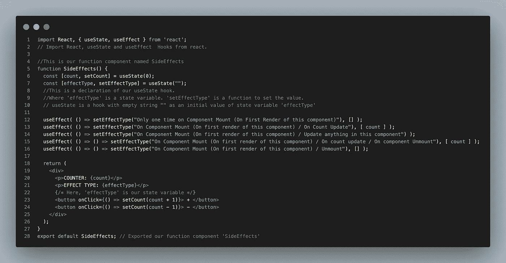
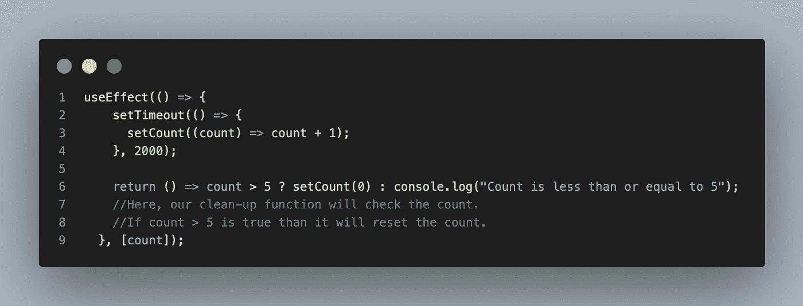

# React Hooks — useEffect()及其不同的用例—两分钟掌握

> 原文：<https://javascript.plainenglish.io/react-hooks-useeffect-and-its-different-use-cases-master-in-2-minutes-a71f4af212bb?source=collection_archive---------9----------------------->

## 2 分钟掌握 useEffect()钩子。

React 挂钩是 React 16.8 版本中添加的 JavaScript 函数。React 不允许在函数组件的主体内部产生副作用，但是我们可以使用`useEffect()` hook 在我们的组件中执行副作用。


[Image](https://pixlr.com/x/#editor) created on Pixlr by the author

## useEffect()

要使用 React 的任何钩子，我们需要将那个特定的钩子导入到我们的组件中，例如`import { useEffect } from ‘react'`。 ***useEffect()*** 钩子将一个函数作为参数，在每次提交到屏幕后运行，不过你可以使用 ***不同类型的 useEffect()*** 声明来控制这一行为。

如果您检查下面陈述的例子，您可以看到在那个组件中使用了五个不同的 useEffect()。每个 useEffect()的行为是不同的，我根据它的行为在每个 useEffect()中有区别地设置了 *effectType* 状态变量的值。



Img: useEffect()

***你可以从*** [***这里***](https://github.com/yagnikkardani/Medium/blob/main/useeffect.js) ***复制上面的代码。***

```
useEffect(() => console.log("On Component Mount"), []);useEffect(() => console.log("On Component Mount / On Count Update"), [count]);useEffect(() => console.log("On Component Mount / Update anything in this component"));useEffect(() => () => console.log("On Component Mount / On count update / On component Unmount"), [count]);useEffect(() => () => console.log("On Component Mount / Unmount"), []);
```

## React 组件通常有两种副作用:

1.  需要清理的副作用。
2.  不需要清理的副作用。

好吧，不要在这里混淆。“清理”听起来很容易理解。在上面列出的不同声明类型中，有一些包含一些依赖关系(在我们的例子中，它是一个状态变量‘count’)。

我们的情况很简单，所以你可以考虑第二种情况——“不清理”。然而，在某些情况下，我们的依赖关系是从外部数据源获取的。假设我们使用“user_id”作为属性来获取用户。在获得那个用户之前，我们决定获得另一个用户，而不是这个用户。在这种情况下， *user_id* 会在先前的获取请求仍在处理中时进行更新。然后，有必要在新的提取开始之前中止先前的提取，以阻止内存/数据泄漏。

清理函数只不过是我们的 useEffect()钩子中的一个返回函数。如果我们的 useEffect()返回一个函数，React 将在组件卸载时运行它，并在运行每个下一个效果之前运行它来清理上一个渲染的效果。

只要看看下面的代码就能快速理解清理功能。在这个例子中，清除函数在运行下一个副作用之前检查计数。如果它发现计数大于 5，它会将其重置为 0。



useEffect() With Clean-up Function

***你可以从*** [***这里***](https://github.com/yagnikkardani/Medium/blob/main/clean_up_function.js) ***复制上面的代码。***

# 结论

本文的目的是快速学习 useEffect()钩子及其用法，希望对你有所帮助。请记住，useEffect()挂钩是 React 组件的副作用，我们可以根据需要以五种不同的方式使用它们。此外，在运行下一个效果之前，清除函数在 useEffect()钩子中非常重要，它可以清除不再需要的数据。要了解 React 的其他重要挂钩，请关注我并保持更新。

[](https://medium.com/@kardaniyagnik/membership) [## 通过我的推荐链接加入 Medium-Yagnik Kardani

### 作为一个媒体会员，你的会员费的一部分会给你阅读的作家，你可以完全接触到每一个故事…

medium.com](https://medium.com/@kardaniyagnik/membership) [](https://www.buymeacoffee.com/kardaniyagnik) [## Yagnik Kardani 正在创建帮助他人成长的技术学习材料。

### 你好👋，我是一名媒体方面的技术作家。我喜欢学习并帮助他人在软件开发和云计算方面成长…

www.buymeacoffee.com](https://www.buymeacoffee.com/kardaniyagnik) 

*更多内容看* [***说白了就是***](https://plainenglish.io/) *。报名参加我们的* [***免费周报***](http://newsletter.plainenglish.io/) *。关注我们* [***推特***](https://twitter.com/inPlainEngHQ) *和*[***LinkedIn***](https://www.linkedin.com/company/inplainenglish/)*。查看我们的* [***社区不和谐***](https://discord.gg/GtDtUAvyhW) *加入我们的* [***人才集体***](https://inplainenglish.pallet.com/talent/welcome) *。*