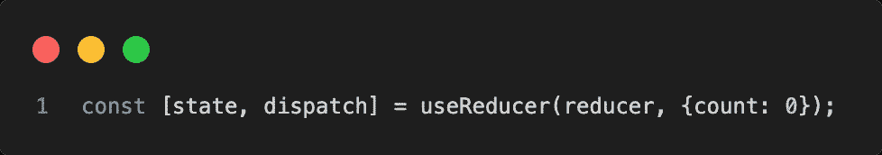
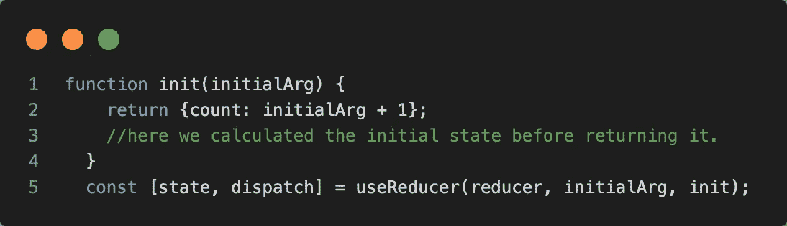

# React Hooks — useReducer() —详细介绍

> 原文：<https://javascript.plainenglish.io/react-hooks-usereducer-ebbb26837749?source=collection_archive---------14----------------------->

## 2 分钟内掌握 useReducer()钩子

React 挂钩是 React 16.8 版本中添加的 JavaScript 函数。useReducer()挂钩类似于 useState()挂钩。当一个复杂的状态逻辑包含多个子值时，或者当下一个状态依赖于前一个状态时，这通常是优选的。

[Image](https://pixlr.com/x/#editor) created on Pixlr by the author

## 正在初始化 useReducer():

useReducer()挂钩接受类型为`(state, action) => newState`的*缩减器*作为第一个参数，并返回与`dispatch`方法配对的当前状态。这个钩子的其他参数定义了初始化 useReducer()钩子的两种不同方式。根据您的使用情况选择:

*   只需将初始状态作为 useReducer()钩子的第二个参数传递:

CodeSnap, taken by Author

*   第二种方式称为 ***惰性初始化*** ，比简单方式更受欢迎。这样我们就可以传递一个' *init'* 函数作为 useReducer()的第三个参数，useReducer()的第二个参数— ' *initialArg'* '就会成为那个函数的一个参数，就像这样:' *init(initialArg)'。*使用这种方式允许我们计算 useReducer()之外的初始状态。如果需要，它还允许我们稍后重置状态。

CodeSnap, taken by Author

## 示例:

看下面的例子。我们有一个带有参数' *initialData* '的 *init* 函数。它返回多个值:parentAge 和 childAge，这些值是根据 initialData 计算的。

然后，我们有一个 reducer 函数来根据给定的动作类型对状态执行动作。最后，我们有了带有 initialData 的主组件' *AgeFinder* '和 useReducer()钩子。我们的组件返回文本字段来更改父母和孩子的年龄。一个值的变化也会改变另一个值。重置按钮用于根据我们提供的*初始数据*重置数值。

# 结论

本文的主要目的是理解 React 中 useReducer()钩子的重要性。我还举例说明了如何在您的应用程序中使用 useReducer()。使用 useReducer()的主要优点是，如果 Reducer 挂钩返回与当前状态相同的值，React 将退出，而不呈现子级或触发效果。

如果你喜欢这篇文章，并想了解更多有趣的东西，请关注我，保持更新。

 [## 通过我的推荐链接加入 Medium-Yagnik Kardani

### 作为一个媒体会员，你的会员费的一部分会给你阅读的作家，你可以完全接触到每一个故事…

medium.com](https://medium.com/@kardaniyagnik/membership)  [## Yagnik Kardani 正在创建帮助他人成长的技术学习材料。

### 你好👋，我是一名媒体方面的技术作家。我喜欢学习并帮助他人在软件开发和云计算方面成长…

www.buymeacoffee.com](https://www.buymeacoffee.com/kardaniyagnik) 

*更多内容请看*[***plain English . io***](https://plainenglish.io/)*。报名参加我们的**[***免费周报***](http://newsletter.plainenglish.io/) *。关注我们关于*[***Twitter***](https://twitter.com/inPlainEngHQ)*和*[***LinkedIn***](https://www.linkedin.com/company/inplainenglish/)*。查看我们的* [***社区不和谐***](https://discord.gg/GtDtUAvyhW) *加入我们的* [***人才集体***](https://inplainenglish.pallet.com/talent/welcome) *。**