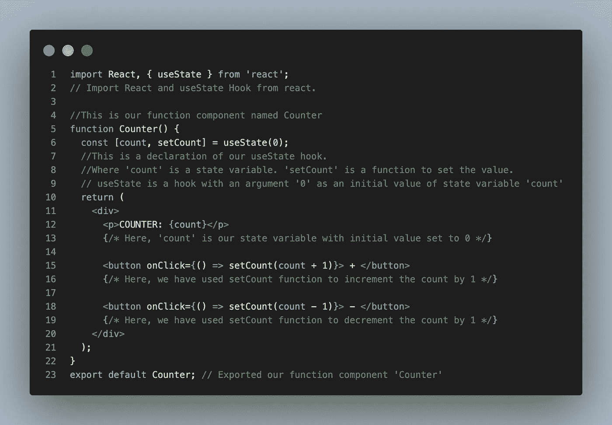

# React Hooks — useState() —详细介绍

> 原文：<https://javascript.plainenglish.io/react-hooks-usestate-become-master-in-2-minutes-19206126fb39?source=collection_archive---------14----------------------->

## 在 2 分钟内掌握 useState()钩子

React 挂钩是 React 16.8 版本中添加的 JavaScript 函数。React `useState`钩子用于跟踪函数组件中的数据或属性。

[Image](https://pixlr.com/x/#editor) created on Pixlr by the author

## 使用状态()

要使用 React 的任何钩子，我们需要将那个特定的钩子导入到我们的组件中，例如`import { useState } from ‘react'`。 ***useState*** 钩子将一个自变量作为初始状态/值，并返回两个参数，value/state 和 function 来设置该值。对于初始渲染，该值将与作为参数传递的初始值相同。

请看下面的例子，以便理解这个钩子的使用情况:

Code Screenshot by the author

*你可以从* [***这里***](https://github.com/yagnikkardani/Medium/blob/main/usestate.js) *复制这段代码。*

## 要使用 React 挂钩，请注意以下规则:

*   只在顶层调用钩子，这意味着不能在循环、条件或嵌套函数中调用它们
*   钩子只能从 React 函数(即函数组件)中调用，而不能从常规 JavaScript 函数中调用。
*   我们也可以在自定义钩子中使用钩子。我们将在另一篇文章中了解这一点。

# 结论

本文的目的是快速学习 useState()钩子，希望对你有帮助。useState 挂钩非常容易理解，但是 React 中还有其他一些重要的挂钩会让您感到困惑。但是，你不需要担心，因为我会为所有的钩子做单独的快速文章。你可以在这里找到它们:**[**use effect()**](https://medium.com/@kardaniyagnik/react-hooks-useeffect-and-its-different-use-cases-master-in-2-minutes-a71f4af212bb)。**

** [## 通过我的推荐链接加入 Medium-Yagnik Kardani

### 作为一个媒体会员，你的会员费的一部分会给你阅读的作家，你可以完全接触到每一个故事…

medium.com](https://medium.com/@kardaniyagnik/membership)  [## Yagnik Kardani 正在创建帮助他人成长的技术学习材料。

### 你好👋，我是一名媒体方面的技术作家。我喜欢学习并帮助他人在软件开发和云计算方面成长…

www.buymeacoffee.com](https://www.buymeacoffee.com/kardaniyagnik) 

*更多内容请看*[***plain English . io***](https://plainenglish.io/)*。报名参加我们的**[***免费周报***](http://newsletter.plainenglish.io/) *。关注我们关于*[***Twitter***](https://twitter.com/inPlainEngHQ)*和*[***LinkedIn***](https://www.linkedin.com/company/inplainenglish/)*。查看我们的* [***社区不和谐***](https://discord.gg/GtDtUAvyhW) *加入我们的* [***人才集体***](https://inplainenglish.pallet.com/talent/welcome) *。****