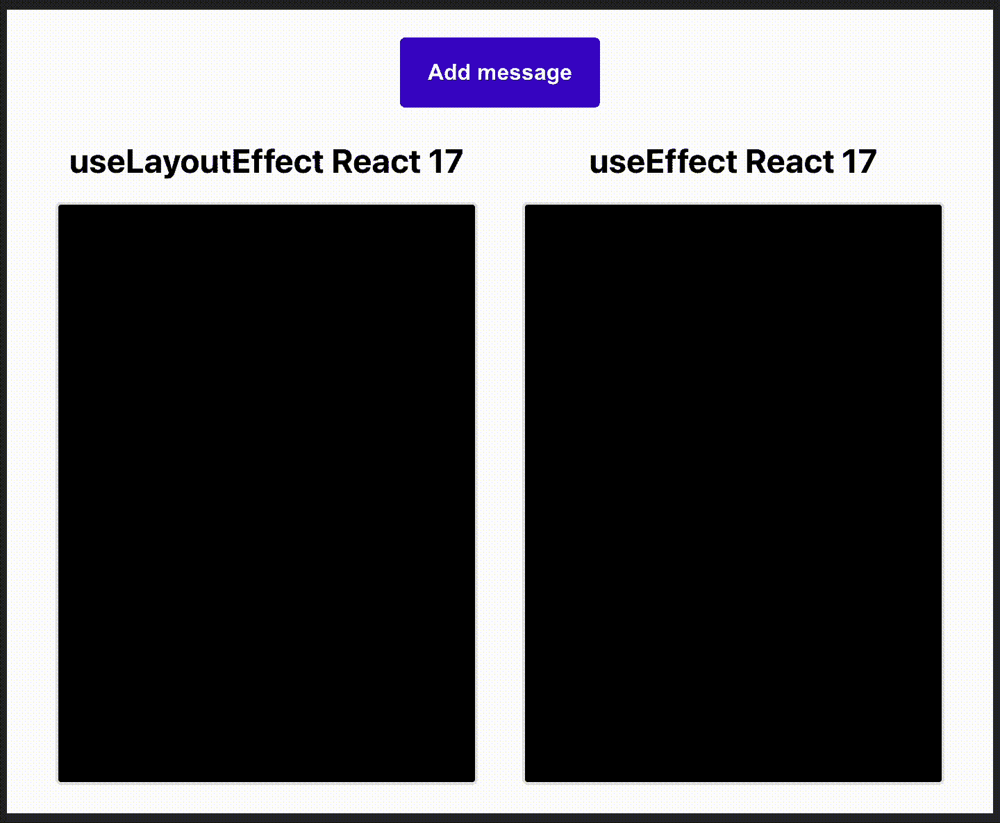
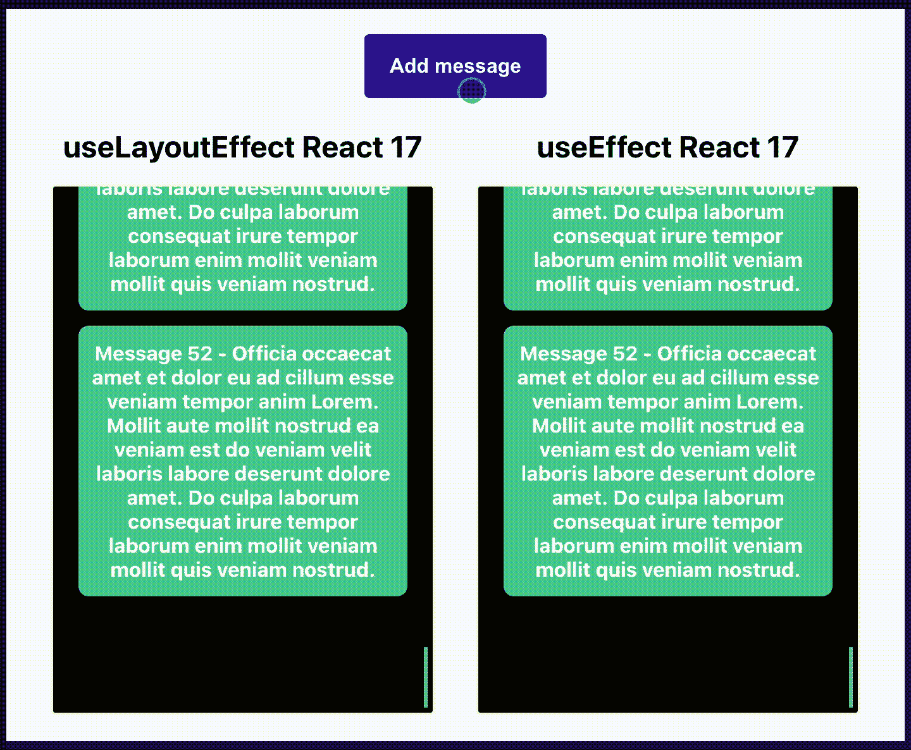
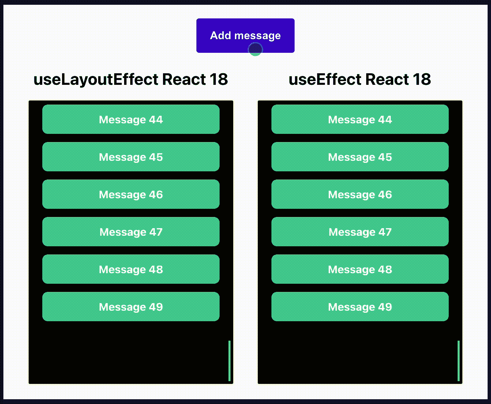

# React 挂钩—何时使用 useLayoutEffect 而不是 useEffect

> 原文：<https://javascript.plainenglish.io/react-hooks-when-to-use-uselayouteffect-instead-of-useeffect-3271a96d881a?source=collection_archive---------0----------------------->

## useEffect 和 useLayoutEffect 的区别——用一个真实的例子来解释。

Photo by [John Schnobrich](https://unsplash.com/@johnschno?utm_source=medium&utm_medium=referral) on [Unsplash](https://unsplash.com?utm_source=medium&utm_medium=referral)

两个 React 钩子( [*useEffect*](https://reactjs.org/docs/hooks-reference.html#useeffect) 和[*useLayoutEffect*](https://reactjs.org/docs/hooks-reference.html#uselayouteffect)***)***签名相同，名字相似，结果相似，有什么区别？与其读一千遍，不如看一遍它们之间的区别！🦉

下面的 gif 显示了两个聊天框——页面加载后，消息被“提取”,然后每个聊天框滚动到底部。左边的框使用`useLayoutEffect`钩子滚动到底部，右边的框使用`useEffect`。**使用** `**useEffect**` **，你可以注意到一些奇怪的闪烁。** **但这是为什么呢？**🤷‍♂️

**useEffect vs useLayoutEffect in React 17 — loading initial data**

*注意:上面的 gif 来自一个使用 React v17 的 app。稍后，我们将使用它进行比较，以了解 React v18+中的不同行为。*

# useLayoutEffect 和 useEffect 的区别

要理解 UI 为什么会闪烁，我们需要先理解两个钩子的区别。**`**useLayoutEffect**`**和** `**useEffect**` **的区别在于挂钩什么时候开火。**在 React 组件生命周期的环境中可以看到这一点:**

## **React 组件的生命周期**

1.  **用户与 app 交互，组件变化的*状态*或*道具*。**
2.  **React 更新文档对象模型(DOM)。**
3.  ****`**useLayoutEffect**`**钩火。******
4.  ****浏览器绘画= >向用户显示视觉变化。****
5.  ******`**useEffect**`**吊钩着火。********

## ****为什么**React 应用程序只在使用效果时闪烁******

****注意`**useLayoutEffect**` **在浏览器绘画和用户看到任何视觉变化**之前触发。这基本上是避免闪烁的秘密。****

******如果你使用** `**useEffect**` **钩子滚动到底部，它只有在消息已经显示给用户之后才会触发(参见组件生命周期),这导致了闪烁。**另一方面，如果使用`useLayoutEffect`钩子，首先将消息添加到 DOM，然后通过改变 DOM 将消息滚动到底部，只有在这之后，才会向用户呈现视觉变化(没有闪烁)。****

## ******何时您应该选择 useLayoutEffect******

****如果你需要直接更新 DOM 并对 UI 进行可视化的修改，你应该使用`useLayoutEffect`。这使它更加平滑，并改善闪烁问题。****

# ****反应 17 和反应 18 中使用效果的不同行为****

****前面的示例显示了消息初始加载时发生的情况。然而，**从 React 18 开始，如果组件的 *props* 或 *state* 因点击**等用户输入而改变，则行为可能会有所不同。****

******使用 React 17** (下面的 gif)**，**如果用户通过点击按钮添加消息，而你使用`useEffect`进行滚动，你仍然可以看到同样的闪烁问题。****

********

*******useEffect vs useLayoutEffect in React 17 — click event*******

****有了 React 18 (下面的 gif)**，**如果用户点击一个按钮添加一条新消息，即使有了`useEffect`，你也能“免费”获得平滑滚动。这是你应该保持你的 npm 包最新的另一个原因。****

********

*******useEffect vs useLayoutEffect in React 18— click event*******

# ******结论******

****`useEffect`和`useLayoutEffect` React 挂钩具有相同的签名，它们都用于副作用。区别在于他们何时开火。在浏览器绘制之前,`useLayoutEffect`钩子触发(在用户可以看到视觉变化之前)。浏览器绘画后会触发`useEffect`钩子。当你直接更新 DOM 时应该使用`useLayoutEffect`来避免闪烁。此外，记得让你的 npm 包和其他工具保持最新，以充分利用它们。****

****如果您喜欢这篇文章，请关注我，了解更多关于 React、JavaScript、TypeScript 等开发的技巧！🚀****

********

## ******GitHub******

****你可以在 GitHub 上找到这篇文章中用于 gif 的 React 应用程序。请随意尝试钩子和不同的 React 版本！💪****

 ****[## GitHub-pix ochi/use-effect-vs-use-layout-effect-react-hooks

### react Hooks——use effect 与 useLayoutEffect，并给出一个真实的例子

github.com](https://github.com/pixochi/use-effect-vs-use-layout-effect-react-hooks)**** 

## ****成为会员****

*****如果你喜欢阅读这样的故事，并想支持我成为一名作家，* [*考虑报名成为一名中等会员*](https://jakub-kozak.medium.com/membership) *。每月 5 美元，你可以无限制地阅读媒体上的故事。如果你* [*用我的链接*](https://jakub-kozak.medium.com/membership) *注册，我会赚一小笔佣金*🙌****

**** [## 通过我的推荐链接加入 Medium 雅各布·科萨克

### 阅读雅各布·科萨克(以及媒体上成千上万的其他作家)的每一个故事。您的会员费直接支持…

jakub-kozak.medium.com](https://jakub-kozak.medium.com/membership) 

## 工作机会——来加入我吧

我在 T21 的团队正在寻找更多的开发者！你有使用 React 和 Ruby on Rails 的经验吗？那就不要犹豫，马上申请吧:[https://www.tjekvik.com/careers](https://www.tjekvik.com/careers)。你可以在欧洲的任何地方工作！🌍**** **** [## 使用 React 进行开发的 10 个最佳代码扩展

### 使用 JavaScript 和 TypeScript 改善您的开发人员体验

jakub-kozak.medium.com](https://jakub-kozak.medium.com/10-best-vs-code-extensions-for-development-with-react-bb1bc9851818)  [## 停止在 React 中使用“&&”进行条件渲染

### 通过在 React 组件中不使用` && '来避免错误

jakub-kozak.medium.com](https://jakub-kozak.medium.com/stop-using-for-conditional-rendering-in-react-a0f7b96200f8)  [## 如何使用带有钩子的 React 上下文进行全局状态管理

### 用 React 的 useContext 创建一个自定义上下文挂钩

javascript.plainenglish.io](/how-to-use-react-context-with-hooks-for-global-state-management-8d7d3526c5af)  [## 最佳时刻。JS 替代方案

### 比较大小、性能、类型脚本支持等

medium.com](https://medium.com/swlh/best-moment-js-alternatives-5dfa6861a1eb)  [## 如何使用 React、TypeScript 和 Webpack 构建 Chrome 扩展

### 从创建样板文件到发布 Chrome 网络商店的完整扩展

medium.com](https://medium.com/swlh/how-to-build-a-chrome-extension-with-react-typescript-and-webpack-92e806ce2e16) 

*更多内容请看*[***plain English . io***](https://plainenglish.io/)*。报名参加我们的* [***免费周报***](http://newsletter.plainenglish.io/) *。关注我们关于*[***Twitter***](https://twitter.com/inPlainEngHQ)[***LinkedIn***](https://www.linkedin.com/company/inplainenglish/)*[***YouTube***](https://www.youtube.com/channel/UCtipWUghju290NWcn8jhyAw)*[***不和***](https://discord.gg/GtDtUAvyhW) *。*******