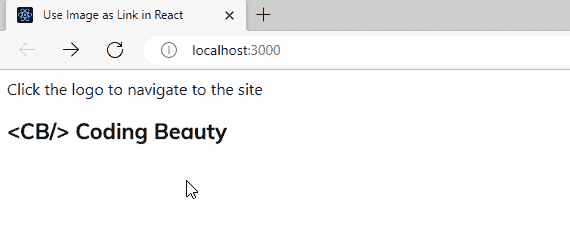

# 如何在 React 中使用图像作为链接

> 原文：<https://javascript.plainenglish.io/react-image-link-4dc90bbfa7bd?source=collection_archive---------5----------------------->

## 了解如何在 React 中轻松使用图像作为链接。


要在 React 中使用图像作为链接，请将图像放在 anchor ( `a`)标签中。单击图像链接将使浏览器导航到指定的 URL。

例如:

`App.js`

```
import cbLogo from './cb-logo.png';

export default function App() {
  return (
    <div>
      Click the logo to navigate to the site
      <br />
      <br />
      <a href="https://codingbeautydev.com" target="_blank" rel="noreferrer">
        </img>
      </a>
    </div>
  );
}
```



Clicking the image link opens the specified URL in a new tab.

我们使用一个`import`语句[将图像](http://codingbeautydev.com/blog/react-link-image)链接到文件中，并将其分配给`img`元素的`src`属性来显示它。

在一个`a`元素上设置的属性将在它包装一个图像时照常工作。例如，在示例中，我们将`a`元素的 target 属性设置为`_blank`，以便在新的选项卡中打开 URL。移除它将使它像正常一样在同一个标签中打开。

出于安全目的，我们还将`rel`道具设置为`noreferrer`。它可以防止打开的页面访问有关打开它的页面的任何信息。

# 使用图像作为反应路由器链接

对于 React Router，您可以通过将图像包装在一个`Link`元素中来使用图像作为链接。

例如:

`ImagePages.jsx`

```
import { Link } from 'react-router-dom';

export default function ImagesPage() {
  return (
    <div>
      <Link to="/nature" target="_blank" rel="noreferrer">
        </img>
      </Link>
    </div>
  );
}
```

*最初发表于*[*codingbeautydev.com*](https://cbdev.link/31fd92)

# JavaScript 做的每一件疯狂的事情

一本关于 JavaScript 微妙的警告和鲜为人知的部分的迷人指南。


[**注册**](https://cbdev.link/d3c4eb) 即可免费领取一份。