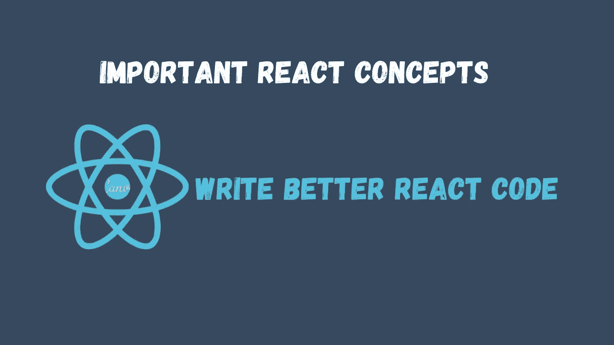

# 你应该知道的 5 个重要的反应概念

> 原文：<https://javascript.plainenglish.io/react-important-concepts-you-should-know-e5bf914749f5?source=collection_archive---------0----------------------->

## 反应最佳实践，这将有助于您编写更干净、更好的代码，并优化性能。

这些重要的 React 概念可以帮助您编写更干净、更好的代码，并优化性能。在本文中，我将分享你应该知道的五个 React 最佳实践。



## 1.使用高阶元件(hoc)

高阶组件是 React 中的一种高级技术，用于增压和重用组件。它将一个组件作为其参数，并返回其他内容。

```
const EnhancedComponent = higherOrderComponent(WrappedComponent);
```

*组件将道具转换成 UI，而高阶组件将组件转换成另一个组件。*

## 2.正确理解 useEffect()钩子

这是重要的事情之一，因为如果你不理解这一点，你将不会有任何反应。我再怎么强调这个钩子的危险性也不为过，你应该正确理解这个钩子以及它与`usestate()`钩子的关系，这样你就不会得到很多无限循环。我喜欢把这个钩子看作是在组件最初被渲染后运行的中间件，我可以谈论更多，但那是改天的文章，如果你想看的话，请跟我来。

## 3.在 React 中延迟加载图像

多个图像会严重影响任何应用程序的性能，为了压缩这个问题，我们避免一次加载所有图像。通过延迟加载，我们可以等到每个图像即将出现在视口中时，才在 DOM 中呈现它们。

## 4.使用动态`import()`在 React 中进行代码拆分

默认情况下，React 应用程序将它们的最终包呈现在一个巨大的文件中，这样做的好处是减少了我们可能对不同文件发出的 HTTP 请求，但随着应用程序变大，文件大小也会增加，这将成为一个严重的问题。通过代码分割，React 允许我们使用动态导入()将一个大的包文件分割成多个块，然后在需要时使用 React.lazy 延迟加载这些块。

## 5.构建自定义挂钩

默认情况下，我们有许多重要的钩子可供我们使用，但是为了进一步扩展组件逻辑，我们构建自定义钩子是很重要的。自定义 React 挂钩是一个重要的工具，可以让您向 React 应用程序添加特殊的、独特的功能。

## 6.Bouns

理解以下内容也很重要:

1.  [定制挂钩](https://reactjs.org/docs/hooks-custom.html)
2.  [React 的钩子规则](https://reactjs.org/docs/hooks-rules.html)
3.  [反应碎片](https://reactjs.org/docs/fragments.html)
4.  [反应上下文和上下文 API](https://reactjs.org/docs/context.html)
5.  [React 门户](https://reactjs.org/docs/portals.html)
6.  [JSX 规则](https://medium.com/nerd-for-tech/jsx-rules-in-react-a-javascript-framework-4b0ab66fdbf9)
7.  [裁判和 DOM](https://reactjs.org/docs/refs-and-the-dom.html)

## 最后

这些是我认为你应该理解的重要概念。如果你喜欢，请留下你的回应，跟随我获得更多的平静。

*更多内容请看**[***说白了。报名参加我们的***](https://plainenglish.io/)***[***免费周报***](http://newsletter.plainenglish.io/) *。关注我们* [***推特***](https://twitter.com/inPlainEngHQ) *和*[***LinkedIn***](https://www.linkedin.com/company/inplainenglish/)*。查看我们的* [***社区不和谐***](https://discord.gg/GtDtUAvyhW) *加入我们的* [***人才集体***](https://inplainenglish.pallet.com/talent/welcome) *。*****