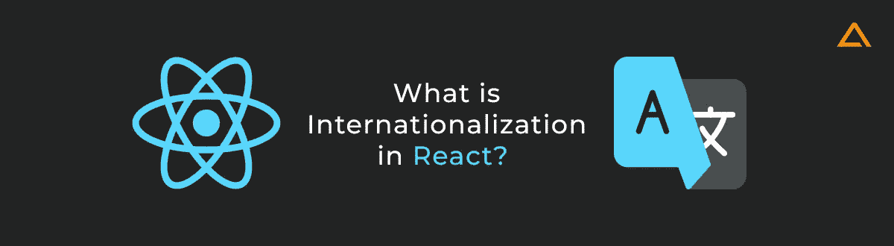

# React 国际化(i18n)和本地化(l10n)指南

> 原文：<https://javascript.plainenglish.io/react-internationalization-i18n-and-localization-l10n-guide-fa3c1162a296?source=collection_archive---------5----------------------->

## *通过遵循适当的* ***React 国际化流程*** 学习如何本地化 React app


React Internationalization (i18n) &Localization (l10n)

*通过遵循适当的* ***React 国际化流程*** *，以及遵循* ***React 国际化最佳实践*** *来学习如何本地化 React 应用程序，使您的应用程序更易于访问，更适合国际市场。*

应用程序国际化是将您的应用程序内容以各种语言提供给更多客户并真正全球化您的应用程序潜力的过程。大多数企业都避免国际化，认为它太复杂，不值得为实现它付出努力。然而，适当的本地化和国际化已经证明了突出应用国际化的影响和重要性。通过集成应用程序本地化和国际化流程，您可以真正提高应用程序的可访问性、可及性和范围。

***Pro 提示:*** *App 国际化也可以缩写为— i18n、intl，App 本地化也常缩写为— l10n。*



# React 中的国际化是什么？

**React 国际化**是指在 React 平台上制作的 app 的国际化。React 是最受欢迎的应用程序开发库之一，被各种流行品牌广泛使用，如脸书、Instagram、SoundCloud Pulse、陀螺仪等。作为构建现代应用的领先技术选择，了解如何在现有或新的 React 应用中实现国际化非常重要。

# React 应用程序国际化的顶级 React I18N 库

React 有自己的库，使得在 React 应用中集成国际化更加容易。以下是 React 最流行的国际化库:


# React 国际化与 React 本地化—b/w I18N 和 L10N 的区别


**React app 国际化**是第一步，React app 本地化是打造全球规模 React app 的第二步。首先，一个国际化的应用程序可以被调整和修改以支持多种语言。然后根据客户的要求，这个国际化的 app 可以明确地本地化为客户要求的特定语言使用。

# 阶段#1 —反应国际化

React 国际化是设计您的 React 应用程序以适应不同语言和地区而不需要工程更改的过程。

**React 国际化的阶段** `Product Design >Product Development >Product Testing (QA)`


# 第 2 阶段—反应本地化

**React 本地化**通过翻译内容和添加特定于语言环境的组件，使国际化的 React 应用程序适应特定的地区/语言。

**反应本地化阶段** `Product Localization>Local Testing and QA>Local Product Marketing`


***也读作:***

[](https://aglowiditsolutions.com/blog/best-react-ui-framework/) [## 2022 年你应该知道的最好的 React UI 框架

### 在前端开发领域工作的开发人员不需要引入 React (ReactJS)库。然而…

aglowiditsolutions.com](https://aglowiditsolutions.com/blog/best-react-ui-framework/) 

# React 应用程序国际化的需求

国际化对于克服软件解决方案的语言障碍非常重要，这些软件解决方案将主要由分布在世界不同地区的各种组织或团队使用。


根据 Statista 在 2020 年进行的一项研究，英语是互联网上最流行的语言，但仅占总市场的 25.9%。这表明英语不一定是互联网的全球语言。这也意味着你没有将你的 React 应用国际化，从而错过了大约 75%的互联网用户，这是一个巨大的市场机会。

# React 国际化如何帮助识别用户区域设置

在国际化应用程序时，需要注意的一个最重要的方面是确定用户的语言环境，以获取目标受众的首选语言。 **React 国际化**有许多不同的方法来应对这一挑战。


**总而言之，有三种确定的检测用户区域设置的方法:**

1.  浏览器的导航器。语言(在客户端对象上)
2.  通过用户的 IP 地址进行地理定位(在服务器上)
3.  接受语言 HTTP 头(在服务器上)

**1。浏览器的导航语言**

浏览器的 navigator.languages 属性返回浏览器的语言版本。它是一个只读属性，返回表示浏览器语言版本的字符串。根据用户在其浏览器上设置的语言偏好，您可以相应地设置 React 应用程序的语言。

**2。通过用户的 IP 地址进行地理定位**

地理定位使用用户的 IP 地址来跟踪他们的区域，并假设该位置的最首选语言为用户的首选语言。例如，如果用户来自加拿大，通过这种方法，为该用户识别的语言主要是英语和法语。但是如果来自加拿大的用户是说西班牙语的少数民族呢？这就是为什么 React 开发人员通常将地理定位作为识别用户地区的最后手段。

**3。接受语言 HTTP 头**

到目前为止，Accept-Language 请求头为用户响应请求提供了一组自然语言。基于此，每种语言被分配一个质量值，该质量值表示该范围所指定的特定语言的用户偏好的优先级或估计数值。整体质量值默认为`q=1`。

`Accept-language: en-CA, ar-EG;q=0.5`

如果我们举个例子，

这意味着“我更喜欢加拿大英语，但也可以接受埃及阿拉伯语”。请注意，没有给`en-CA`分配`'q'`值；因此，`en-CA`的`q`的默认值被假定为`'1'`，这是最高的偏好值。

**也读作:**

[](https://aglowiditsolutions.com/blog/react-performance-optimization/) [## 2022 年 React 性能优化提示

### web 应用程序中的性能问题并不新鲜，开发人员处理这些困难已经有一段时间了…

aglowiditsolutions.com](https://aglowiditsolutions.com/blog/react-performance-optimization/) 

# 如何用 i18next 设置 React 国际化——完整教程

现在，我们已经了解了与 React 国际化及其重要性相关的各种概念，是时候学习如何实现 React 国际化，以使您的 React 应用程序真正全球化，同时又足够本地化，以便任何语言或地区的任何用户都能理解并轻松使用您的应用程序。我们将使用 i18next GitHub 库，因为它是最可靠和高效的 **React 国际化库**之一。


# 1.首先创建一个 React 应用程序

如果你已经有了 React app，可以跳过这一部分。然而，从零开始，我们将首先设置我们的 React 应用程序。以下是如何创建 React 应用程序(CRA):

**运行该命令:**

`npx create-react-app react-i18n-app`

**接下来，我们可以启动服务器:**

`npm start`

# 2.安装所需的依赖项

国际化 React 应用程序的最有效方法是使用 React i18next 库。i18next 是一个广受欢迎的基于 JavaScript 的 **React 国际化框架**。它可以用于许多编程语言和框架，但它与 React 最兼容。为了充分利用 React i18next 库的潜力，我们必须安装一些支持库:

从安装 i18 开始接下来:

`npm install react-i18next --save`

接下来，我们需要一个后端库来帮助我们从源目录中获取翻译，还需要一个语言检测器来帮助识别用户的语言。运行以下命令:

`npm i i18next-HTTP-backend i18next-browser-language detector`

现在，我们需要安装 React Bootstrap 以满足样式要求:

`npm install react-bootstrap@next` [自举@5.1.0](mailto:bootstrap@5.1.0)

# 3.构建主页

接下来，我们将在开始国际化之前创建 React 应用程序的主页。在这里，我们将构建 React 应用程序所需的所有必要组件。

## 导航栏

任何 web 应用程序都需要导航组件。要创建`src/components/Navigation.js`，请编写以下代码:

```
import { Container, Nav, Navbar, NavDropdown } from "react-bootstrap";

function Navigation () {

  return (
    <Navbar bg="light" expand="lg">
      <Container>
        <Navbar.Brand href="#">React i18n</Navbar.Brand>
        <Navbar.Toggle aria-controls="basic-navbar-nav" />
        <Navbar.Collapse id="basic-navbar-nav">
          <Nav className="me-auto">
            <NavDropdown title="Language" id="basic-nav-dropdown">
              <NavDropdown.Item href="#">English</NavDropdown.Item>
              <NavDropdown.Item href="#">French</NavDropdown.Item>
            </NavDropdown>
          </Nav>l
        </Navbar.Collapse>
      </Container>
    </Navbar>
  );
}

export default Navigation;
```

## 标题

接下来，让我们用这段代码创建`src/components/Greeting.js`:

```
function Greeting () {

  return (
    <h1>Hey </h1>
  );
}

export default Greeting;
```

## 文本

创建文本组件— `src/component/Text.js`:

```
function Text () {

  return (
    <p> Thank you for visiting our app.</p>
  )
}

export default Text;
```

现在，要在 web 应用程序上显示这些组件，您需要更改`src/App.js`的内容:

```
import React from 'react';
import { Container } from 'react-bootstrap';
import 'bootstrap/dist/css/bootstrap.min.css';
import Greeting from './components/Greeting';
import Loading from './components/Loading';
import Navigation from './components/Navigation';
import Text from './components/Text';

function App() {

  return (
    <>
      <Navigation />
      <Container>
      	<Greeting />
      	<Text />
      </Container>
    </>
  );
}

export default App;
```

连接到服务器并运行以下代码；它将显示一个简单的 web 应用程序，带有一个导航栏和我们作为组件添加的文本。

**也读作:**

[](https://aglowiditsolutions.com/blog/react-chart-libraries/) [## 2022 年顶级 React 图表库可直观显示您的数据

### 您是否需要针对大规模数据可视化项目的即时可靠的解决方案，而您没有…

aglowiditsolutions.com](https://aglowiditsolutions.com/blog/react-chart-libraries/) 

# 4.为 React 国际化设置 i18next

现在您已经准备好了一个功能正常的 React web 应用程序，我们将设置 i18next 来配置和初始化它。

通过运行以下代码创建路径`src/i18n.js`开始:

```
import i18n from "i18next";
import { initReactI18next } from "react-i18next";
import I18nextBrowserLanguageDetector from "i18next-browser-languagedetector";
import Backend from 'i18next-http-backend';

i18n
  .use(I18nextBrowserLanguageDetector)
  .use(Backend)
  .use(initReactI18next) // passes i18n down to react-i18next
  .init({
    fallbackLng: 'en',
    debug: true,

    interpolation: {
      escapeValue: false // react already safes from xss
    }
  });

  export default i18n;
```

这里我们从 i18next 导入了 i18n。然后，我们还为 i18n 添加了语言检测器和后端插件。此外，我们安装了 initReactI18next 插件，用于连接 i18n 和我们的 React 应用程序。

现在我们通过传递一个 options 对象来初始化 i18n。你可以传递一个选项列表给初始化器。对于这个项目，我们将通过三个选项:

`fall backing` -如果在 i18n 中没有检测到语言，该功能将作为默认语言。当与 web 应用程序交互时，会从用户的首选语言或基于他们之前选择的语言来检测该语言。

`debug` -默认情况下，该功能启用控制台中的调试消息。React 开发人员不需要在生产阶段使用它。

`interpolation`中的`escapeValue`应该设置为 false，因为 React 不会受到跨站点脚本(XSS)的攻击。

# 5.添加翻译文件

`i18next-HTTP-backend`插件将在目录- `public/locales/{language}/translation.json`中搜索翻译文件。这里的`{language}`部分将包含所选语言的代码缩写。例如，`"en"`如果是英语，`"ca"`如果是加拿大英语，等等。

我们将为示例 React 项目添加两种语言——英语(en)和丹麦语(da)。因此，我们需要创建一个 locales 目录，并在它下面创建两个目录，`en`和`da`。

现在，您应该在每个语言变体中创建一个名为`translation.json`的文件。首先，我们开始在`en`文件中添加 translation.json:

```
{
  "greeting": "Hey",
  "text": "Thank you for visiting our app.",
  "language": "Language"
}
```

通过这样做，您创建了三个转换键。当您使用这些键时，键的相关字符串值将以所选语言输出。因此，我们需要在所有语言文件中提供重复的键，但是值应该被翻译以匹配该语言。

记住这一点，我们在 da 文件中创建 translation.json:

```
{
 "greeting": “hej”,
 "text": " Tak" fordi du besøgte vores app.”,
 "language": "sprog"
}
```

# 6.i18n 实例已经可以使用了

现在我们已经在 App.js 中创建了 i18n 文件，我们需要将它导入到 React 项目中:

`import i18n from './i18n';`

导入 i18n 实例和翻译文件后，我们需要确保组件得到渲染。为此，我们利用 React 的暂停获取数据:

```
<Suspense fallback= {<Loading />}>
	<Navigation />
	<Container>
		<Greeting />
        <Text />
    </Container>
</Suspense>
```

在这里，当 i18next 加载翻译文件时，我们传递`Loading`组件作为后备属性。由于我们通过加载添加了一个新的组件，我们需要用下面的代码创建一个新的目录- `src/components/Loading.js`:

```
import { Spinner } from "react-bootstrap";

function Loading () {
  return (
    <Spinner animation="border" role="status">
      <span className="visually-hidden">Loading...</span>
    </Spinner>
  )
}

export default Loading;
```

我们可以用它来翻译应用程序组件和子组件的字符串。

# 7.使用 useTranslation 函数翻译字符串

翻译字符串在 i18next 中有多种用法。React 开发人员最喜欢的方法之一是使用`useTranslation`钩子。用这种方法，你可以很容易地翻译字符串。

让我们从翻译`Greeting`组件开始:

```
function Greeting () {
  const { t } = useTranslation();
    ...
}
```

在“问候”组件的开头添加了这段代码之后，我们用我们刚刚从`userTranslation`引入的`t`的翻译函数替换了从“嘿”返回的 JSX 的内部内容:

```
return (
    <h1>{t('greeting')}</h1>
  );
```

接下来，我们对文本等其他组件重复相同的过程:

```
import { useTranslation } from "react-i18next";
function Text () {
  const { t } = useTranslation();

  return (
    <p>{t('text')}</p>
  )
}

export default Text;
```

现在导航组件也有了一个文本元素“语言”。我们还将翻译“语言”部分的文本:

`<NavDropdown title={t('language')} id="basic-nav-dropdown">`

现在，如果我们检查 web 应用程序的前端，我们会注意到没有什么变化，内容仍然是英文的。然而，因为我们使用了传递翻译函数，所以它比实际的字符串更重要。我们可以看到它正在输出正确的字符串；它显示 i18next 正在正确地加载翻译，在前端显示正确的语言。

注意——如果您试图通过使用我们之前在初始阶段设置的下拉菜单来改变网站的语言，什么都不会改变。虽然我们已经在后端添加了不同的语言文件，但是我们还没有连接该功能来根据用户点击的语言改变语言。

# 8.允许更改网站语言

您的用户应该有权更改 React 网站的语言。为此，我们需要设置一个 React web 应用程序的所有部分都可以访问的上下文。创建“上下文”消除了通过各种组件/级别传递任何状态的需要。

首先，通过添加以下代码来创建文件— `src/LocaleContext.js`:

```
import React from "react";

const defaultValue = {
  locale: 'en',
  setLocale: () => {}
}

export default React.createContext(defaultValue);
```

现在在 src/App.js 目录中创建州区域设置:

```
function App() {
  const [locale, setLocale] = useState(i18n.language);
```

这里我们传递 i18n.language 作为初始值。language 属性表示当前选择的语言。i18n 加载所有翻译的总时间将会更长；因此初始值将保持`undefined`。因此，我们需要利用 i18n 触发的`languageChanged`事件，当语言被初始加载和改变时。

`i18n.on('languageChanged', (lng) => setLocale(i18n.language));`

现在，我们应该用上下文提供者包围返回的 JSX:

```
<LocaleContext.Provider value={{locale, setLocale}}>
      <Suspense fallback={<Loading />}>
        <Navigation />
          <Container>
            <Greeting />
            <Text />
          </Container>
	</Suspense>
</LocaleContext.Provider>
```

现在，您可以通过任何子组件来访问 locale 和 setters。现在，为了更改语言，您仍然需要一个侦听器函数，它通过导航栏中下拉链接上的单击事件来触发语言更改。为此，我们将从函数开始时的上下文中获取区域设置状态:

`const { locale } = useContext(LocaleContext);`

这样做添加了一个监听器组件，它将改变 i18n 中的语言:

```
function changeLocale (l) {

if (locale !== l) {

i18n.changeLanguage(l);

}

}
```

现在，我们将侦听器绑定到两个下拉项目(英语和丹麦语)的 click 事件:

```
<NavDropdown.Item href="#" onClick={() => changeLocale('en')}>English</NavDropdown.Item>
              <NavDropdown.Item href="#" onClick={() => changeLocale('da')}>Danish</NavDropdown.Item>
```

现在，当您打开 web 应用程序并更改语言时，您将看到基于您选择的语言的翻译页面。即使在设置了您的首选语言后刷新页面，页面也将保持相同的语言，除非您使用其他下拉项目手动更改它。

# 9.移动翻译文件的位置

您的翻译文件默认位于`public/locales/{language}/translation.json`目录中。但是，如果您愿意，可以更改这一点。

要更改翻译文件的位置，请将`src/i18n.js`目录中的`.use(Backend)`更改为以下内容:

```
.use(new Backend(null, {

loadPath: '/translations/{{lng}}/{{ns}}.json'

}))
```

**包装完毕！**

这里的加载路径是相对于公共的。使用上面提到的路径，您可以将翻译文件转移到标记为 translations 的目录中。您还可以更改 loadPath 的值，将 language 作为第一个参数，将 namespace 作为第二个参数。

您最终拥有了一款国际化的 React 应用程序，可以根据不同的语言和地区轻松进行本地化，使您的应用程序更容易被全球各地的人们访问，扩大您的目标受众，产生更好的收入流，并使您的业务真正全球化。

*原载于 2022 年 3 月 29 日 https://aglowiditsolutions.com*[](https://aglowiditsolutions.com/blog/react-internationalization-localization/)**。**

**更多内容看* [***说白了。报名参加我们的***](https://plainenglish.io/) **[***免费周报***](http://newsletter.plainenglish.io/) *。关注我们关于*[***Twitter***](https://twitter.com/inPlainEngHQ)*和**[***LinkedIn***](https://www.linkedin.com/company/inplainenglish/)*。加入我们的* [***社区不和谐***](https://discord.gg/GtDtUAvyhW) *。*****