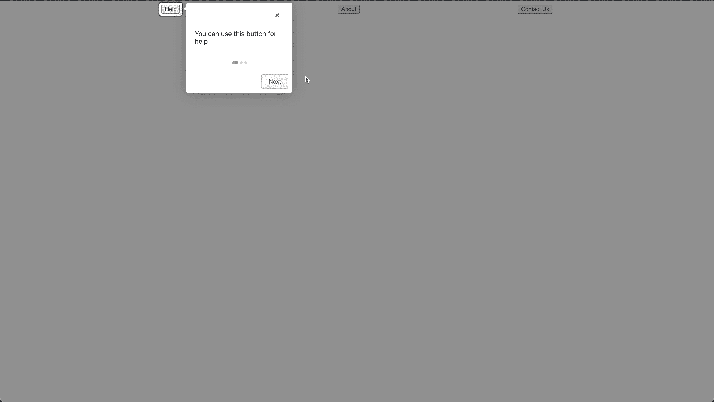
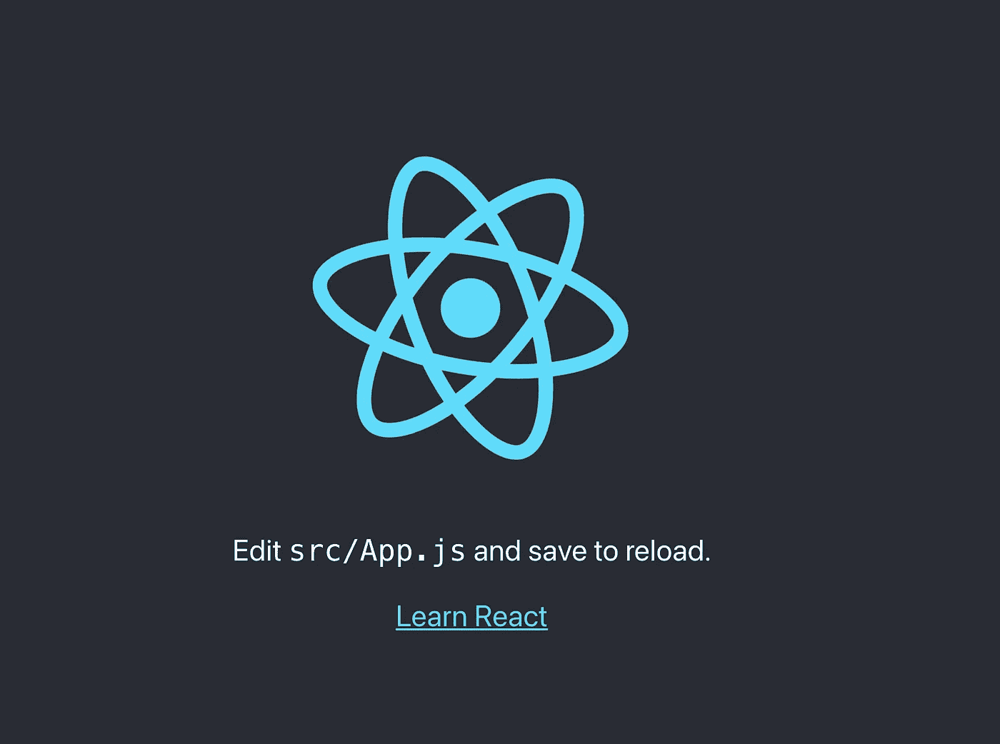

# React.js Onboarding 使用 Intro.js

> 原文：<https://javascript.plainenglish.io/react-js-onboarding-using-intro-js-4b03aa2f584e?source=collection_archive---------0----------------------->

## Intro.js 的基本用法演示


在从事开源项目(Care Amarillo)时，我一直在寻找一种方法来指导新用户。我以前用过 Intro.js，所以我搜索并找到了它的 React 包装器。我将演示这个包的基本用法。

[](https://www.npmjs.com/package/intro.js-react) [## intro.js-react

### 围绕 Intro.js 的一个小的 React 包装器。该包装器提供了对步骤和提示的支持。你可以找一个小…

www.npmjs.com](https://www.npmjs.com/package/intro.js-react) 

下面是我们想要实现的目标的一个小例子:



首先，让我们创建一个空白的 react 应用程序。我使用 create-react-app 来设置样板代码。如果您还没有，可以参考以下文档:

[](https://github.com/facebook/create-react-app) [## GitHub-Facebook/create-react-app:通过运行一个命令来设置一个现代化的 web 应用程序。

### 创建没有构建配置的 React 应用程序。Create React 应用程序可以在 macOS、Windows 和 Linux 上运行。如果某事…

github.com](https://github.com/facebook/create-react-app) 

在终端中运行命令(确保您在这个项目的根目录中):

```
npx create-react-app onboarding
```

注意“onboarding”是我给 React 应用程序起的名字。

构建完成后，您可以在终端中使用以下命令运行应用程序:

```
npm start
```

您将看到初始模板，如下所示:



接下来打开 App.js。

代码最初是这样的:

```
import logo from './logo.svg';
import './App.css';
function App() {
  return (
    <div className="App">
      <header className="App-header">
        
        <p>
          Edit <code>src/App.js</code> and save to reload.
        </p>
        <a
          className="App-link"
          href="https://reactjs.org"
          target="_blank"
          rel="noopener noreferrer"
        >
          Learn React
        </a>
      </header>
    </div>
  );
}
export default App;
```

让我们把它改成这样:

```
import logo from './logo.svg';
import './App.css';
function App() {
  return (
    <div className="App">
      <div id="buttonRow">
        <button id="help">Help</button>
        <button id="about">About</button>
        <button id="contact">Contact Us</button>
      </div>
    </div>
  );
}
export default App;
```

请注意，我们删除了 header 元素，并添加了一行按钮。

接下来，打开 App.css 文件并添加 buttonRow CSS:

```
#buttonRow{
  display: flex;
  justify-content: space-evenly;
  padding: 8px;
}
```

接下来，我们需要安装 intro.js react 包。在您的终端中运行以下命令:

```
npm i intro.js-react
```

再次打开 App.js 并添加这两个导入:

```
import { Steps } from 'intro.js-react';
import React, {useState} from 'react';
```

现在，在 buttonRow 的正上方添加 Intro.js 步骤组件:

```
<Steps
    enabled={enabled}
    steps={steps}
    initialStep={initialStep}
    onExit={onExit}
/>
```

完整的 HTML 应该是这样的:

```
<div className="App">
    <Steps
        enabled={enabled}
        steps={steps}
        initialStep={initialStep}
        onExit={onExit}
     />
     <div id="buttonRow">
        <button id="help">Help</button>
        <button id="about">About</button>
        <button id="contact">Contact Us</button>
     </div>
</div>
```

由于 App.js 是一个功能组件，我们将对 enabled、steps 和 initialStep 使用钩子。将这段代码添加到返回 HTML 的代码的正上方。

```
const [enabled,setEnabled] = useState(true)
const [initialStep,setInitialStep] = useState(0)

const onExit = () => {
    setEnabled(false)  
}
const steps = [
    {
      element: '#help',
      intro: 'You can use this button for help',
      position: 'right',
    },
    {
      element: '#about',
      intro: 'You can use this button to get more information',
    },
    {
      element: '#contact',
      intro: 'You can use this button to contact us',
    },
];
```

我们已经将 enabled 设置为 true，将 initialStep 设置为 0。每当用户到达这个屏幕时，这将自动生成 Intro.js。onExit 函数在我们退出后禁用 Intro.js。

steps 对象定义了我们的步骤。在我们的例子中，我们使用 id，但是这个包也支持其他的选择器。Intro 定义了我们希望每个步骤传达的信息。

重新加载页面，这应该是您的结果:


以下是 App.js 的完整源代码:

```
import './App.css';
import 'intro.js/introjs.css';
import { Steps } from 'intro.js-react';
import React, {useState} from 'react';
function App() {
    const [enabled,setEnabled] = useState(true);
    const [initialStep,setInitialStep] = useState(0);

    const onExit = () => {
        setEnabled(false)
    }

    const steps = [
        {
            element: '#help',
            intro: 'You can use this button for help',
            position: 'right',
        },
        {
            element: '#about',
            intro: 'You can use this button to get more information',
        },
        {
            element: '#contact',
            intro: 'You can use this button to contact us',
        },
    ];

    return (
        <div className="App">
            <Steps
              enabled={enabled}
              steps={steps}
              initialStep={initialStep}
              onExit={onExit}
            />
            <div id="buttonRow">
                <button id="help">Help</button>
                <button id="about">About</button>
                <button id="contact">Contact Us</button>
             </div>
        </div>
     );
}

export default App;
```

感谢您花时间阅读这篇文章！

通过我的推荐链接加入 Medium。你的会员费直接支持克里斯托弗咖啡和你阅读的其他作家。你也可以在媒体上看到所有的故事。

[](https://cmcoffee.dev/membership) [## 加入我的推荐链接-克里斯托弗咖啡媒体

### 阅读 Christopher Coffee(以及 Medium 上成千上万的其他作家)的每一个故事。您的会员费直接…

cmcoffee.dev](https://cmcoffee.dev/membership) 

*更多内容请看*[***plain English . io***](http://plainenglish.io/)*。报名参加我们的**[***免费周报***](http://newsletter.plainenglish.io/) *。在我们的* [***社区获得独家访问写作机会和建议***](https://discord.gg/GtDtUAvyhW) *。**