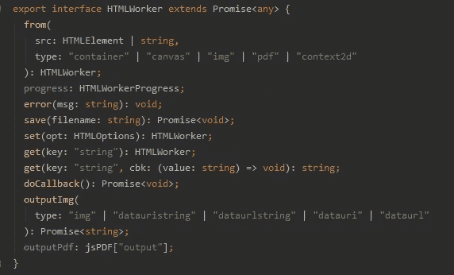
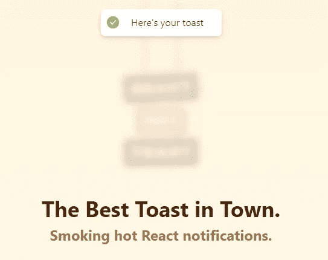

# 使用反应构建 jsPDF 下载状态指示器

> 原文：<https://javascript.plainenglish.io/react-jspdf-download-status-indicator-613cff7a938d?source=collection_archive---------4----------------------->

## 当使用 jsPDF.html()时，如何为您的用户提供一个现代的 UX


A successful download

# 问题是

我最近一直在使用 jsPDF 库来创建网页的 PDF 快照。这是非常无缝的，但是我意识到当页面快照是“处理/格式化”时，没有 UI 反馈来告诉用户某件事实际上正在发生——这是糟糕的 UX！

我找不到一个清晰简单的方法来显示负载或状态指示器。通过结合 jsPDF、快速反应和一点承诺知识，我们可以创建一个简单的现代 UX 来解决这个问题。

如果您想直接跳到代码上，请到这里来！

# 解决方案

我们将使用 jsPDF 库来生成和保存我们的 PDF，用热吐司来显示我们的通知，并把它作为我们选择的 JavaScript UI 框架。

## doc.html()和 doc.save()

`.html()`是 JsPDF 从 HTML 元素生成 PDF 的方式。`.html`方法通常调用回调来保存(下载)新生成的 PDF。这里有一个简单的例子；

```
//Generate and save a PDF of the current page body called savedPDF.pdfdoc.html(document.body, {
        callback: function (pdf) {
          pdf.save("savedPDF");
        }
      })
```

最初，在查看这段代码时，我尝试通过回调设置 loading/error/completed useStates，但是很快就变得混乱了。有一种更简单的方式——**使用诺言**。

## HTMLWorker 承诺

如果您查看 JsPDF 库的 typescript 索引文件，您可以找到`.html()`方法的类型和定义。


.html() method definition

这告诉我们，我们需要提供一个字符串或 HTMLElement 作为我们的第一个参数，并且我们可以选择使用 HTMLOptions 界面中的任何方法——这就是`callback: (){}`保存 pdf 的来源。

您还会注意到`.html()`方法返回了一个 HTMLWorker 类型。这实际上只是一个带有一些扩展的标准 JS Promise。



就像任何其他承诺一样，这将从待定变为已解决或已拒绝。我们可以使用这些状态来显示通知。

## 显示通知

反应热吐司是一个非常简单的小库，用于显示吐司通知。



敬酒有很多种方式，但我们将重点介绍以 JS Promise 为参数的`toast.promise()`方法。
一旦我们给了它一个承诺，toast 库就会根据承诺的状态 ***整理出它应该显示什么*。****

**—显示微调器* ***已解决*** *—显示绿色勾号* ***已拒绝*** *—显示红色叉号* (如果您愿意，这些当然是完全可定制的)*

*所以我们需要做的就是给`toast.promise()`一个有效的承诺，比如由`doc.html()`返回的承诺。使用与上面相同的代码，我们可以这样做:*

```
*toast.promise(
      doc.html(document.body, {
        callback: function (pdf) {
          pdf.save("savedPDF");
        }
      }),
      //Custom messages to show the user
      {
        loading: "Downloading file...",
        error: "Download failed. Please try again.",
        success: "Download successful"
      }
    );*
```

*最后一步是在 React 组件返回的 JSX 中的某处包含一个`<Toaster/>`组件。*

```
*return <div>
    <div>Content here</div>
    <Toaster/>
</div>*
```

***就是这样！***

*如果你想看完整的工作示例，请查看这个 CodeSandbox。感谢阅读。*

*如果你喜欢这篇文章或者觉得它有用，请随意。或者，你可以在这里的 Medium [*上支持我*](https://jamesmbrightman.medium.com/membership) *或者给我买一杯* [*咖啡*](https://ko-fi.com/jamesbrightman) *！非常感谢所有的支持。**

**更多内容请看* [***说白了。报名参加我们的***](https://plainenglish.io/) **[***免费周报***](http://newsletter.plainenglish.io/) *。关注我们关于*[***Twitter***](https://twitter.com/inPlainEngHQ)*和*[***LinkedIn***](https://www.linkedin.com/company/inplainenglish/)*。加入我们的* [***社区不和谐***](https://discord.gg/GtDtUAvyhW) *。****