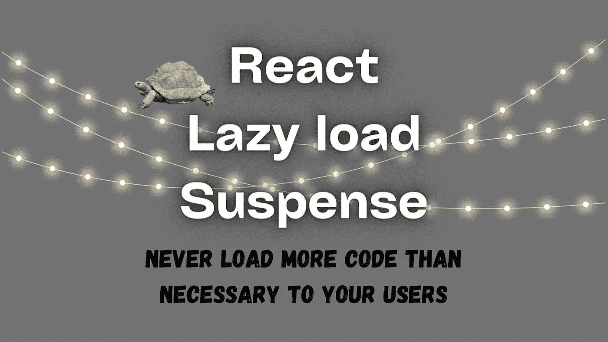

# 对延迟加载和暂停做出反应，以获得更好的性能

> 原文：<https://javascript.plainenglish.io/react-lazy-load-suspense-for-better-performance-2458735b980e?source=collection_archive---------13----------------------->

## 向您最终用户注入不必要的代码会导致性能泄漏，需要加载更多的代码，即使实际上只需要很少一部分代码。



# 惰性负载——为什么它如此强大？

React 应用程序可以轻松增长，可以添加越来越多的组件，这些组件可以包含 10-500 行代码或更多(不推荐)，第三方请求等等。即使最终用户页面不需要加载每个组件，也会降低 React 应用程序的性能，损害用户体验。

## 加载组件而不加载惰性负载

```
import React from 'react';
import GalleryComponent from './GalleryComponent'

const HomeComponent = () => (
  <div>
    <GalleryComponent />
  </div>
)
```

## 用惰性负载加载组件

```
import React, { lazy } from 'react';

const GalleryComponent = lazy(() => import('./GalleryComponent'));

const HomeComponent = () => (
  <div>
    <GalleryComponent />
  </div>
)
```

如你所见，添加惰性负载非常简单，也非常值得。只有当`<HomeComponent/>`组件被加载时，`<GalleryComponent />`也会被加载。

> 这种称为**动态导入**的导入类型，这样我们就可以使用这种方法在组件级别上轻松地对**React 应用程序进行代码拆分**。

# 延迟加载和暂停组合

既然我们知道了惰性负载是如何工作的，以及它如何帮助我们反应应用程序性能和用户体验，为什么我们还需要反应悬念呢？

让我们看一下我们之前使用的同一个例子，但是现在让我们假设`<GalleryComponent />`包含一个问题，比如:API 请求需要几秒钟返回结果，JavaScript 负载大，设备较弱或者网络连接不好。

```
import React, { lazy } from 'react';

/* 
  - GalleryComponent contain API request / large JavaScript payload. 
*/
const GalleryComponent = lazy(() => import('./GalleryComponent'));

const HomeComponent = () => (
  <div>
    <GalleryComponent />
  </div>
)
```

在这种情况下，用户将会看到几秒钟的空白区域，直到从`<GalleryComponent />`收到结果，这不利于用户体验，这就是 React 悬念的目的。

反应暂停帮助我们向用户显示一条消息或另一个组件，告诉用户该组件正在加载，因此用户会在加载延迟时看到这条消息。

```
import React, { lazy, Suspense } from 'react';

const GalleryComponent = lazy(() => import('./GalleryComponent'));

const renderLoader = () => <p>Loading...</p>;

const DetailsComponent = () => (
  <Suspense fallback={renderLoader()}>
    <GalleryComponent />
  </Suspense>
)
```

暂停接收一个回退组件，它将在加载延迟时向用户显示。这样，当`<GalleryComponent />`加载时，用户将会看到“正在加载…”的消息。

## 挂起多个组件

```
import React, { lazy, Suspense } from 'react';

const GalleryComponent = lazy(() => import('./GalleryComponent'));
const MoreGalleryComponent = lazy(() => import('./MoreGalleryComponent'));
const GalleryInfoComponent = lazy(() => import('./GalleryInfoComponent'));

const renderLoader = () => <p>Loading...</p>;

const DetailsComponent = () => (
  <Suspense fallback={renderLoader()}>
    <GalleryComponent />
    <MoreGalleryComponent />
    <GalleryInfoComponent />
  </Suspense>
)
```

这里我们可以看到 React Suspense 是多么的**非常有用**,“正在加载…”消息将一直显示给用户，直到所有组件都已获取完毕，只有这样用户才能**看到它们同时显示**。

感谢你到目前为止的阅读，如果你喜欢这样的内容，并且你想支持我作为一个程序员和作家写更多这样的文章，尽你所能提高这篇文章的排名和 [***请用我的链接注册成为 Medium 的会员(5 美元/月订阅)，你将可以无限制地访问 Medium 上的所有内容。***](https://medium.com/membership/@nissimzarur)

*更多内容看* [***说白了就是 io***](https://plainenglish.io/) *。报名参加我们的* [***免费周报***](http://newsletter.plainenglish.io/) *。关注我们关于*[***Twitter***](https://twitter.com/inPlainEngHQ)*和*[***LinkedIn***](https://www.linkedin.com/company/inplainenglish/)*。查看我们的* [***社区不和谐***](https://discord.gg/GtDtUAvyhW) *加入我们的* [***人才集体***](https://inplainenglish.pallet.com/talent/welcome) *。*