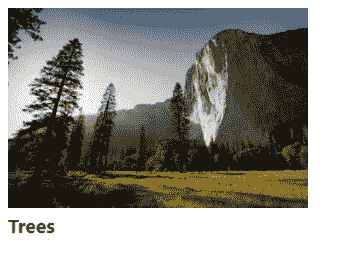

# 如何在 React 中链接图像

> 原文：<https://javascript.plainenglish.io/react-link-image-b2708e25dc92?source=collection_archive---------7----------------------->

## 关于如何在 React 中链接和显示远程或本地图像的教程。


要在 React 中链接一个本地图像，将该图像放在文件的顶部，并将其分配给一个`img`元素的`src`属性。

例如:

`App.js`

```
// 👇 import image from file
import myImage from './my-image.jpg';export default function App() {
  return (
    <div>
      {/* 👇 show image */}
       <br /> <span
        style={{
          color: 'green',
          fontSize: '1.2em',
          fontWeight: 'bold',
        }}
      >
        Trees
      </span>
    </div>
  );
}
```



当使用像 Create React App 这样的基于 Webpack 的工具时，这种方法是可行的。

请注意，图像文件必须在项目目录中才能成功导入。如果文件在项目目录之外，将会出现错误。

# 用`require()`功能链接图片

或者，我们可以使用`require()`函数在 React 中链接图像。

下面的代码示例将在页面上产生与第一个示例完全相同的结果。

`App.js`

```
export default function App() {
  return (
    <div>
      {/* 👇 */}
       <br />
      <span
        style={{
          color: 'green',
          fontSize: '1.2em',
          fontWeight: 'bold',
        }}
      >
        Trees
      </span>
    </div>
  );
}
```

这里`require()`的优势是它不需要在页面的顶部。我们可以简单地将`require()`的结果赋给`src` prop，而不必将其存储在变量中。

# 在`public`文件夹中链接图像

在 React 中链接图像的另一种方法是将它放在`public`文件夹中，并用其相对路径引用它。

例如，如果我们将`my-image.png`文件放在`public`文件夹中，我们将能够在页面上显示它，如下所示:

`App.js`

```
export default function App() {
  return (
    <div>
      {/* 👇 show image */}
       <br /> <span
        style={{
          color: 'green',
          fontSize: '1.2em',
          fontWeight: 'bold',
        }}
      >
        Trees
      </span>
    </div>
  );
}
```

当我们有许多想要动态显示的图像时，使用`public`文件夹是非常有利的。

在下面的例子中，我们动态显示了放置在`public`下的`grid`子文件夹中的 100 张图像，并以一定的模式命名(`image-1.jpg`、`image-2.jpg`，...，`image-100.png`)在一个格子里。

`App.js`

```
export default function App() {
  return (
    <div>
      <div
        style={{
          display: 'grid',
          gridTemplateColumns:
            'repeat(auto-fit, minmax(min-content, 250px))',
          gap: '8px',
        }}
      >
        {[...Array(100)].map((_, i) => {
          return (
            <div>
              {/* 👇 linking images dynamically */}
              
            </div>
          );
        })}
      </div>
    </div>
  );
}
```

# 链接远程图像

如果图片是在线存储的，那么我们只需要将图片的 URL 设置为`src`属性来链接和显示它，就像我们在普通 HTML 中做的那样。

`App.js`

```
export default function App() {
  return (
    <div>
      {/* 👇 show remote image */}
       <br /> <span
        style={{
          color: 'green',
          fontSize: '1.2em',
          fontWeight: 'bold',
        }}
      >
        Trees
      </span>
    </div>
  );
}
```

*原载于*[*codingbeautydev.com*](https://cbdev.link/c42d6f)

# JavaScript 做的每一件疯狂的事情

一本关于 JavaScript 微妙的警告和鲜为人知的部分的迷人指南。


[**报名**](https://cbdev.link/d3c4eb) 立即免费领取一份。