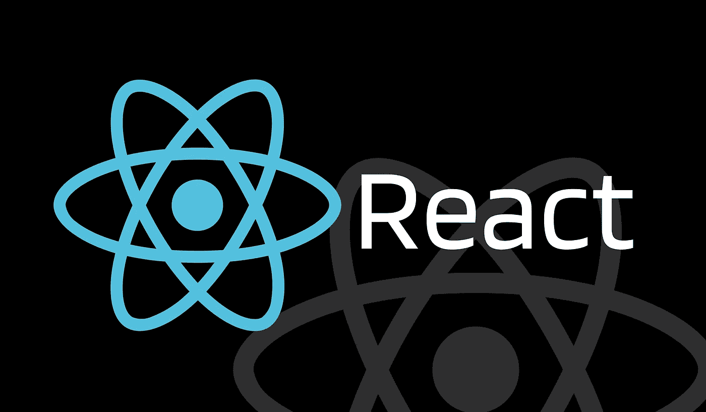

# React.memo —高阶组件

> 原文：<https://javascript.plainenglish.io/react-memo-a-higher-order-component-7bcb392ac40e?source=collection_archive---------6----------------------->

## React.memo 用一个例子的详细解释。

Image created by the author on [Canva](http://canva.com)

# React 中的高阶组件是什么？

正如 React 文档中提到的，高阶组件(HOC)是 React 中重用组件逻辑的一种高级技术。HOC 不是 React API 的一部分，但它只是一个以组件作为参数并返回新组件的函数。

# 什么是 React.memo？

如题， **React.memo** 是一个**高阶函数**。它用于记忆组件的结果，这有助于提高 React 应用程序的性能。

简单地说，如果我们的组件为传递给它的相同属性值返回相同的结果，那么呈现相同的结果会破坏应用程序的性能。React memo 是这个问题的解决方案。我们只需要将组件包装在对 *React.memo* 的调用中，因此 React 将跳过组件的渲染，并重用之前的渲染结果。

# 例子

现在，让我们考虑一个简单的例子来更精确地阐明这个概念。假设我们有一个父组件和一个子组件。现在，每当父组件由于其自身的状态改变而重新呈现时，子组件也将重新呈现，这是 React 的常见特性。这里，子组件中没有发生状态变化，这意味着子组件的不必要呈现将影响性能。为了解决这个问题，我们只需要将我们的子组件包装在 React.memo 中，这样 React 将使用之前的渲染结果。

请参见下面的示例。在我们的示例中，我们有一个打印*值 1* 的*父组件*，以及一个在浏览器显示上打印*值 2* 的*子组件*。

在没有使用 Memo 的 ***第一种情况下，子组件在两个值都改变时重新渲染，这被称为性能差，因为子组件只使用 value2 作为其属性。***

我们的 ***第二个案例利用备忘录*** 解决了这个问题。在这种情况下，我已经将子组件包装在 React Memo 中，因此只有当 value2 发生变化时，它才会重新呈现。

## 父组件:

## 子组件:

## ***案例 1:无反应备忘录示例&输出***

Output video created by the author

## 案例 2:使用 React 备忘录示例和输出

Output video created by the author

# react . memo vs . use memo()

React Memo 是一个将 React 组件作为参数的特设组件，它用于记忆传递给它的组件的结果。另一方面，useMemo()是一个 React 钩子，它接受一个函数和一个依赖数组，然后记忆从传递给它的函数返回的值。如果你还是很迷茫，不要着急。去看看我在 useMemo() hook 上的另一篇文章，它会帮助你理解两者之间的区别。

 [## React Hooks — useMemo() —通过示例进行说明

### 什么是 useMemo()？我们应该什么时候使用它？怎么用？

javascript.plainenglish.io](/quickly-learn-usememo-hook-2fb59fd99b62) 

# 结论

本文的目的是理解 React.memo 的概念，它是 React 中的一个高阶组件。我用一个父子组件的简单例子展示了它的用例。我还附上了显示输出的视频。两种场景中的控制台输出将帮助您跟踪子组件的重新呈现次数。我希望这篇文章能帮助你详细理解 React 备忘录。请跟随我阅读更多类似这样有趣的文章。

 [## 通过我的推荐链接加入 Medium-Yagnik Kardani

### 作为一个媒体会员，你的会员费的一部分会给你阅读的作家，你可以完全接触到每一个故事…

medium.com](https://medium.com/@kardaniyagnik/membership)  [## Yagnik Kardani 正在创建帮助他人成长的技术学习材料。

### 你好👋，我是一名媒体方面的技术作家。我喜欢学习并帮助他人在软件开发和云计算方面成长…

www.buymeacoffee.com](https://www.buymeacoffee.com/kardaniyagnik) 

*更多内容看* [***说白了就是***](https://plainenglish.io/) *。报名参加我们的* [***免费周报***](http://newsletter.plainenglish.io/) *。关注我们关于*[***Twitter***](https://twitter.com/inPlainEngHQ)*和*[***LinkedIn***](https://www.linkedin.com/company/inplainenglish/)*。查看我们的* [***社区不和谐***](https://discord.gg/GtDtUAvyhW) *加入我们的* [***人才集体***](https://inplainenglish.pallet.com/talent/welcome) *。*