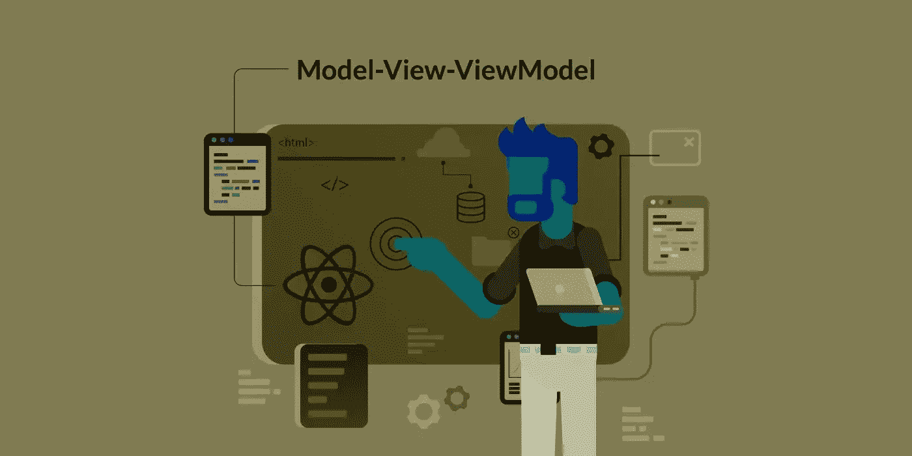
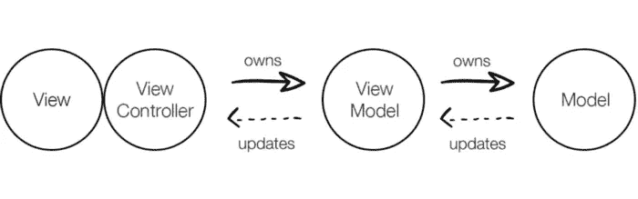
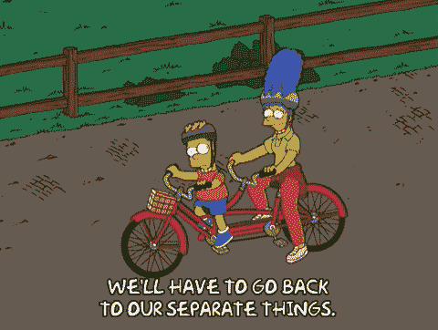
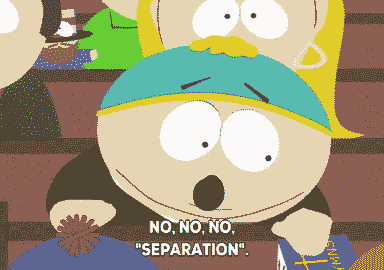

# React: MVVM 使用 MobX 和钩子的例子

> 原文：<https://javascript.plainenglish.io/react-mvvm-with-mobx-89b2444b1f64?source=collection_archive---------3----------------------->



您有开发 React 应用程序的经验，但是您从未在您的项目中使用过模型-视图-视图模型(MVVM)架构模式。不要担心！在这篇文章中，我将向您概述如何在您的下一个 React 应用中实现 MVVM，它使用 MobX 来创建高度可测试的代码。

## MVVM？那是什么鬼东西？

MVVM 是通过将驱动 UI 的代码(例如，改变按钮上的颜色或标签上的文本)从驱动它的业务逻辑(例如，根据 John 是否被授权产生字符串“Hello，John”或“Hello，Guest ”)中分离出来，方法是将该逻辑转移到组件之外的独立对象中。在用户的要求下，呈现信息或执行任务的行为会因应用程序中的每个屏幕或组件而异。



MVVM explained

## 为什么用 MVVM？

MVVM 维护连接到视图的特定于视图的逻辑，从某种意义上说，它不是在更全局的设置中维护的(像 Redux may)，但它也将它从视图中分离/解耦，因为它是完全由开发人员定义的完全不同的对象。也就是说，它是如何工作的并不神秘，并且它可以在相关的高代码覆盖率下进行测试。



测试，MVVM 使得对对象的逻辑进行单元测试变得更加容易，而不是模糊 UI 测试的界限。我们不需要渲染任何组件，也不需要依赖任何特定于 UI 的生命周期或其他依赖。相反，我们可以简单地创建一些纯业务逻辑，注入任何我们自己的依赖项，并确保它产生 UI 期望的任何东西。


将它与 UI 分离还允许我们构建一个“哑”UI，这意味着我们的 UI 除了显示数据而不改变它，并将交互转移到其他东西(视图模型)之外什么也不做。这简化了 UI 代码(使其更容易阅读),因为不需要逻辑，所以更易于重用——并使在 Storybook 中显示 UI 组件变得非常容易。



## **MobX 是什么？值得吗？**

MobX(根据他们的网站)是一个久经考验的库，通过透明地应用函数式反应式编程，使状态管理变得简单和可伸缩。

它是一个库，当视图模型的状态发生变化时，它会通知视图，从而产生一个新的呈现(这称为观察者模式)。

## 这个例子

如果您曾经阅读过 Redux Toolkit 文档，您可能会遇到他们的反例。我们将使用 MVVM 方法构建相同的东西，看看它看起来有什么不同，以及如何测试它。

要将其转换为 MVVM 设计，我们需要一个称为视图模型的对象来存放我们的逻辑，一个称为视图的对象将视图模型作为道具并返回完全呈现的视图，另一个对象将它们连接在一起。

从视图模型开始，我们可以将所有的功能都转移到这个对象上，只暴露视图需要交互的内容:

```
// ViewModel.js
import {action, computed, observable} from "mobx";

class ViewModel {
  // Initial value for the count variable that is marked as observable
  @observable private count = 0;

  constructor(/*here we can accept any dependency*/){
    // here we use our dependency and manipulate it
   }

  @action onClick = (): void => {
    this.count += 1;
  };

  @computed get countLabel(): string {
    return `clicked ${this.count} times`;
  }
}

export default ViewModel;
```

在视图模型中，我们可以使用 Jest 在测试中模拟它们。但是，在我们开始测试之前，这里是我们的观点:

```
// View.jsx

import {observer} from "mobx-react";
import ViewModel from "./ViewModel";

const ViewComponent = ({viewModel}: Props) => (
  <div>
    <p>{viewModel.countLabel}</p>
    <button onClick={viewModel.onClick}>Click me</button>
  </div>
);

export default observer(ViewComponent);
```

我们的视图不再被认为仅仅是 UI 代码。视图不执行任何逻辑；从显示的信息到用户交互，一切都通过视图模型传递。

最后，还有将它们粘合在一起的“胶水”。这是我们在“根”或其他组件中提到的组件(而不是显式的“ViewModel.js”或“View.jsx”)。

```
// App.jsx 
const App = () => {
  const viewModel = new ViewModel(/*here we can inject dependenicies to retrieve them as i said above*/);
  return <ViewComponent viewModel={viewModel} />;
};

export default App;
```

对于每个 MVVM 组件，这个文件看起来完全一样(除了注入到视图模型中的依赖项，如果它们存在的话)。它的主要目标是将依赖项注入视图模型并返回视图，从而消除了在使用该视图的 UI 组件中对样板代码的需求。

## **测试！**

现在是使用 MVVM 的主要原因:测试！本质上，您必须构建一个标准的组件测试，在与组件进行交互之前显示组件。

我们的视图模型测试将会像这样结束。

```
// ViewModel.test.js
import ViewModel from "./ViewModel";

beforeEach(() => {
  viewModel = new ViewModel(/*we mock our dependency*/);
});

it("has appropriate initial label", () => {
  expect(viewModel.countLabel).toEqual("clicked 0 times");
});

describe("when clicked", () => {
  beforeEach(() => {
    viewModel.onClick();
  });

  it("updates the counter label", () => {
    expect(viewModel.countLabel).toEqual("clicked 1 times");
  });
});
```

在开发单元测试时，我们通常希望一次测试一件事情。这是一个视图模型测试，类似于他们的样本组件测试。不通过 UI，我们可以只测试驱动计数器的逻辑。

## 简单地

我描述的用例非常简单，这可能会让您疑惑“这有什么意义？”鉴于反例的简单性，这是合理的。更有可能的是，我们会有网络呼叫、异步活动和要跟踪的全球状态，这是 MVVM 真正能发光的地方。我们可以简单地注入这种依赖，并使用 MVVM 验证我们的 UI 行为，而不必开发 UI 测试来确保我们的 UI 按预期运行。

有了 MVVM，你可以建立一个清晰的关注点分离，测试将会像呼吸一样简单。

*更多内容请看*[***plain English . io***](https://plainenglish.io/)*。报名参加我们的* [***免费周报***](http://newsletter.plainenglish.io/) *。关注我们关于*[***Twitter***](https://twitter.com/inPlainEngHQ)[***LinkedIn***](https://www.linkedin.com/company/inplainenglish/)*[***YouTube***](https://www.youtube.com/channel/UCtipWUghju290NWcn8jhyAw)*[***不和***](https://discord.gg/GtDtUAvyhW) ***。*****

*****对缩放您的软件启动感兴趣*** *？检查* [***电路***](https://circuit.ooo/?utm=publication-post-cta) *。***