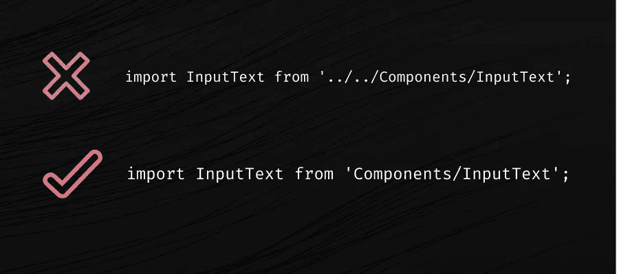

# React Native 中绝对导入的介绍

> 原文：<https://javascript.plainenglish.io/react-native-absolute-imports-quick-easy-5e3b60897f34?source=collection_archive---------0----------------------->

## 反应本地绝对进口-使初学者容易。



React Native Absolute Imports Quick & Easy!

绝对导入有助于简化路径，并随着项目的增长更好地组织项目。同样，使用绝对导入，可以更容易地将带有导入的代码复制粘贴到项目的另一个文件中，而不必修改导入路径。😆

当项目的文件夹结构复杂时，我们将在项目中有长的相对导入，如下所示:

```
import Input from ‘../../../components/form/input’;
```

它很难重构，而且看起来很乱。解决方法是将相对进口转换为绝对进口。

**步骤 1 —安装** `**babel-plugin-module-resolver**` **插件**

```
$ npm install --save-dev babel-plugin-module-resolver
```

或者

```
$ yarn add --dev babel-plugin-module-resolver
```

**步骤 2 —更新** `**babel.config.js**`

在`babel.config.js`中添加以下代码片段

```
module.exports = {
  plugins: [
    [
      'module-resolver',
      {
        alias: {
          '@app': './src',
        },
      },
    ],
  ],
}
```

注意:`@app`是一个别名，可以随便给。

**第三步——设置** `**jsconfig.json**` **或** `**tsconfig.json**`

**使用 JavaScript**

创建/打开`jsconfig.json`文件(在项目的根目录中)并在`compilerOptions`中添加`baseUrl`和`paths`设置，如下面的代码片段所示:

```
{
  "compilerOptions": {
    "baseUrl": ".",
    "paths" : {
      "@app/*": ["src/*"]
    }
  }
}
```

**使用打字稿**

如果您在 React 原生项目中使用 TypeScript，更新`tsconfig.json`文件(在项目的根目录中)并在`compilerOptions`中添加与 JavaScript 相同的设置。

```
{
  "compilerOptions": {
    "baseUrl": ".",
    "paths" : {
      "@app/*": ["src/*"]
    }
  }
}
```

**第 4 步—实施绝对导入**

现在，绝对导入设置已成功配置，将`src`文件夹作为自定义基础目录，我们可以从如下位置导入位于`src/components/form/input.js`的输入组件:

```
import Input from '@app/components/form/input';
```

快乐学习！请随意为这篇文章鼓掌，并关注更多文章！

*更多内容请看*[***plain English . io***](https://plainenglish.io/)*。报名参加我们的* [***免费周报***](http://newsletter.plainenglish.io/) *。关注我们关于*[***Twitter***](https://twitter.com/inPlainEngHQ)*和*[***LinkedIn***](https://www.linkedin.com/company/inplainenglish/)*。查看我们的* [***社区不和谐***](https://discord.gg/GtDtUAvyhW) *加入我们的* [***人才集体***](https://inplainenglish.pallet.com/talent/welcome) *。*