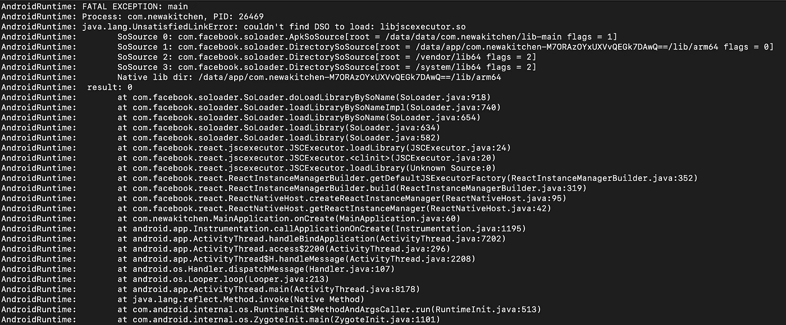
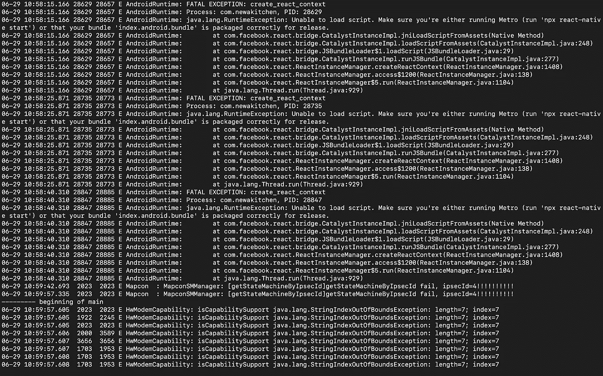

# 修复 React-原生 android 发布版本

> 原文：<https://javascript.plainenglish.io/react-native-android-release-build-crashes-fa93f07a2ba4?source=collection_archive---------1----------------------->

## Android 发布版本在启动时崩溃，但在开发模式下运行良好。


经过几个月的精心研发，你的应用终于可以发布了。充满无限的兴奋和成就感，你期待着向世界介绍你的百万美元的应用程序。然后你按照 [React-Native 官方指南](https://reactnative.dev/docs/signed-apk-android)中提到的每一步，生成一个生产就绪的`.apk`文件，用于在发布到谷歌 Play 商店之前测试你的应用。

然后，在终端中运行以下命令，编译并生成一个生产构建`.apk`文件；生成的文件将位于`android/app/build/outputs/apk/release/app-release.apk`下。

```
cd android./gradlew assembleRelease
```

生成`.apk`文件后，你把它安装在你的 Android 设备上，只要你打开应用，它就崩溃了。

你不知道哪里出了问题；您开始重新检查，看看您是否遗漏了 React-Native 文档中提到的任何步骤；你开始在 StackOverflow 和 Github 上搜索解决方案，尝试所有你发现的随机解决方案。你感到沮丧，紧张，充满了自我怀疑。冒名顶替综合症爆发了，你后悔选择了 React-Native 而不是其他移动开发框架。

**TL；DR:** 在看了很多关于 StackOverflow 和 GitHub 问题的回答和评论后，我也有类似的感觉。以下是我在寻找和修复发布版本问题时遵循的步骤。

# **使用 Logcat CLI 确定问题**

将您的设备连接到您的机器(确保 USB 调试在上**)并在您的终端上运行以下命令。**

```
adb logcat '*:E'
```

点击了解更多关于 **Logcat CLI 语法** [的信息。](https://developer.android.com/studio/command-line/logcat)

在运行 logcat 工具来记录系统日志之后，我遇到了两个导致应用程序崩溃的问题。

**1。找不到要加载的 DSO:libjsexecutor . so**



**java.lang.UnsatisfiedLinkError**: couldn’t find DSO to load: **libjsexecutor.so**

我通过在 GitHub 注释[这里](https://github.com/facebook/react-native/issues/25537#issuecomment-1104619909)提到的`build.gradle`文件中的`project.ext.react`数组内添加`enableVmCleanup: false`解决了 libjsexecutor.so 错误。

```
project.ext.react = [
    enableHermes: true,     // clean and rebuild if changing
    **enableVmCleanup: false,** //this
]
```

2. **java.lang.RuntimeException:无法加载脚本。**



**java.lang.RuntimeException**: Unable to load script. Make sure you’re either running Metro (run ‘npx react-native start’) or that your bundle **‘index.android.bundle’** is packaged correctly for release.

要解决此问题，请遵循以下步骤

*   如果文件已经存在，从`android/app/src/main/assets`中删除`index.android.bundle`，或者只运行下面的命令(确保您在项目的根目录下)。

```
rm android/app/src/main/assets/index.android.bundle
```

*   运行下面给出的命令来生成你的 android 包，这将在`android/app/src/main/assets`中生成`index.android.bundle`文件

```
npx react-native bundle \
--platform android \
--dev false \
--entry-file index.js \
--bundle-output android/app/src/main/assets/index.android.bundle
```

*   现在运行下面的命令来生成一个发布版本

```
cd android
./gradlew clean
./gradlew assembleRelease
```

希望这将修复你的应用程序的崩溃问题，你的应用程序应该准备好部署。

*随时提供任何反馈和改进，编码快乐……*