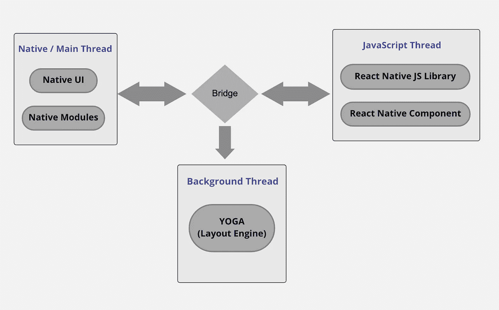

# 反应原生架构—旧与新

> 原文：<https://javascript.plainenglish.io/react-native-new-architecture-old-vs-new-d0130f42bc79?source=collection_archive---------1----------------------->

## 新旧 React 原生架构之间的端到端比较。更多关于 JSI、Turbo 模块和 Fabric 的信息。

React Native Architecture (Old vs New)

欢迎来到另一个博客，在上一个博客中，我们讨论了关于 React Native 的所有内容:优点、缺点和未来 **。**将讨论向前推进，在这篇博客中，我们将通过了解当前的架构、缺点和新的架构来深入了解 React Native 的内部工作方式。

> 🎺🎺🎺 ***最新博客上的公告*** 🎺🎺🎺：
> 
> [***React Native 新架构分析及结果—***React Native 讲座之一总结& Flutter — Hybrid meetup。新的 React 本机体系结构的结果以及分析。](https://medium.com/@srvkmr130/analysis-of-react-native-new-architecture-with-results-1c157ab9c9c8?source=your_stories_page-------------------------------------)

## **当前架构**

在当前的场景中，当我们查看 react 原生架构时，我们发现两个不同的部分经常相互作用——一个是原生世界，另一个是 JavaScript 世界。众所周知，React Native 通过创建本地元素来帮助我们构建**跨平台**应用程序，这些元素可以很容易地被本地世界理解。因此，我们不能直接访问创建的元素的节点，所以我们不能使用 React (JavaScript world)执行任何类型的操作。那么两个世界之间的交流是如何发生的呢？嗯，这种双向交互通过 **React Native bridge** 发生。React Native 将来自 React 世界的一堆命令解析为一个 JSON 数组，将其序列化为一个字符串，然后通过那个桥将其传输到本地世界。

为了保持跨所有平台的一致性，React Native 通过将基于 React 的显示样式(例如，flex)转换为每个元素的相对位置值来实现实际布局，然后最终将其传递到本机世界的 UI 层。概括地说，当前的 React 本机架构基于 3 个主要线程-

1.  **Main/Native/UI 线程** —所有 UI 元素都在这里呈现，本地代码也在这里执行。
2.  **布局线程/阴影线程** —这是一个计算实际布局的后台线程。如前所述，它在脸书的布局引擎 **Yoga** 的帮助下重铸了 flexbox 的布局。
3.  **JavaScript 线程** —这个线程负责执行和编译所有 JavaScript 相关的代码。

React Native current architecture

## 缺点

1.  在当前的体系结构中，线程之间的通信是通过桥进行的，因此它导致了较低的传输速率和不必要的数据复制。
2.  由于通信是异步发生的，这种异步方法的一个主要缺点是它不实时执行事件，而是调度动作。让我们想象一个场景，我们实现了一个平面列表，当我们开始滚动时，每次事件被触发并被安排执行。因此，当处理大量列表项并快速滚动时，在实际呈现发生之前，人们很容易注意到一个白色小故障。发生这种情况是因为当滚动完成时，本地世界的 UI 层还没有收到任何布局信息。因此，这种滚动效果需要同步发生，以实现期望的结果，这在当前的架构中是不可能的。

因此，需要能够解决这些问题的新型/现代建筑。

## **新建筑就位**

新的架构引入了一个称为 JavaScript 接口(JSI)的不同层，作为 React Native bridge 的替代。这一层将允许本地世界与 Javascript 世界直接通信，因此 JS 线程和本地模块的完全同步现在是可能的。

JSI 架构的优势-

1.  **Turbo 模块:**首先，这一层将允许 JS 保存宿主对象的引用，并在需要时调用它们的方法。所以即使在应用打开之前，我们也不需要预加载 JavsScript 使用的原生模块。这也消除了额外的序列化开销，这是我们目前在基于桥的架构中所具有的。
2.  **Fabric:**JSI 提供的另一个优势是它为下一代 React 原生视图管理器(称为 Fabric)奠定了基础。在 Fabric 的帮助下，渲染机制变得更加优化和高效，因为它将直接在 C++中创建阴影树，从而提高与主机平台的互操作性。

React Native Re-Architecture

## 结论

所以这都是关于 React Native 的新旧架构。最有可能在 2022 年底，我们会从 React 本地团队听到一些关于新架构推出的好消息。

*关于最佳编码实践——请查看我之前的博客:* [***最佳编码实践——React Native Edition 2022***](/best-coding-practices-react-native-edition-2022-da833c8161de)

感谢阅读！

*更物在* [***素朴***](https://plainenglish.io/) *。报名参加我们的* [***免费周报***](http://newsletter.plainenglish.io/) *。*[***Twitter***](https://twitter.com/inPlainEngHQ)[***LinkedIn***](https://www.linkedin.com/company/inplainenglish/)*[***YouTube***](https://www.youtube.com/channel/UCtipWUghju290NWcn8jhyAw)*和*[**T42【不和**](https://discord.gg/GtDtUAvyhW)*。**