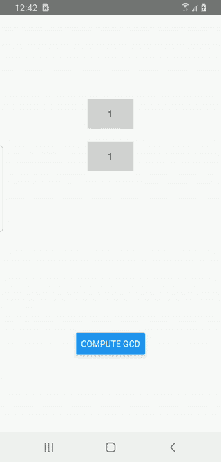

# react Native & JavaScript 接口:早期采用者指南

> 原文：<https://javascript.plainenglish.io/react-native-the-javascript-interface-a-guide-for-early-adopters-c42c46f6fe4b?source=collection_archive---------7----------------------->

## 第 2 部分——用 Android 设置 JavaScript 界面


Photo by [Fotis Fotopoulos](https://unsplash.com/@ffstop?utm_source=unsplash&utm_medium=referral&utm_content=creditCopyText) on [Unsplash](https://unsplash.com/s/photos/programming?utm_source=unsplash&utm_medium=referral&utm_content=creditCopyText)

现在这一刻，我们都在等待！设置 JSI 与 Android 配合使用。如果你还没有，[请阅读本系列的第 1 部分](/react-native-the-javascript-interface-a-guide-for-early-adopters-f08274e86de9)，看看如何在 iOS 中设置。

再次特别感谢 Oscar Franco 的这篇文章。虽然我还没有看到他在 Android 方面的任何内容，但我翻遍了他的“Quick SQLite for React-Native”库，以找出如何做所有事情。他是这项技术的真正主人，而不是我，我只是一个卑微的教官。在这篇文章之后，请随意翻翻他的代码以了解更多信息。希望，我能给你这样做的工具！

[](https://github.com/ospfranco/react-native-quick-sqlite) [## GitHub-OSP Franco/react-native-quick-sqlite:react-native 的快速 SQLite。

### 用于本地反应的快速 SQLite。通过在…上创建帐户，为 OSP Franco/react-native-quick-SQLite 开发做出贡献

github.com](https://github.com/ospfranco/react-native-quick-sqlite) 

记住，这是一个非常艰难的过程。如果你被卡住了，可以在这里查看一下 [**GitHub 项目。**](https://github.com/friyiajr/EarlyJSITutorial) 我会多次引用它，因为这篇文章需要很多长文件。

🚨**注意:**如果你在 M1 上，你需要在开始这篇文章之前遵循 [**这些额外的步骤**](https://github.com/flutter/flutter/issues/76393#issuecomment-784014307) 。

## 设置 Android 构建系统

还记得在 iOS 中我们是如何开始编写开箱即用的 C++代码的吗？遗憾的是，在 Android 中，情况并非如此。C++开发是一种二等公民，Android Studio 迫使您手动设置所有构建步骤。

## 配置 build.gradle

我们要做的第一件事是用一些新代码在库级别更新`build.gradle`文件。在文件的顶部添加这两个导入:

```
import org.apache.tools.ant.filters.ReplaceTokens
import java.nio.file.Paths
```

接下来，将您的 gradle 工具更新为以下内容:

```
classpath 'com.android.tools.build:gradle:4.2.2'
```

将这段代码添加到文件中的`android`块之前。我们稍后将使用它来获取到`node_modules`的路径。

在函数后面添加这段代码，这样我们就可以在以后的构建中使用 React-Native 版本。我们还将使用它将所有脸书 React-Native 库的路径传递到 C++构建系统中。

在`defaultConfig`中的`externalNativeBuild`块下复制并粘贴这个`cmake`命令。注意，我们在这里使用节点模块路径和 React-Native 版本。我们实际上是将这些值传递给 Android 的 C++构建系统。

将打包选项添加到 gradle 文件的顶层。它将防止生成重复的 facebook RN 库。

最后，为`configurations`添加这段代码我们马上就要写这段代码，但是这段代码是在构建步骤中执行的。

```
configurations {
  extractHeaders
  extractJNI
}
```

在 repositories 下添加下面的代码，它可以找到 React-Native Android 源代码。

然后在 dependencies 下添加这段代码，这样我们就可以提取 React-Native 的 JNI 文件，并将它们添加到项目中。

最后，将这些函数复制并粘贴到文件的底部。这有助于将 JNI 文件添加到项目中。

通常，在这个时候，我会一起给你看整个事情。不幸的是，这次我们制作了一个庞大的文件。不过不要担心，你可以在我的 [**GitHub repo 这里**](https://github.com/friyiajr/EarlyJSITutorial/blob/master/android/build.gradle) 看看这一切。

## 设置 Android C++构建系统

有了`CMakeLists.txt`文件，我们就要从头开始了。很可能你以前从未做过这些，这真的很吓人。不过不要担心。一旦有人告诉你，这些其实很容易理解。让我们从设置几个变量开始:

接下来，如果您使用小于 68 的 React 原生版本，我们将不得不设置更多的变量。

在这之后，我们必须告诉 C++构建系统我们需要哪些目录中的文件。在顶部，我们放入了`cpp`文件夹，然后列出了我们想要包含的所有库。

然后我们必须将库添加到我们的构建中。我们用下面的代码来做这件事。

接下来，告诉构建在哪里可以找到我们包含的目录。您会发现这个列表与之前的列表相似。

现在，我们将通过向构建中添加库并将这些库分配给变量来结束。您可以这样做:

最后，当构建完成时，我们通过链接所有这些库来结束。

```
target_link_libraries(
  ${PACKAGE_NAME}
  ${LOG_LIB}
  ${JSI_LIB}
  ${REACT_NATIVE_JNI_LIB}
  ${FBJNI_LIB}
  android
)
```

这个文件又太长了。要查看所有这些代码，请点击这里查看我的[**GitHub repo**](https://github.com/friyiajr/EarlyJSITutorial/blob/master/android/CMakeLists.txt)**。**

## 添加您的第一个 Android C++代码

要编译所有内容，请转到您的`cpp-adapter.cpp`文件并添加以下代码:

```
#include <jni.h>
#include <jsi/jsi.h>
#include <fbjni/fbjni.h>
#include <ReactCommon/CallInvokerHolder.h>
#include <typeinfo>
#include <android/log.h>
#include "react-native-teaching-jsi.h"using namespace facebook;JNIEXPORT jint JNI_OnLoad(JavaVM * vm, void * ) {}
```

此时，运行您的应用程序，并确保它能够编译。厉害吧！您已经构建了您的第一个 C++库！不幸的是，你的应用程序在启动时会立即崩溃🙃。Android C++ build 系统是不是很棒？

## 完成 CPP 适配器

就像在 iOS 中一样，我们需要运行一些代码来告诉应用程序我们正在全局 JS 对象中安装一个函数。我们从在`cpp-adapter.cpp`中创建一个结构开始。注意`installMath`的用法，这是我们在第 1 部分中编写的 C++函数。

对`kJavaDescriptor`变量要非常小心。该字符串必须与 Java 包的路径相匹配。如果你没有复制我的命名，你需要适应你的应用程序。如果错了，app 会频繁崩溃，很难调试。

之后，当应用程序启动时，我们调用初始化函数。

如果你尝试编译这个应用程序，它仍然会崩溃，但是，这应该可以解决我们需要的所有 C++问题。要仔细检查你的代码 [**看看这个文件**](https://github.com/friyiajr/EarlyJSITutorial/blob/master/android/cpp-adapter.cpp) **。**在下一部分，让我们修复这个崩溃，让一切正常运行。

## 编写与 JavaScript 链接的 Java 代码

我希望我能告诉你设置这个构建的 C++部分的怪异之处，但不幸的是事实并非如此。我们现在需要设置将 C++代码链接到 JS 引擎的 Java 代码。

## Android 原生 Java 类

我们要做的第一件事是创建一个名为`AndroidNative`的类。它将作为 Java 和 C++之间的接口。通过添加以下导入来启动文件:

接下来，添加以下代码:

注意这里`public native void`的用法。Java 中标记`native`的方法可以直接调入 C++。我们将使用该方法将我们的 C++方法“安装”到 JS `global`对象中。

将这些行添加到文件中，因为 React-Native 框架需要它们:

```
public AndroidNative(ReactApplicationContext reactContext) {
  *super*(reactContext);
}@Override
@NonNull
public String getName() {
  return NAME;
}
```

最后，添加安装方法。这将加载 C++库并调用 install 函数。注意`isBlockingSynchronousThread.`的使用，这需要设置为`true`，以便在应用程序启动时加载库。

## 制作 JSI 模块包

此时，我们将使用上一节中的代码。实际上，它所做的只是获取我们的本机模块，并调用我们之前创建的安装函数。

## 制作 React 包

我们需要编写的最后一个代码是 React 包，它允许 React-Native 查看我们的代码。我们只需创建这个文件，并将我们的 Android 原生类添加到其中。

## 向您的示例应用程序添加库

将这段代码添加到`example`应用程序的`MainApplication.java`文件中的 React 本地主机。

```
*import* com.facebook.react.bridge.*JSIModulePackage*;
*import* com.reactnativeteachingjsi.TeachingJsiModule;
*import* com.reactnativeteachingjsi.TeachingJsiPackage;

*public class* MainApplication *extends* Application *implements ReactApplication* {

  *private final* ReactNativeHost mReactNativeHost =
      *new* ReactNativeHost(*this*) {

        @Override
        *protected JSIModulePackage* getJSIModulePackage() {
          *return new* TeachingJsiPackage();
        }
```

您还需要将`MainApplication`中的包更改为:

```
[@Override](http://twitter.com/Override)
protected List<ReactPackage> getPackages() {
  [@SuppressWarnings](http://twitter.com/SuppressWarnings)("UnnecessaryLocalVariable")
  List<ReactPackage> packages = new PackageList(this).getPackages();
  // Packages that cannot be autolinked yet can be added manually here, for TeachingJsiExample:
  // packages.add(new MyReactNativePackage());
  packages.add(new TeachingJsiModule());
  return packages;
}
```

点击查看整个[MainApplication.java**档案。**](https://github.com/friyiajr/EarlyJSITutorial/blob/master/example/android/app/src/main/java/com/example/reactnativeteachingjsi/MainApplication.java)

## 结论

此时，如果您运行该应用程序，您应该会看到以下内容:



哇，那是许多工作，不是吗？我个人迫不及待地想等到 JSI 图书馆为大众消费做好准备，这样我们就不用做这些了。无论哪种方式，我希望你喜欢这个旅程，并享受与基地项目黑客的乐趣🙂。

*更多内容看* [***说白了。报名参加我们的***](https://plainenglish.io/) **[***免费周报***](http://newsletter.plainenglish.io/) *。关注我们关于*[***Twitter***](https://twitter.com/inPlainEngHQ)*和*[***LinkedIn***](https://www.linkedin.com/company/inplainenglish/)*。查看我们的* [***社区不和谐***](https://discord.gg/GtDtUAvyhW) *加入我们的* [***人才集体***](https://inplainenglish.pallet.com/talent/welcome) *。***