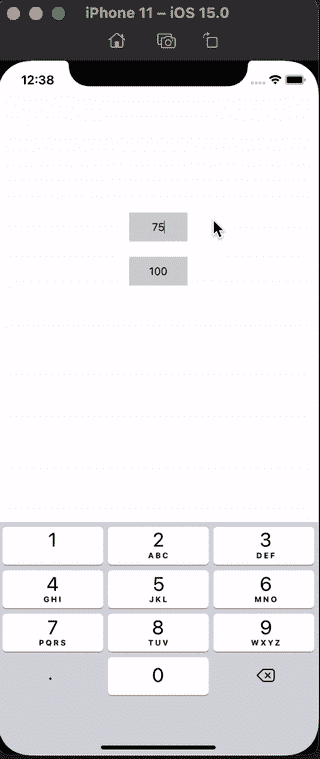
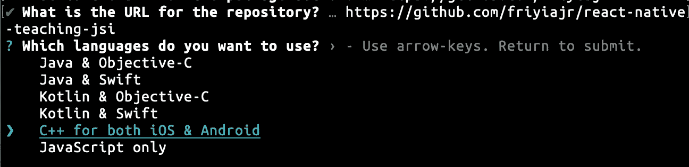
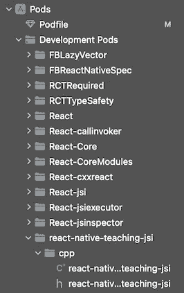

# react Native & JavaScript 接口:早期采用者指南

> 原文：<https://javascript.plainenglish.io/react-native-the-javascript-interface-a-guide-for-early-adopters-f08274e86de9?source=collection_archive---------4----------------------->

## *第 1 部分——用 iOS 设置 JavaScript 接口*


Photo by [Jake Walker](https://unsplash.com/@jakewalker?utm_source=unsplash&utm_medium=referral&utm_content=creditCopyText) on [Unsplash](https://unsplash.com/s/photos/code-ios-swift-xcode?utm_source=unsplash&utm_medium=referral&utm_content=creditCopyText)

我的程序员之旅开始于智能手机普及的时候。我仍然记得大学时在 Android 手机上编写我的第一个 hello world 应用程序时的兴奋感。随着我职业生涯的进展，我使用蓝牙低能耗和 C++库，并编写了高度优化的应用程序。对我来说，最令人兴奋的事情莫过于充分利用我正在开发的硬件。

在 React-Native 中，很长一段时间都很难做到这一点，因为我们必须通过 JavaScript 桥来回传递值。幸运的是，Meta 的团队最近公布了 JavaScript 接口(JSI)模块。JSI 模块可以通过共享内存同步调用本机函数。

尽管 JSI 模块还没有准备好供大众消费，但它们已经足够强大，可以进行实验，并为真正的产品发布做好准备。

本文是两部分系列的第一部分。本系列的目标是制作一个快速、简单、复制粘贴的 JSI 模块指南，这样你就可以尽快开始试验它们了。据我所知，社区里不存在这样的东西，也不需要这样的东西。

**第 1 部分**基于 Oscar Franco 在 YouTube 上播放的关于在 iOS 上设置 JSI 的播放列表。如果你想要一个长的，深入的解释，我推荐你去[这里](https://www.youtube.com/watch?v=DA3KXef81sg&list=PLanS_SVm5swimC_m5zWfly0EPJTk7Tsp8)看看他的频道。

[**Part 2**](/react-native-the-javascript-interface-a-guide-for-early-adopters-c42c46f6fe4b) 据我所知还没有人谈过。这是[为 Android](/react-native-the-javascript-interface-a-guide-for-early-adopters-c42c46f6fe4b) 设置 JSI 模块。不过别担心，我给🧑‍做过实验🔬我会向你解释这一过程。

记住，如果你卡住了，可以在这里查看 [**GitHub 项目。**](https://github.com/friyiajr/EarlyJSITutorial)

## 我们今天在建造什么？

和往常一样，我想在我们建造之前解释一下我们在建造什么。从表面上看，今天的项目似乎有点无聊。也就是说，这个项目实际上是关于学习建立 JSI。一旦你掌握了这些知识，你就可以随心所欲地设计复杂的模块。

在这里，我们创建了一个应用程序，使用 C++函数计算最大公分母，该函数将在 Android 和 iOS 之间共享。



Our app running on iOS

## 生成库样板文件

目前，没有简单的方法来生成 JSI 库。相反，我们要做的是生成一个 JavaScript 桥库，并将其迁移到 JSI 库中。您要做的第一件事是运行这个命令:

`npx create-react-native-library react-native-teaching-jsi`

你可以按回车键，直到你看到这个菜单:



确保在此选择`C++ for Android and iOS`。这将确保我们编写的所有 C++代码是完全跨平台的。

## 移除 Flipper 以加快编译速度(可选)

在开始之前，我建议你在你的`example/Podfile`里评论一下 Flipper。它有很多不完整的版本，有时会导致无法编译。当你完成了教程，你可以随时回来，并尝试设置它，如果你觉得倾向。

## 制作跨平台代码

生成模板后，您将希望从运行项目根目录下的`yarn`开始安装所有的依赖项。接下来从项目根目录运行`open example/ios/TeachingJsiExample.xcworkspace`，打开项目`example`中的 Xcode。对大多数人来说这看起来很奇怪，但是我们会从那里编辑我们的豆荚。我们这样做是为了让 Xcode 给我们自动完成的功能。我建议此时尝试从 Xcode 运行应用程序，以确保一切正常工作。您应该会看到一个空白屏幕，显示文本“结果:21”。

接下来，在 Xcode 中的 Pods/Development Pods 下找到库文件。它看起来会像这样。



将`react-native-teaching-jsi.h`文件的内容更新如下:

```
#ifndef react_native_teaching_jsi_h
#define react_native_teaching_jsi_h#include <jsi/jsilib.h>
#include <jsi/jsi.h>**using** **namespace** facebook;**void** installMath(jsi::Runtime &rt);#endif /* my_cpp_module_hpp */
```

接下来，移动到`react-native-teaching-jsi.cpp`文件。这里我们要用 C++编写我们的共享函数来计算最大公分母。很酷吧？

让我们从使用`facebook`名称空间和编写一个快速 GCD 函数开始。它看起来会像这样。

```
#include "react-native-teaching-jsi.h"**using** **namespace** facebook;**int** computeGcd(**int** a, **int** b) {
  **while** (b) b ^= a ^= b ^= a %= b;
  **return** a;
}
```

现在，你一定很好奇。我们如何告诉 JavaScript/TypeScript 这个函数的存在？实现这一点的方法是访问 JavaScript 运行时并“安装”您想要在 JS 全局对象中使用的各种函数。在此之前，我们需要创建注册 compute gcd 的 install 函数。

将此功能添加到您的`react-native-teaching-jsi.h`文件中。

我确信这个函数需要消化很多东西😅所以我们来分解一下。

```
**void** installMath(jsi::Runtime & rt) {
```

函数头包含对`jsi::Runtime.`的引用，这是访问 JS 引擎和从 JavaScript 调用函数所必需的。

```
**auto** propId = jsi::PropNameID::forAscii(rt, "gcd");
```

prop id 只是我们函数的唯一 id。

```
**auto** lamda = [](jsi::Runtime & rt,
    **const** jsi::Value & thisValue,
    **const** jsi::Value * args,
    size_t count
  ) -> jsi::Value {
    **auto** data = args->asObject(rt);
    **auto** aValue = data.getProperty(rt, "a");
    **auto** bValue = data.getProperty(rt, "b");
    **int** a = aValue.asNumber();
    **int** b = bValue.asNumber();
    **int** gcd = computeGcd(a, b);
    **return** jsi::Value(gcd);
  };
```

上面的代码是事情变得有趣的地方。这个 C++ lambda 函数从 JavaScript 接口中提取数据，并将其转换成我们可以使用的原始值。我们使用实用方法`asObject`和`getProperty`将原始数据转换成 C++可以处理的数据类型。

```
jsi::Function gcd = 
      jsi::Function::createFromHostFunction(rt, propId, 2, lamda);rt.global().setProperty(rt, "jsiGcd", gcd);
```

然后我们通过调用`rt.global()`来结束，它告诉 JavaScript 我们想要在全局模块上注册这个函数。

## 在 JavaScript 运行时注册函数

在从 JavaScript 调用这个函数之前，我们需要做的最后一步是在 JavaScript 运行时安装我们的函数。我们需要在这里写一点 Objective-C 代码。这段 Obj-C 代码实际上只是 C++和 JavaScript 之间的粘合剂。

在`iOS`目录下，找到`TeachingJsi.h`文件，添加以下代码:

```
**@interface** TeachingJsi : NSObject <RCTBridgeModule>
  **@property**(**nonatomic**, **assign**) **BOOL** setBridgeOnMainQueue;
**@end**
```

这告诉 Objective-C 您将在主线程上注册 JSI 工作所需的函数。

一旦你完成了这个，进入你的`TeachingJsi.mm`文件。从添加这些导入开始:

```
#import <React/RCTBridge+Private.h>
#import <React/RCTUtils.h>
#import <jsi/jsi.h>
#import <ReactCommon/CallInvoker.h>
#import <memory>
```

然后在`@implementation`下添加以下代码:

```
@synthesize bridge = _bridge;
```

导出模块后，您需要告诉 Objective-C 您将在主线程上注册您的方法:

```
+ (BOOL)requiresMainQueueSetup {
  return YES;
}
```

接下来设置桥:

```
- (**void**)setBridge:(RCTBridge *)bridge {
  _bridge = bridge;
  _setBridgeOnMainQueue = RCTIsMainQueue();
  RCTCxxBridge *cxxBridge = (RCTCxxBridge *)**self**.bridge;

  **if**(!cxxBridge.runtime) {
    **return**;
  }
  installMath(*(facebook::jsi::Runtime *) cxxBridge.runtime);
}
```

最后，删除文件中的所有其他代码。所有内容看起来应该是这样的:

## 完成事情

您最不想做的事情是检查我们到目前为止编写的所有代码是否都按预期运行。由于这不是一篇关于如何制作 UI 的文章，只需将我的 UI 代码复制并粘贴到你的`App.tsx`中。

您的最终结果应该是这样的:


## **结论**

现在你知道了！使用 iOS 设置 JSI。[请继续关注第 2 部分](/react-native-the-javascript-interface-a-guide-for-early-adopters-c42c46f6fe4b)，在那里我将介绍如何让它与 Android 一起工作。公平的警告，那篇文章不会这么容易。如果你以前没有使用过 Java 本地接口(JNI)或 CMakeLists，这可能会有点困难。我保证会很有趣，真的很有意思🙂。期待在那里见到你！

*更多内容请看*[***plain English . io***](https://plainenglish.io/)*。报名参加我们的* [***免费周报***](http://newsletter.plainenglish.io/) *。关注我们关于*[***Twitter***](https://twitter.com/inPlainEngHQ)*和*[***LinkedIn***](https://www.linkedin.com/company/inplainenglish/)*。查看我们的* [***社区不和谐***](https://discord.gg/GtDtUAvyhW) *加入我们的* [***人才集体***](https://inplainenglish.pallet.com/talent/welcome) *。*