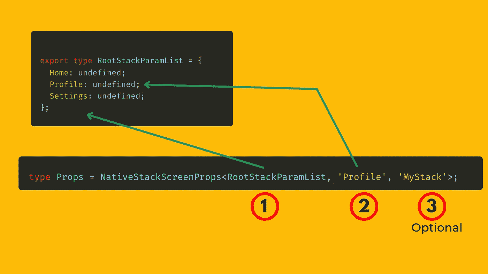
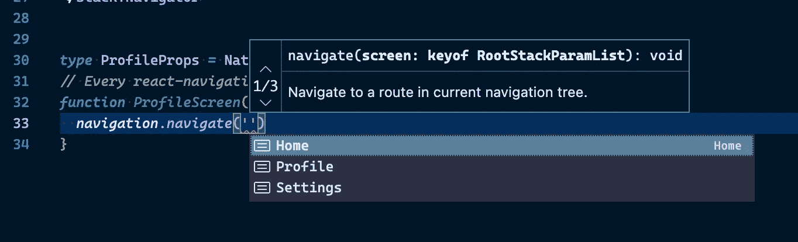
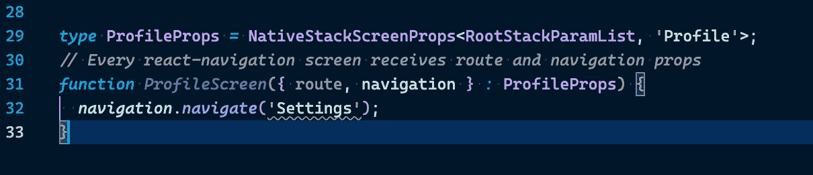
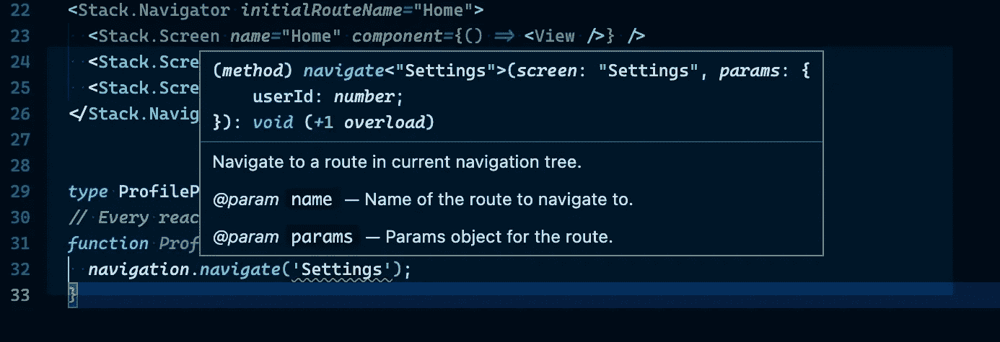
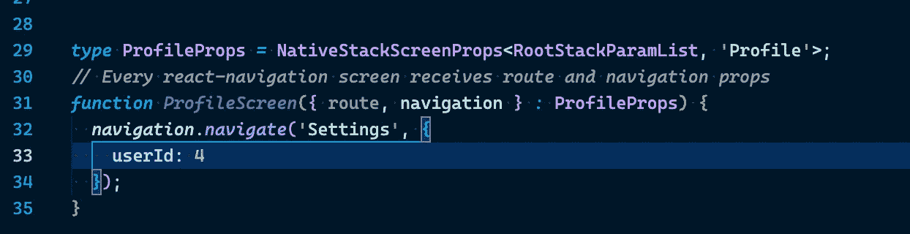

# 使用类型脚本反应导航版本 6

> 原文：<https://javascript.plainenglish.io/react-navigation-v6-with-typescript-5c9c065d45a5?source=collection_archive---------0----------------------->


Photo by [Lautaro Andreani](https://unsplash.com/es/@lautaroandreani?utm_source=medium&utm_medium=referral) on [Unsplash](https://unsplash.com?utm_source=medium&utm_medium=referral)

用 TypeScript 设置 React 本机移动应用程序导航非常简单。理解它只需要两步。

如果你理解了这两个步骤，那么你就能够为你的 react 本地应用构建任何带有完整类型检查的导航。

1.  键入检查导航器。
2.  检查单个屏幕的类型。

让我们创建一个包含 3 个屏幕的本地堆栈导航结构:主页、设置和配置文件屏幕。

1.  **类型检查导航仪**

您需要做的第一件事是创建一个对象类型，将 ***路线名称*** 映射到路线的 ***参数*** 。在我们的例子中，我们的屏幕不依赖于任何参数，所以我们将路由名称映射到 undefined。

```
*// I call this object type* ***RootStackParamList****export* *type* **RootStackParamList** *=* {
    *Home:* undefined;
    *Profile:* undefined;
    *Settings:* undefined;
};
```

现在当你用 create**X**Navigator(**X**可以是 Stack、BottomTab、Drawer)创建导航器时，你必须让它知道你上面创建的结构。

```
*//Instead of this
//const Stack = createNativeStackNavigator()*; *// Do this
const Stack = createNativeStackNavigator<****RootStackParamList****>()*;
```

现在，我们可以创建导航器，如下所示:

```
<Stack.Navigator *initialRouteName=*"Home">
    <Stack.Screen *name=*"Home" *component=*{() *=>* <View />} />
    <Stack.Screen *name=*"Profile" *component=*{() *=>* <View />} />
    <Stack.Screen *name=*"Settings" *component=*{() *=>* <View />} /></Stack.Navigator>
```

上面的代码经过了全面的类型检查，屏幕的`**name**`属性只能是您的 ***RootStackParamList 中定义的名称之一。*** *已经享受到打字稿的好处了😇。*

这将为`Navigator`和`Screen`组件的道具提供类型检查和智能感知。导航器的`**initialRouteName**` 道具只能是***RootStackParamList***对象中定义的键(Home、Profile、Settings)之一。

现在到第二步。

2.**类型检查单个屏幕**

为什么我们需要对单个屏幕进行类型检查，因为我们需要注释一个屏幕接收到的`**navigation**`道具和`**route**`道具。当我们想导航到另一个屏幕时，我们需要智能感知，我们不想一直去导航器检查我们的屏幕名称，我们希望 TypeScript 向我们显示有效/可用的名称。

```
// Every react-navigation screen receives **route** and **navigation** props
function ProfileScreen({ **route**, **navigation** }) {
  *// ...*
}
```

React Navigation 中的导航器包导出一个**通用类型**来定义来自相应导航器的`navigation`和`route`道具的类型。

例如，您可以使用`**NativeStackScreenProps**`作为本机堆栈导航器(`@react-navigation/native`)、使用`**StackScreenProps**`作为堆栈导航器(`@react-navigation/stack`)、使用`**DrawerScreenProps**`作为抽屉导航器(`@react-navigation/drawer`)、使用`**BottomTabScreenProps**`作为底部标签导航器(`@react-navigation/bottom-tabs`)等等。

对于我们的例子，我们将使用`NativeStackScreenProps`作为本机堆栈导航器。

这个类型有 3 个泛型:

1.  参数列表对象是为导航器定义的( **RootStackParamList)**
2.  当前屏幕所属路线的名称。
3.  导航器的 ID(**这是可选的**)

举个例子，

```
type Props = NativeStackScreenProps<**RootStackParamList**, '**Profile**', '*MyStack*'>;
```



Create Params for the Navigator and Create Props for the Screen

现在让我们将此应用到我们的**个人资料屏幕**。

```
*type* **ProfileProps** *=* NativeStackScreenProps<RootStackParamList, 'Profile'>;*// Every react-navigation screen receives route and navigation props
function* ***ProfileScreen***({ route, navigation } *:* **ProfileProps**) {
    *// ...* }
```

现在，我们可以使用`**navigate**`、`**push**`等输入您正在导航的*路线名称*和*参数*。TypeScript 现在知道可以从 Profile 屏幕导航到哪些屏幕，如下所示。



Intellisense on the navigate() function

对于我们的设置屏幕需要将`**userID**`作为参数的场景，我们的参数列表如下所示:

```
*export* *type* RootStackParamList *=* {
    *Home:* undefined;
    *Profile:* undefined;
    *Settings:* {
        *userId:* number;
    };};
```

现在 TypeScript 突出显示了如下所示的`navigation.navigate('Settings')`:



TypeScript complaining about the Settings route

这是因为我们定义了设置路线来接受参数列表中的`**userID**` 参数。这就是为什么我们希望我们的导航由 TypeScript 进行类型检查。



What is needed?

将鼠标悬停在“导航”上，会显示如上所见的确切内容。



You can see the error has disappeared.

现在，在 navigate 函数中使用`**userID**` 作为第二个参数传递 params 对象后，错误消失了。

享受使用 TypeScript 提供的适当的类型检查和智能感知来构建 React 导航。

根据 React Navigation 的建议，您可以根据您的项目将所有类型提取到一个单独的文件中。

我将在下一个系列中介绍如何处理嵌套屏幕。

*更多内容请看*[***plain English . io***](https://plainenglish.io/)*。报名参加我们的* [***免费周报***](http://newsletter.plainenglish.io/) *。关注我们关于*[***Twitter***](https://twitter.com/inPlainEngHQ)*和*[***LinkedIn***](https://www.linkedin.com/company/inplainenglish/)*。查看我们的* [***社区不和谐***](https://discord.gg/GtDtUAvyhW) *加入我们的* [***人才集体***](https://inplainenglish.pallet.com/talent/welcome) *。*