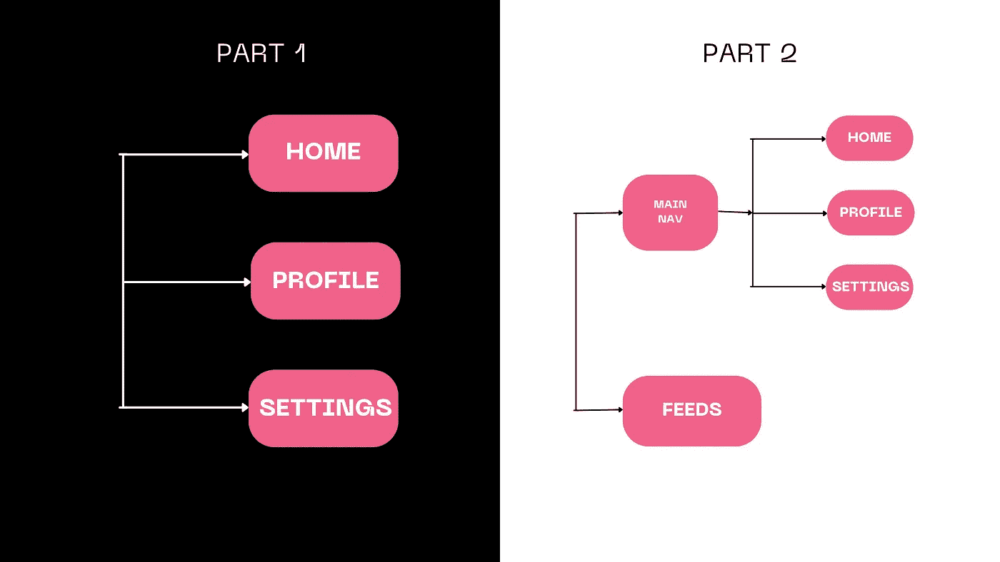
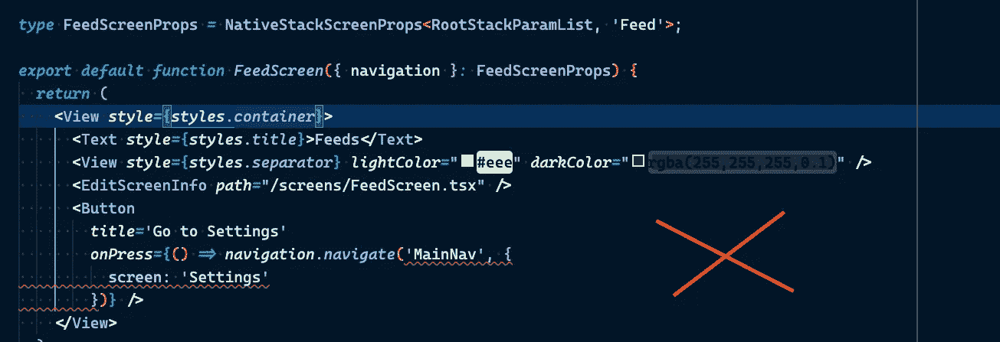
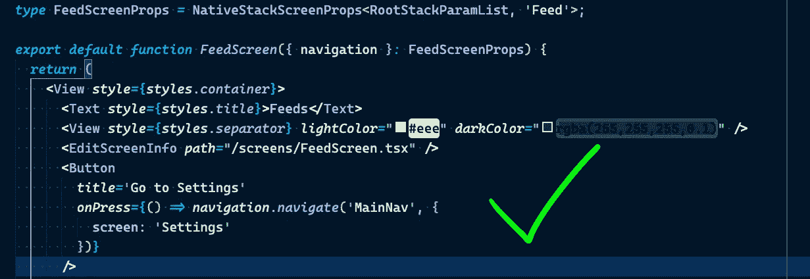
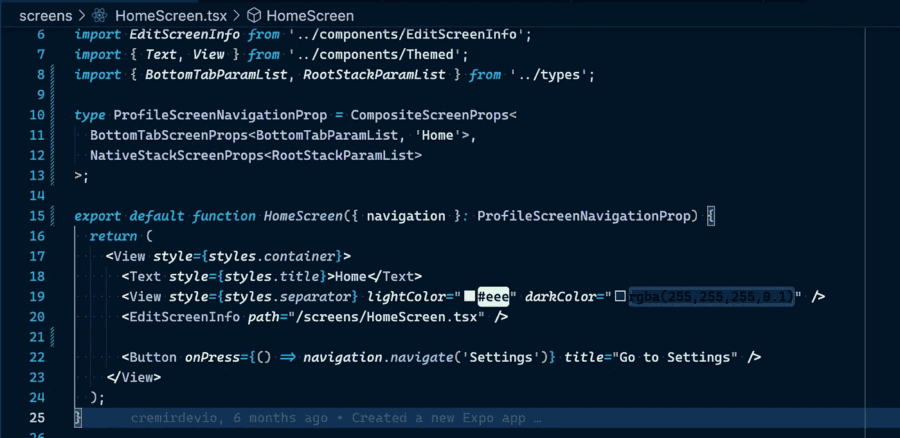
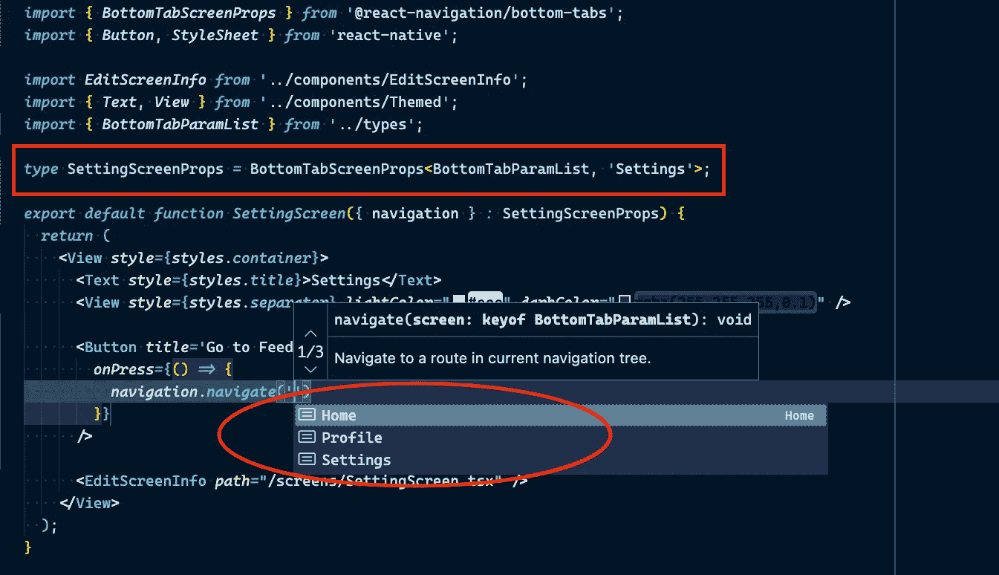
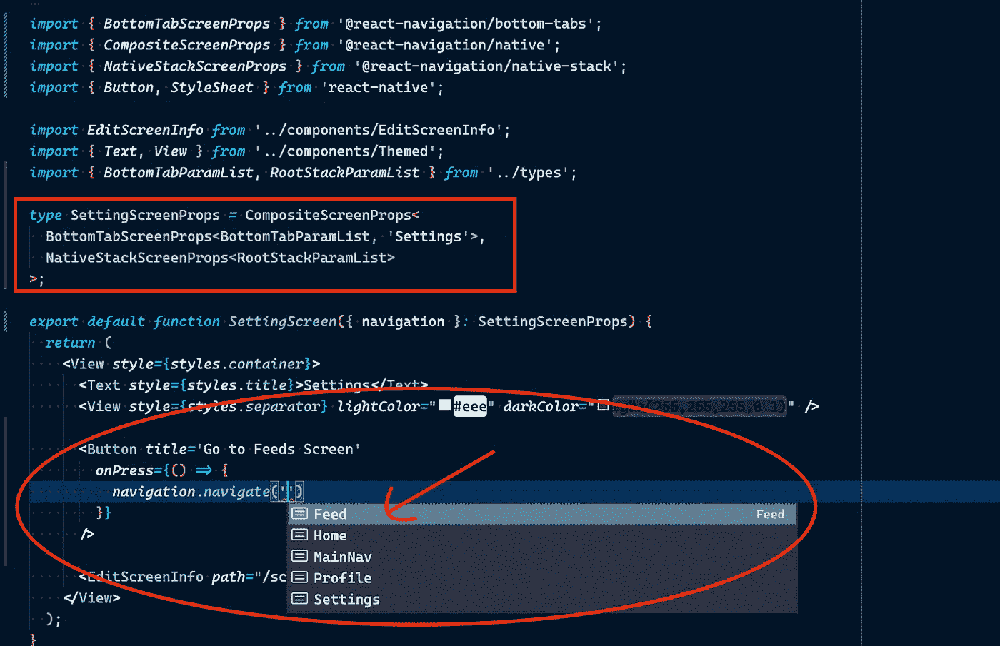

# 使用类型脚本反应导航版本 6:嵌套导航

> 原文：<https://javascript.plainenglish.io/react-navigation-v6-with-typescript-nested-navigation-part-2-87844f643e37?source=collection_archive---------1----------------------->

## 第 2 部分:关于如何使用 TypeScript 为 React 应用程序设置带有完整类型检查的嵌套导航的教程。


Photo by [Lautaro Andreani](https://unsplash.com/es/@lautaroandreani?utm_source=medium&utm_medium=referral) on [Unsplash](https://unsplash.com?utm_source=medium&utm_medium=referral)

现在我们已经熟悉了设置您的[React Native mobile application navigation with type script](/react-navigation-v6-with-typescript-5c9c065d45a5)。让我们通过设置带有完整类型检查的嵌套导航来更进一步。

让我们在不同的导航器中使用另一个名为 Feeds 的屏幕来扩展 3 个屏幕(主页、个人资料和设置)。在我们继续之前，我对前一个系列的源代码做了一些修改，从堆栈导航切换到底部选项卡导航。除了以下几点，没有太大的区别:

```
// from 
const Stack = createNativeStackNavigator<RootStackParamList>();*// to
const BottomTab = createBottomTabNavigator<RootStackParamList>()*;
```

下面是公共 gist 的链接，看看改动:[https://gist . github . com/cremirdevio/519 a2 AC 54 be 0 b 601 a 63 CB 30 ce 0596 a 2 . js](https://gist.github.com/cremirdevio/519a2ac54be0b601a63cb330ce0596a2.js)

这是我们将在本文中实现的导航结构。我们将看到如何使用下面的结构对嵌套导航进行类型检查。底部选项卡导航将嵌套到堆栈导航中。

我们的根导航将是一个堆栈导航，其中一个堆栈导航屏幕(主导航)将包含一个底部选项卡导航。



我们开始吧🚀🚀🚀

记住所涉及的两(2)个步骤:**类型检查导航器**和**类型检查单个屏幕:**

1.  **类型检查导航仪**

**注意:**您可以通过传递嵌套屏幕的`screen`和`params`属性来[导航到嵌套导航器](https://reactnavigation.org/docs/nesting-navigators#navigating-to-a-screen-in-a-nested-navigator)中的一个屏幕，如下所示:

```
// This is an example where the **Feed** Screen is nested in another
// Navigator named **Home**navigation.navigate('Home', {
  screen: 'Feed',
  params: { sort: 'latest' },
});
```

现在，让我们看看如何对它进行类型检查。

因为我们的根导航将只包含 2 个屏幕，所以让我们根据需要调整***RootStackParamList***。

```
*export* *type* **RootStackParamList** *=* {
  *MainNav:* undefined;
  *Feed:* undefined;
};
```

我们还将创建另一个对象来定义底部选项卡屏幕(我们称之为 **BottomTabParamList** )。

```
*export* *type* **BottomTabParamList** *=* {
  *Home:* undefined;
  *Profile:* undefined;
  *Settings:* undefined;
};
```

我们做以下操作来声明*底部选项卡屏幕*为*根堆栈*中 ***MainNav*** 屏幕的子。

```
*export* *type* RootStackParamList *=* {
  *MainNav****:* NavigatorScreenParams<BottomTabParamList>;**
  *Feed:* undefined;
};
```

事情是这样的:我们需要提取底部选项卡屏幕的参数(*主页、配置文件和设置*)，并将它们分配为 ***主导航*** 路线的*参数*。这可以通过使用`**NavigatorScreenParams**`实用程序，将我们的*BottomTabParamList***作为参数来完成。**

**仅仅这样做就使 **Feeds 屏幕**能够导航到 **MainNav** 路线内的嵌套屏幕。见下图:**

****

**When ***MainNav: undefined,*** *FeedScreen has no access to the nested navigation screens.***

****

***Now, when* ***MainNav:* NavigatorScreenParams<BottomTabParamList>*,*** *FeedScreen has access to the nested navigation screens.***

**2.**检查单个屏幕的类型****

**最初，我们了解到 React Navigation 中的导航器包导出了一个**通用类型**来定义来自相应导航器的`navigation`和`route`道具的类型。**

**例如，您可以将`**NativeStackScreenProps**`用于本机堆栈导航器(`@react-navigation/native`)；将`**StackScreenProps**`用于堆栈导航器(`@react-navigation/stack`)；将`**DrawerScreenProps**`用于抽屉导航器(`@react-navigation/drawer`)；将`**BottomTabScreenProps**`用于底部标签导航器(`@react-navigation/bottom-tabs`)等等。**

**当您嵌套导航器时，屏幕的导航属性是多个导航属性的组合。例如，如果我们在堆栈中有一个选项卡(就像我们的例子一样)，那么`navigation` prop 将同时有`jumpTo`(来自选项卡导航器)和`push`(来自堆栈导航器)。为了更容易地组合来自多个导航器的类型，您可以使用`**CompositeScreenProps**`类型。**

**我们的主屏幕的道具类型应该是这样的:**

```
*import* *type* { *CompositeScreenProps* } *from* '@react-navigation/native';
*import* *type* { *BottomTabScreenProps* } *from* '@react-navigation/bottom-tabs';
*import* *type* { NativeStackScreenProps } *from* '@react-navigation/stack';*type* **HomeScreenNavigationProp** *=* **CompositeScreenProps**<
  BottomTabScreenProps<BottomTabParamList, 'Home'>,
  NativeStackScreenProps<RootStackParamList>
>;
```

****

**All is looking good 🥳**

**先来了解一下`**CompositeScreenProps**` 的效用。**

**`CompositeScreenProps`类型有两个参数，第一个参数是**主导航**的属性类型(拥有这个屏幕的导航器的类型，在我们的例子中是包含`Home`屏幕的底部选项卡导航器)，第二个参数是辅助导航的属性类型(父导航器的类型，在我们的例子中是本地堆栈导航器)。**主要类型**应始终将*屏幕的路线名称作为其第二个参数*。**

****组成 2 个屏幕道具的主要重要性是什么？****

```
**CompositeScreenProps**<
  BottomTabScreenProps<BottomTabParamList, '**<Screen Route Name>**'>,
  NativeStackScreenProps<RootStackParamList>
>;
```

**完成以上操作后，我们底部选项卡屏幕中的导航属性可以直接导航到 FeedScreen。**

**默认情况下，底部选项卡导航器中的导航属性只能导航到其导航器中的屏幕/路线。请参见下面的示例:**

****

**Feeds route is not available to the navigate function. 𐄂**

**让我们看看当我们使用`**CompositeScreenProps**`工具合成屏幕道具时是什么样子的。**

****

**Feeds route is available to the navigate function. ☑️**

**在这里了解更多关于 React Navigation with TypeScript 的信息:[https://React Navigation . org/docs/TypeScript/# nesting-navigators](https://reactnavigation.org/docs/typescript/#nesting-navigators)**

***更多内容请看* [***说白了。报名参加我们的***](https://plainenglish.io/) **[***免费周报***](http://newsletter.plainenglish.io/) *。关注我们* [***推特***](https://twitter.com/inPlainEngHQ) ，[***LinkedIn***](https://www.linkedin.com/company/inplainenglish/)*，*[***YouTube***](https://www.youtube.com/channel/UCtipWUghju290NWcn8jhyAw)*，以及* [***不和***](https://discord.gg/GtDtUAvyhW) *。*****