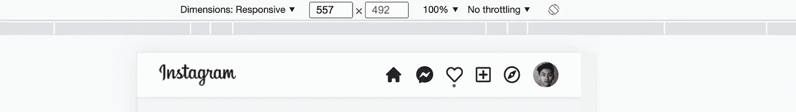
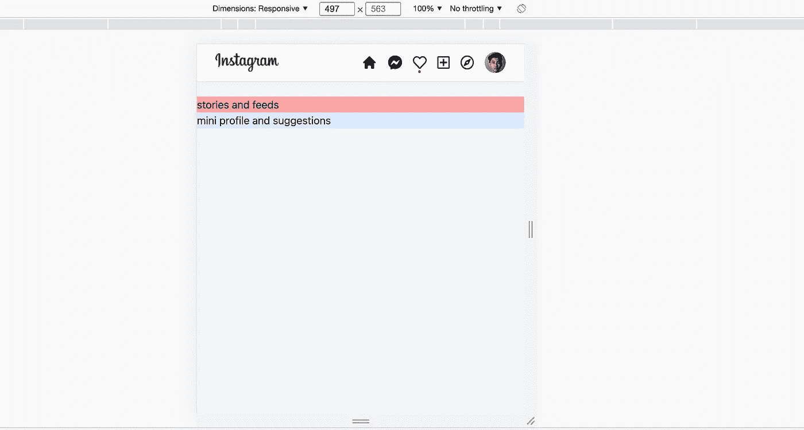

# 用 React、Next.js 和 Tailwind CSS 构建一个 Instagram Feed UI 克隆

> 原文：<https://javascript.plainenglish.io/react-nextjs-instagram-feeds-ui-with-tailwind-css-part-1-adjust-the-style-of-header-and-building-e33fa9ead586?source=collection_archive---------17----------------------->

## 第 1 部分:调整页眉的样式并构建布局

在本文中，我们将讨论如何创建 Instagram feed。

通过[加入](https://www.youtube.com/channel/UCu4-4FnutvSHVo9WHvq80Ww/join)频道，你将可以无限制地访问 YouTube 频道的所有源代码，并免费学习 Udemy 课程。


[我们从之前创建 Instagram 头部的项目开始。](https://ckmobile.medium.com/instagram-ui-clone-with-tailwindcss-and-nextjs-all-articles-b0308a5489e)

我们对标题做了一些修改，使它更接近真实的标题。

将最大宽度设置为 4xl。

将内容的高度设置为 10 个单位。(图像、输入和图标组)

将徽标和输入框的宽度设置为总宽度的 4/6。

最初将输入框设置为隐藏，然后设置为在断点 md 显示 flex。

```
<div className=" shadow-sm border-b bg-white top-0 fixed w-full z-20"><div className="flex justify-between **max-w-4xl** mx-5 xl:mx-auto p-2"><div className="relative w-24 **h-10** lg:inline-grid ">
**<div className="flex justify-between w-4/6">**<Image src="https://www.instagram.com/static/images/web/mobile_nav_type_logo.png/735145cfe0a4.png" layout="fill" objectFit="contain" /></div><div ref={inputAreaRef} className="**hidden**  relative mt-1 p-1 pl-2 rounded-md sm:text-sm border-solid border-[1.2px] border-gray-300 **md:flex** bg-gray-50 **items-center** ">{searchVisible && <SearchIcon className="  h-5 w-5 text-gray-400  " />}<input type="text" placeholder="search" className="headerinput pl-1 bg-gray-50 block  focus:outline-none" />{crossVisible && <PlusCircleIcon className="  h-5 w-5 text-gray-400 rotate-45 " />}{showToolTip && <SearchTip />}</div>
**</div>**<div className="flex items-center justify-end space-x-4 "><HomeIcon className="h-6 cursor-pointer" /><FontAwesomeIcon className="cursor-pointer" icon={faFacebookMessenger} size="lg" /><div className="relative "><FontAwesomeIcon className="cursor-pointer" icon={faHeart} size="lg" /><div className="block absolute w-1 h-1 left-1/2 -translate-x-1/2 bg-red-600 rounded-full " /><HeartTip /></div><FontAwesomeIcon className="cursor-pointer" icon={faPlusSquare} size="lg" /><FontAwesomeIcon className="cursor-pointer" icon={faCompass} size="lg" /><div className="avatar"><div className="rounded-full w-8 h-8"></div></div></div></div</div>
```

当屏幕尺寸较小时，输入框将被隐藏。



当屏幕尺寸碰到断点 md 时，就会出现。


## 创建 feed 组件

在组件下，创建 Feed.js，主元素有类`grid grid-cols-1`。因此，当移动视图，它只有一个栏目，所以它会显示故事和饲料，迷你个人资料和建议将被放在底部。

当屏幕尺寸较大时，故事和提要将放在左侧，而“迷你简介和建议”将放在右侧。

```
const Feed = () => {return (<main className="grid grid-cols-1 md:grid-cols-2 md:max-w-3xl xl:grid-cols-3 xl:max-w-4xl mx-auto"><section className="col-span-2 bg-red-300">stories and feeds</section><section className="bg-blue-100">mini profile and suggestion</section></main>)}export default Feed
```



如果你喜欢这个故事，你可能也喜欢中等会员。一个月才 5 美元(一杯咖啡的价格！)但是它会在支持你最喜欢的作家的同时，给你无限的接触故事的机会。如果你注册使用[这个链接](https://ckmobile.medium.com/membership)，我会赚一小笔佣金。谢谢！

# 关注我们: [YouTube](https://www.youtube.com/channel/UCu4-4FnutvSHVo9WHvq80Ww?sub_confirmation=1) ， [Medium](https://ckmobile.medium.com/) ， [Udemy](https://www.udemy.com/user/cyruschan2/) ， [Linkedin](https://www.linkedin.com/company/ckmobi/) ， [Twitter](https://twitter.com/ckmobilejavasc1) ， [Instagram](https://www.instagram.com/ckmobile8050) ， [Gumroad](https://app.gumroad.com/ckmobile) ， [Quora](https://ckmobile.quora.com/) ， [Telegram](https://t.me/ckmobi)

加入分支机构赚钱

[https://ckmobile.gumroad.com/affiliates](https://ckmobile.gumroad.com/affiliates)

*更多内容看* [***说白了。报名参加我们的***](http://plainenglish.io/) **[***免费周报***](http://newsletter.plainenglish.io/) *。在我们的* [***社区获得独家访问写作机会和建议***](https://discord.gg/GtDtUAvyhW) *。***