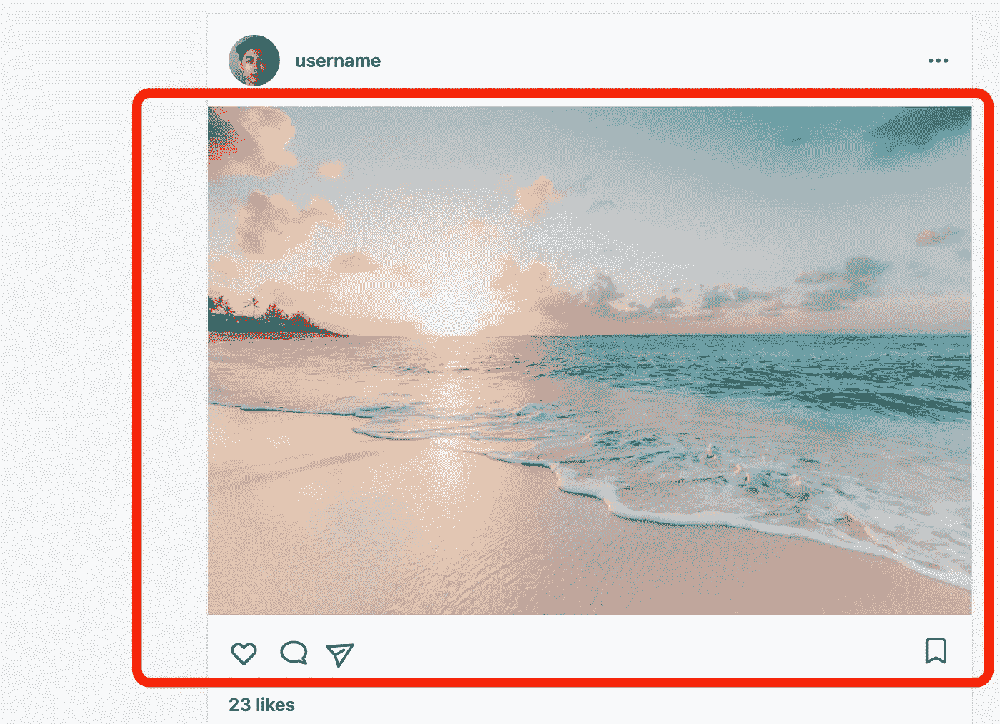
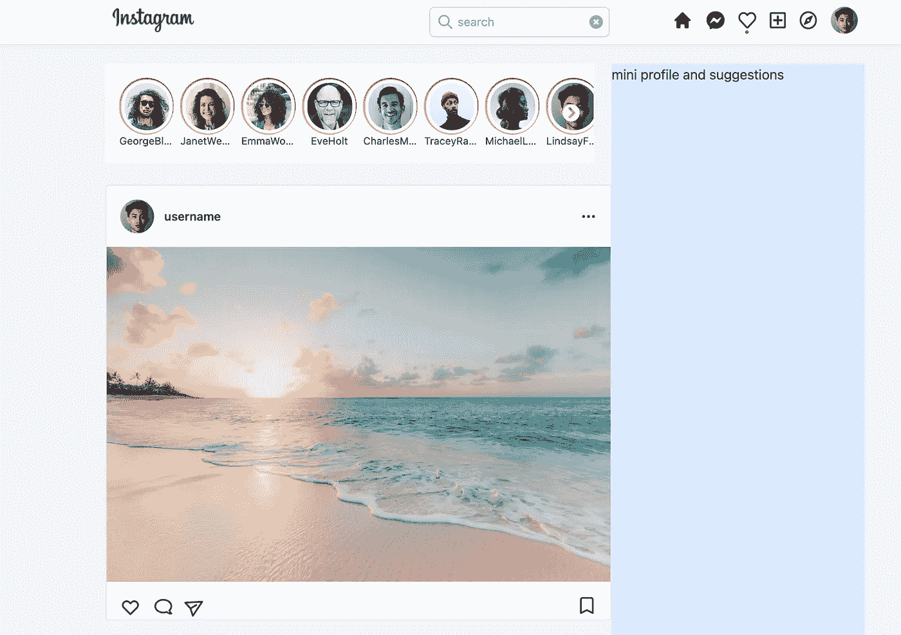

# 用 React、Next.js 和 Tailwind CSS 构建一个 Instagram Feed UI 克隆

> 原文：<https://javascript.plainenglish.io/react-nextjs-instagram-feeds-ui-with-tailwind-css-part-4-add-the-image-and-icons-group-52e62bbe140c?source=collection_archive---------15----------------------->

## 第 4 部分—添加图像和图标组

在本文中，我们将使用 fontawesome 和 React heroicon 添加用户共享的图片、心形图标、评论图标、共享图标和收藏图标。

通过[加入频道](https://www.youtube.com/channel/UCu4-4FnutvSHVo9WHvq80Ww/join)，你将可以无限制地访问 Youtube 频道的所有源代码，并免费学习 Udemy 课程。



## 添加图像

首先，我们添加带有外部链接的图像。

```

```

宽度为 100%。

## 添加图标

在这一部分，我们将添加图标，所以我们需要从 heroicons 中导入心形，纸飞机，书签。

从“react-fontawesome”导入 fontawesome 图标，也从免费的常规 SVG 图标导入注释图标。

```
import {DotsHorizontalIcon, HeartIcon, PaperAirplaneIcon, BookmarkIcon} from "@heroicons/react/outline";import { FontAwesomeIcon } from '@fortawesome/react-fontawesome';import { faComment } from '@fortawesome/free-regular-svg-icons';
```

在下，添加以下内容

```
<div className="flex justify-between px-4 pt-4"><div className="flex space-x-4 items-center"><HeartIcon className="h-6" /><FontAwesomeIcon className="cursor-pointer scale-x-[-1] " icon={faComment} size="lg" /><PaperAirplaneIcon className="h-6 rotate-[60deg] mb-1" /></div><BookmarkIcon className="h-6" /></div>
```

使用

和`flex`来保持所有图标，水平填充 4 个单位，顶部填充 4 个单位。使用另一个带 flex 的< div >来放置心形、评论和纸飞机图标。

因此，心，评论和平面图标将在一组，然后这个图标组将在左侧和书签图标将在右侧。

我们还在图标组添加了`items-center`,这样所有的图标都会垂直居中对齐。

将`scale-x-[-1]`添加到评论图标，这样它会垂直翻转。

将`rotate-[60deg]`添加到平面图标上，这样它就会旋转 60 度，就像真正的 Instagram 图标一样。

完整代码:

```
import {DotsHorizontalIcon, HeartIcon, PaperAirplaneIcon, BookmarkIcon} from "@heroicons/react/outline";import { FontAwesomeIcon } from '@fortawesome/react-fontawesome';import { faComment } from '@fortawesome/free-regular-svg-icons';const Post = () => {return (<div className="bg-white my-7 border rounded-sm"><div className="flex items-center p-4"><div className="avatar mr-3"><div className="rounded-full w-10 h-10"></div></div><p className="flex-1  text-sm font-semibold">username</p><DotsHorizontalIcon className="h-5" /></div><div className="flex justify-between px-4 pt-4"><div className="flex space-x-4 items-center"><HeartIcon className="h-6" /><FontAwesomeIcon className="cursor-pointer scale-x-[-1] " icon={faComment} size="lg" /><PaperAirplaneIcon className="h-6 rotate-[60deg] mb-1" /></div><BookmarkIcon className="h-6" /></div></div>)}export default Post
```



如果你喜欢这个故事，你可能也喜欢中等会员。一个月才 5 美元(一杯咖啡的价格！)但是它会在支持你最喜欢的作家的同时，给你无限的接触故事的机会。如果你注册使用[这个链接](https://ckmobile.medium.com/membership)，我会赚一小笔佣金。谢谢！

# 关注我们: [YouTube](https://www.youtube.com/channel/UCu4-4FnutvSHVo9WHvq80Ww?sub_confirmation=1) ， [Medium](https://ckmobile.medium.com/) ， [Udemy](https://www.udemy.com/user/cyruschan2/) ， [Linkedin](https://www.linkedin.com/company/ckmobi/) ， [Twitter](https://twitter.com/ckmobilejavasc1) ， [Instagram](https://www.instagram.com/ckmobile8050) ， [Gumroad](https://app.gumroad.com/ckmobile) ， [Quora](https://ckmobile.quora.com/) ， [Telegram](https://t.me/ckmobi)

加入分支机构赚钱

[https://ckmobile.gumroad.com/affiliates](https://ckmobile.gumroad.com/affiliates)

*更多内容请看* [***说白了就是***](http://plainenglish.io/) *。报名参加我们的* [***免费每周简讯***](http://newsletter.plainenglish.io/) *。在我们的* [***社区***](https://discord.gg/GtDtUAvyhW) *获得独家获得写作机会和建议。*