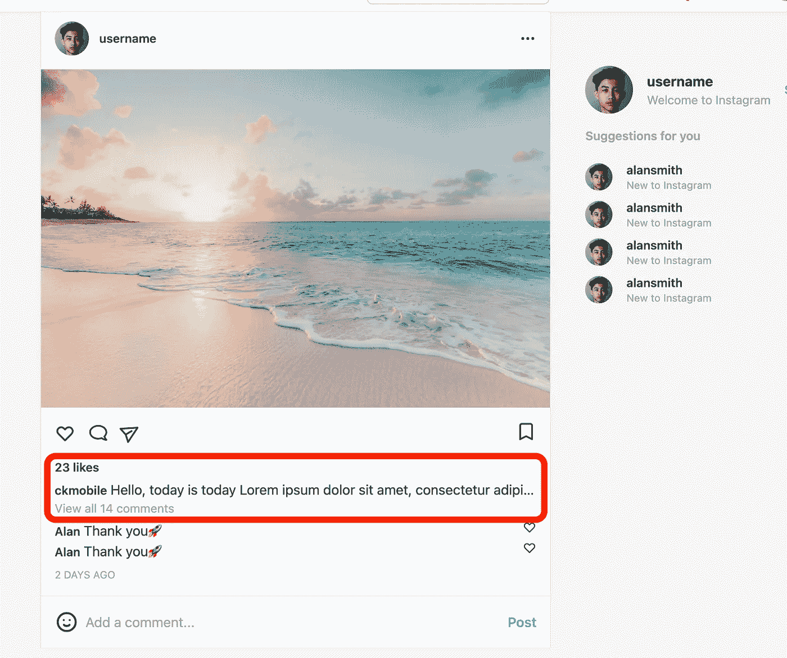

# 用 React、Next.js 和 Tailwind CSS 构建一个 Instagram Feed UI 克隆

> 原文：<https://javascript.plainenglish.io/react-nextjs-instagram-feeds-ui-with-tailwind-css-part-5-number-of-likes-caption-and-comments-f5f9ea9929?source=collection_archive---------20----------------------->

## 第 5 部分—喜欢、标题和评论的数量

在这篇文章中，我们将添加喜欢，标题和评论的数量。

通过[加入](https://www.youtube.com/channel/UCu4-4FnutvSHVo9WHvq80Ww/join)频道，你将可以无限制地访问 YouTube 频道中的所有源代码，并免费学习 Udemy 课程。



## 喜欢和标题

在图标组之后，我们添加包含赞数和标题的段落。

有类`px-4`使填充 4 水平单位。`mt-4`是在这个段落和顶部的图标组之间创建 4 个单位的边距。`truncate`就是隐藏溢出的文字，然后加上省略号(末尾三个点)。


Three dots at the end

然后我们创建另一个

，字体粗细为半粗体，小文本，页边距底部为 1 个单位，用来保存喜欢的数量。

最后，我们使用来保存字体粗细为半粗体、右边距为 1 个单位、小文本的用户名。之后，添加不带任何样式的标题。

```
<p className="px-4 mt-4 truncate"><p className="font-semibold mb-1 text-sm">23 likes</p><span className="font-semibold mr-1 text-sm">ckmobile</span>Hello, today is today</p>
```

## 评论

对于评论部分，我们使用

来保存文本“查看所有 14 条评论”。我们使用`px-4`添加添加横线，`text-sm`形成小文本，`mb-1`用于 1 个单位的页边空白底部。`text-gray-400`为灰色文本，`cursor-pointer`所以当鼠标经过它时，光标会变成一根手指。

```
<p className="px-4 text-sm mb-1 text-gray-400 cursor-pointer ">View all 14 comments</p>
```


如果你喜欢这个故事，你可能也喜欢中等会员。一个月才 5 美元(一杯咖啡的价格！)但是它会在支持你最喜欢的作家的同时，给你无限的接触故事的机会。如果你使用[这个链接](https://ckmobile.medium.com/membership)注册，我会赚一小笔佣金。谢谢！

# 关注我们: [YouTube](https://www.youtube.com/channel/UCu4-4FnutvSHVo9WHvq80Ww?sub_confirmation=1) ， [Medium](https://ckmobile.medium.com/) ， [Udemy](https://www.udemy.com/user/cyruschan2/) ， [Linkedin](https://www.linkedin.com/company/ckmobi/) ， [Twitter](https://twitter.com/ckmobilejavasc1) ， [Instagram](https://www.instagram.com/ckmobile8050) ， [Gumroad](https://app.gumroad.com/ckmobile) ， [Quora](https://ckmobile.quora.com/) ， [Telegram](https://t.me/ckmobi)

加入分支机构赚钱

[https://ckmobile.gumroad.com/affiliates](https://ckmobile.gumroad.com/affiliates)

*更多内容请看* [***说白了就是***](http://plainenglish.io/) *。报名参加我们的* [***免费每周简讯***](http://newsletter.plainenglish.io/) *。在我们的* [***社区***](https://discord.gg/GtDtUAvyhW) *获得独家获得写作机会和建议。*