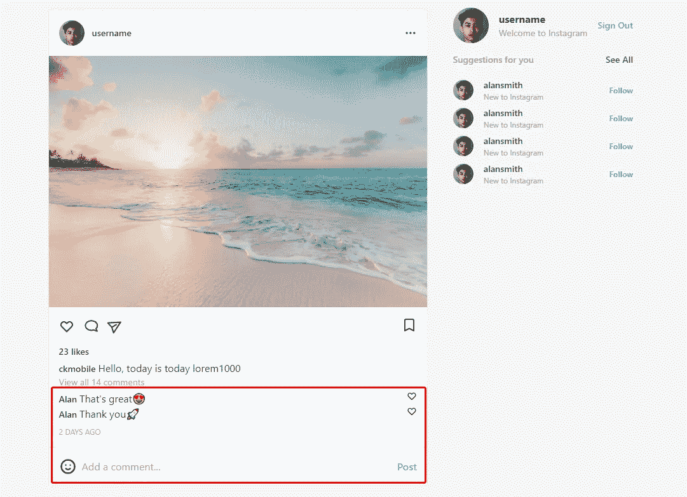
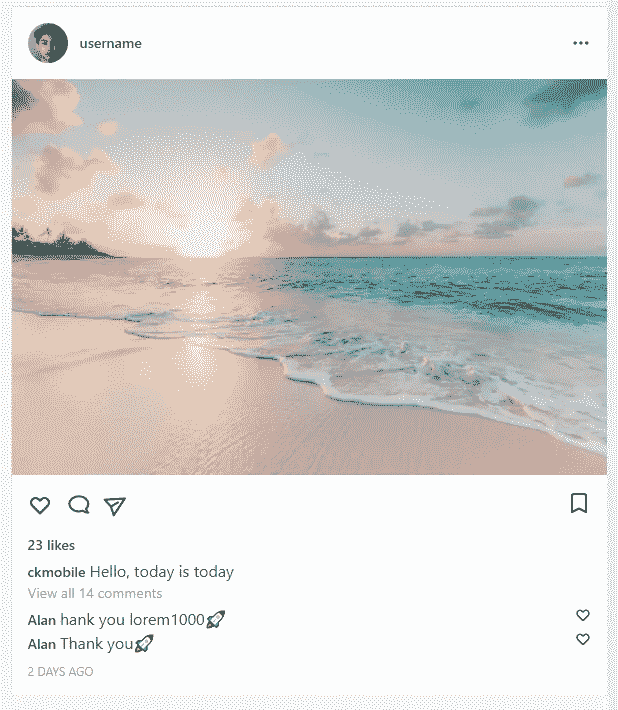

# 用 React、Next.js 和 Tailwind CSS 构建一个 Instagram Feed UI 克隆

> 原文：<https://javascript.plainenglish.io/react-nextjs-instagram-feeds-ui-with-tailwind-css-part-6-comment-and-input-box-b149413a8885?source=collection_archive---------17----------------------->

## 第 6 部分:注释和输入框

在这一部分，我们将添加来自其他用户的评论和供人们添加评论的输入框。

通过[加入频道](https://www.youtube.com/channel/UCu4-4FnutvSHVo9WHvq80Ww/join)，你将可以无限制地访问 YouTube 频道中的所有源代码，并免费学习 Udemy 课程。



## 评论

对于父节点

，我们使用了`px-4`，它在左右两侧添加了填充，使用了`flex`使用户名、评论和图标排成一行，`justify-between`使用户名和心形图标放在两端。

对于评论部分，我们使用了一个

来保存每个评论，使用了来保存用户名，字体粗细为半粗体，边距为 1，文本较小。

我们从 react 轮廓导入 HeartIcon，然后用`h-4`来限制图标的高度。

然后我们把这个评论复制一次，把评论的内容改一下就行了。

最后，我们添加时间，水平填充 4 个单位，空白顶部 2 个单位，额外的小文本和空白底部 4 个单位的灰色。

我们加上水平线

```
import {BookmarkIcon,ChatIcon,DotsHorizontalIcon,EmojiHappyIcon,**HeartIcon**,PaperAirplaneIcon,} from "@heroicons/react/outline";<div className="px-4   flex justify-between"><div><span className="font-semibold mr-1 text-sm">Alan</span>That's great😍</div><HeartIcon className="h-4" /></div><div className="px-4  truncate flex justify-between"><div><span className="font-semibold mr-1 text-sm">Alan</span>Thank you🚀</div><HeartIcon className="h-4" /></div><div className="px-4 mt-2 text-gray-400 text-xs mb-4">2 DAYS AGO</div><hr />
```



## 输入接线盒

我们从 heroicon react 大纲中导入 EmojiHappyIcon。

```
import {BookmarkIcon,ChatIcon,DotsHorizontalIcon,**EmojiHappyIcon,**HeartIcon,PaperAirplaneIcon,} from "@heroicons/react/outline";
```

用 classname `flex items-center p-4`创建一个表单，使表情符号、输入字段和发布按钮排成一行，垂直居中对齐，水平填充 4 个单位。

然后我们添加高度为 7 个单位、右边空白为 2 个单位的快乐图标。输入类型等于文本的字段，`flex-1`使其占据所有剩余空间。没有边框和轮廓，设置环形焦点时为零。添加带有文本“添加评论…”的占位符

最后添加字体粗细为半加粗，蓝色为 400 单位的按钮。

```
<form className="flex items-center p-4"><EmojiHappyIcon className="h-7 mr-2" /><inputtype="text"className="border-none flex-1 focus:ring-0 outline-none"placeholder="Add a comment..."/><buttontype="submit"className="font-semibold text-blue-400">Post</button></form>
```


## 在帖子上复制帖子

在 Post.js 中，我们再复制一个<post>组件。这使我们能够滚动页面。</post>

```
import Post from "./Post"const Posts = () => {return (<div>**<Post/>****<Post/>**</div>)}export default Posts
```

如果你喜欢这个故事，你可能也喜欢中等会员。一个月才 5 美元(一杯咖啡的价格！)但是它会在支持你最喜欢的作家的同时，给你无限的接触故事的机会。如果你使用[这个链接](https://ckmobile.medium.com/membership)注册，我会赚一小笔佣金。谢谢！

# 关注我们: [YouTube](https://www.youtube.com/channel/UCu4-4FnutvSHVo9WHvq80Ww?sub_confirmation=1) ， [Medium](https://ckmobile.medium.com/) ， [Udemy](https://www.udemy.com/user/cyruschan2/) ， [Linkedin](https://www.linkedin.com/company/ckmobi/) ， [Twitter](https://twitter.com/ckmobilejavasc1) ， [Instagram](https://www.instagram.com/ckmobile8050) ， [Gumroad](https://app.gumroad.com/ckmobile) ， [Quora](https://ckmobile.quora.com/) ， [Telegram](https://t.me/ckmobi)

加入分支机构赚钱

[https://ckmobile.gumroad.com/affiliates](https://ckmobile.gumroad.com/affiliates)

*更多内容请看* [***说白了就是***](http://plainenglish.io/) *。报名参加我们的* [***免费每周简讯***](http://newsletter.plainenglish.io/) *。在我们的* [***社区***](https://discord.gg/GtDtUAvyhW) *获得独家获得写作机会和建议。*