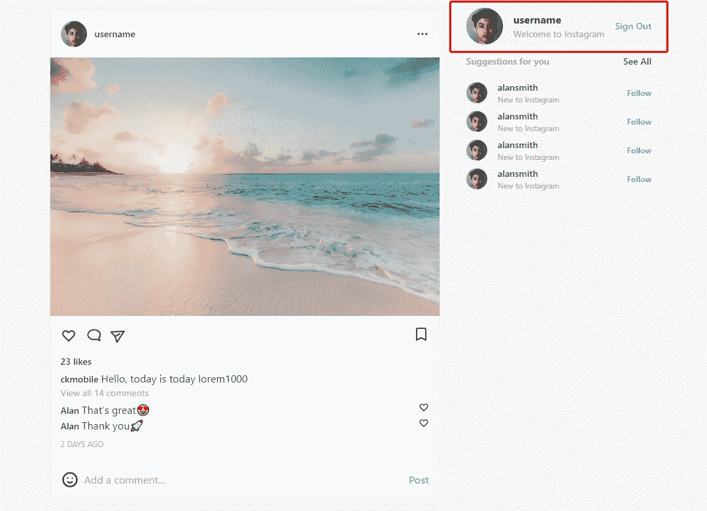
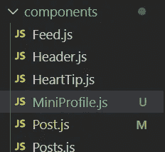
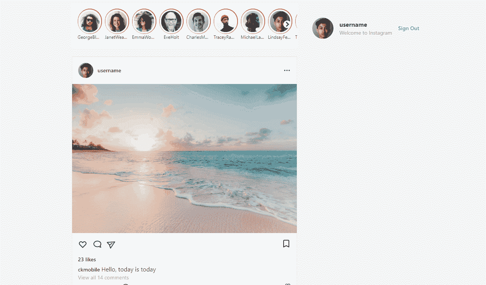

# 用 React、Next.js 和 Tailwind CSS 构建一个 Instagram Feed UI 克隆

> 原文：<https://javascript.plainenglish.io/react-nextjs-instagram-feeds-ui-with-tailwind-css-part-7-create-miniprofile-component-55cea212687d?source=collection_archive---------12----------------------->

## 第 7 部分:创建 MiniProfile 组件

在本文中，我们将向 Instagram 克隆添加 mini profile 组件。

通过[加入频道](https://www.youtube.com/channel/UCu4-4FnutvSHVo9WHvq80Ww/join)，你将可以无限制地访问 YouTube 频道中的所有源代码，并免费学习 Udemy 课程。



在 components 文件夹下，我们创建 MiniProfile.js



在 MiniProfile.js 中，我们添加了类名为`flex items-center justify-between mt-10 ml-10`的

。

通过使用`flex`，头像、带有描述的用户名和注销按钮将排成一行。`justify-between`使三个项目之间有相同的空间。我们还增加了 10 个单位的左边和上边的空白。

```
const MiniProfile = () => {return (<div className="flex items-center justify-between mt-10 ml-10"></div>)}export default MiniProfile
```

然后我们用 Daisy UI 添加头像。设置 14 个单位的宽度和高度。

```
const MiniProfile = () => {return (<div className="flex items-center justify-between mt-10 ml-10">**<div className="avatar">****<div className="rounded-full w-14 h-14">********</div>**</div></div>)}export default MiniProfile
```

我们添加了另一个

，它保存了带有`flex-1`和`mx-4`的用户名和描述。它给出了 4 个单位的水平边距，并且它将占据所有剩余的空间

添加字体粗细为粗体的用户名和小文本、灰色的描述。

```
const MiniProfile = () => {return (<div className="flex items-center justify-between mt-10 ml-10"><div className="avatar"><div className="rounded-full w-14 h-14"></div></div><div className="flex-1 mx-4"><h2 className="font-bold">username</h2><h3 className="text-sm text-gray-400">Welcome to Instagram</h3></div>**<button className="text-blue-400 text-sm font-semibold" >****Sign Out****</button>**</div>)}export default MiniProfile
```

最后，使用 400 单位的蓝色字体，小字体，字体粗细为半粗体。

## 导入到 Feed.js

回到 Feed.js，导入 MiniProfile 并放入第二部分。

移除该部分的背景色，并在类名为`fixed`的

中添加 MinProfile。

```
import MiniProfile from "./MiniProfile";import Posts from "./Posts";import Stories from "./Stories";const Feed = () => {return (<main className="grid grid-cols-1  md:max-w-3xl xl:grid-cols-3  xl:max-w-4xl mx-auto"><section className="col-span-2 "><Stories/><Posts/></section>**<section >****<div className="fixed ">****<MiniProfile/>****</div>****</section>**</main>)}export default Feed
```



如果你喜欢这个故事，你可能也喜欢中等会员。一个月才 5 美元(一杯咖啡的价格！)但是它会在支持你最喜欢的作家的同时，给你无限的接触故事的机会。如果你使用[这个链接](https://ckmobile.medium.com/membership)注册，我会赚一小笔佣金。谢谢！

# 关注我们: [YouTube](https://www.youtube.com/channel/UCu4-4FnutvSHVo9WHvq80Ww?sub_confirmation=1) ， [Medium](https://ckmobile.medium.com/) ， [Udemy](https://www.udemy.com/user/cyruschan2/) ， [Linkedin](https://www.linkedin.com/company/ckmobi/) ， [Twitter](https://twitter.com/ckmobilejavasc1) ， [Instagram](https://www.instagram.com/ckmobile8050) ， [Gumroad](https://app.gumroad.com/ckmobile) ， [Quora](https://ckmobile.quora.com/) ， [Telegram](https://t.me/ckmobi)

加入分支机构赚钱

[https://ckmobile.gumroad.com/affiliates](https://ckmobile.gumroad.com/affiliates)

*更多内容请看* [***说白了就是***](http://plainenglish.io/) *。报名参加我们的* [***免费每周简讯***](http://newsletter.plainenglish.io/) *。在我们的* [***社区***](https://discord.gg/GtDtUAvyhW) *获得独家获得写作机会和建议。*