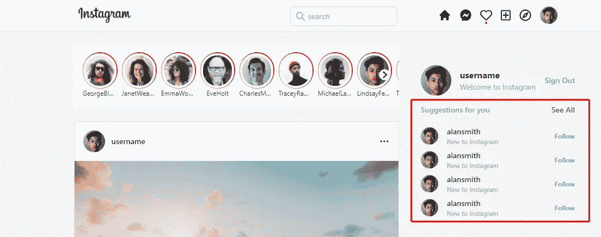
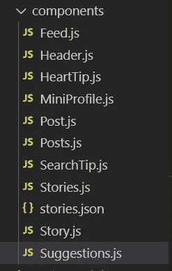
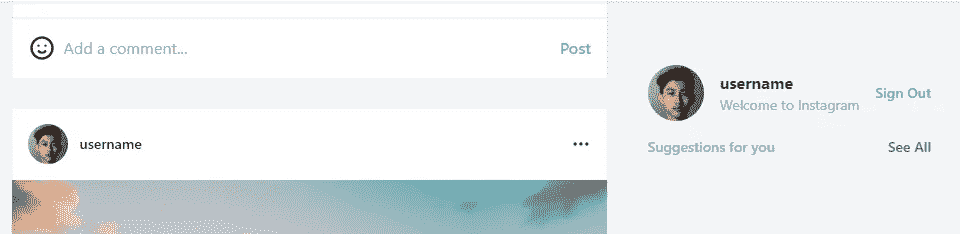
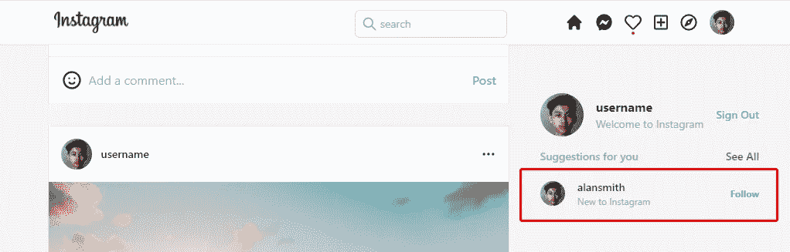

# 用 React、Next.js 和 Tailwind CSS 构建一个 Instagram Feed UI 克隆

> 原文：<https://javascript.plainenglish.io/react-nextjs-instagram-feeds-ui-with-tailwind-css-part-8-create-suggestion-component-522047b039e9?source=collection_archive---------16----------------------->

## 第 8 部分:创建建议组件

在本文中，我们将添加建议组件。

通过[加入频道](https://www.youtube.com/channel/UCu4-4FnutvSHVo9WHvq80Ww/join)，你将可以无限制地访问 YouTube 频道的所有源代码，并免费学习 Udemy 课程。



在“components”文件夹下，添加 Suggestions.js



## 标题和按钮

在 Suggestions.js 中，添加带有`mt-4 ml-10`的

，上边距为 4 个单位，左边距为 10 个单位。

然后我们用`flex justify-between`创建另一个

，这样标题“给你的建议”和按钮“查看全部”就会排成一行，把这两个元素推到两端。

```
const Suggestions = () => {return (<div className="mt-4 ml-10"><div className="flex justify-between text-sm mb-5"><h3 className="text-sm font-semibold text-gray-400">Suggestions for you</h3><button className="text-gray-600 font-semibold">See All</button></div></div>)}export default Suggestions
```



## 建议

对于每个建议，我们添加了类名`flex items-center justify-between mt-3`，这样头像、用户名描述和跟随按钮将会排成一行，并且垂直居中对齐。它们之间有相同的空间，上边距为 3 个单位。

然后借助 daisy UI 添加头像，设置 8 个单位的高度和宽度。

然后用

按住标题“alansmith”和描述“Instagram 新手”。这个的类名是`flex-1 ml-4`，所以它会占用所有剩余的空间。

我们使用字体粗细为半粗体和小文本的

## 作为用户名。

使用

### 和灰色超小文本进行描述。

最后，用加粗的蓝色小字体创建 follow 按钮。

```
<divclassName="flex items-center justify-between mt-3"><div className="avatar"><div className="rounded-full w-8 h-8"></div></div><div className="flex-1 ml-4"><h2 className="font-semibold text-sm">alansmith</h2><h3 className="text-xs text-gray-400">New to Instagram</h3></div><button className="text-blue-400 text-xs font-bold">Follow</button></div>
```



我们再重复几次。


如果你喜欢这个故事，你可能也喜欢中等会员。一个月才 5 美元(一杯咖啡的价格！)但是它会在支持你最喜欢的作家的同时，给你无限的接触故事的机会。如果你使用[这个链接](https://ckmobile.medium.com/membership)注册，我会赚一小笔佣金。谢谢！

# 关注我们: [YouTube](https://www.youtube.com/channel/UCu4-4FnutvSHVo9WHvq80Ww?sub_confirmation=1) ， [Medium](https://ckmobile.medium.com/) ， [Udemy](https://www.udemy.com/user/cyruschan2/) ， [Linkedin](https://www.linkedin.com/company/ckmobi/) ， [Twitter](https://twitter.com/ckmobilejavasc1) ， [Instagram](https://www.instagram.com/ckmobile8050) ， [Gumroad](https://app.gumroad.com/ckmobile) ， [Quora](https://ckmobile.quora.com/) ， [Telegram](https://t.me/ckmobi)

加入分支机构赚钱

[https://ckmobile.gumroad.com/affiliates](https://ckmobile.gumroad.com/affiliates)

*更多内容请看* [***说白了就是***](http://plainenglish.io/) *。报名参加我们的* [***免费每周简讯***](http://newsletter.plainenglish.io/) *。在我们的* [***社区***](https://discord.gg/GtDtUAvyhW) *获得独家获得写作机会和建议。*