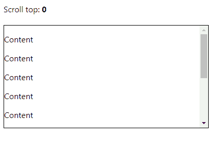
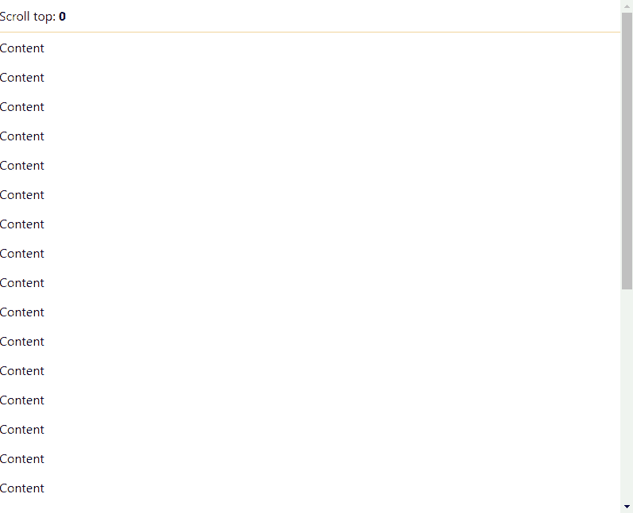

# 如何在 React 中轻松处理 onScroll 事件

> 原文：<https://javascript.plainenglish.io/react-onscroll-fbd93e3d9f8a?source=collection_archive---------5----------------------->


要处理 React 元素上的`onScroll`事件，需要为元素的`onScroll`属性分配一个函数，并使用 event 对象来执行一个动作。每当用户在页面上向上或向下滚动时，就会发生该操作。

例如:

`App.jsx`

```
import { useState } from 'react';

export default function App() {
  const [scrollTop, setScrollTop] = useState(0);

  const handleScroll = (event) => {
    setScrollTop(event.currentTarget.scrollTop);
  };

  return (
    <div>
      Scroll top: <b>{scrollTop}</b>
      <br />
      <br />
      <div
        style={{
          border: '1px solid black',
          width: '400px',
          height: '200px',
          overflow: 'auto',
        }}
        onScroll={handleScroll}
      >
        {[...Array(10)].map((_, i) => (
          <p key={i}>Content</p>
        ))}
      </div>
    </div>
  );
}
```



The text is updated when the component’s `onScroll` event fires.

每当视窗滚动时，传递给`onScroll`属性的函数(事件监听器)就会被调用。它是用一个事件对象调用的，该对象可用于执行操作和访问与滚动事件相关的信息。

这个事件对象的`currentTarget`属性返回`onScroll`监听器所连接的元素。

**提示:**如果您不确定何时使用事件对象的`currentTarget`或`target`属性，本文可能会有所帮助:[JavaScript 中的事件目标与当前目标:重要的区别](https://codingbeautydev.com/blog/javascript-event-target-vs-currenttarget/)。

我们使用元素的`scrollTop`属性来获取元素的滚动条距离其最顶端的位置有多远。然后我们用新值更新状态变量，这反映在页面上。

**注意**:我们使用了`[useState](https://reactjs.org/docs/hooks-state.html)`钩子来管理状态。这个钩子返回两个值的数组，其中第一个是存储状态的变量，第二个是在被调用时更新状态的函数。

# 在 React 中处理`window`对象上的 onScroll 事件

我们还可以处理全局`[window](https://developer.mozilla.org/en-US/docs/Web/API/Window)`对象上的`onScroll`事件，以便在视窗滚动时执行一个动作。我们可以用`addEventListener()`方法做到这一点:

`App.js`

```
import { useState, useEffect } from 'react';

export default function App() {
  const [scrollTop, setScrollTop] = useState(0);

  useEffect(() => {
    const handleScroll = (event) => {
      setScrollTop(window.scrollY);
    };

    window.addEventListener('scroll', handleScroll);

    return () => {
      window.removeEventListener('scroll', handleScroll);
    };
  }, []);

  return (
    <div>
      <div
        style={{
          position: 'fixed',
          padding: '10px 0',
          top: '0',
          backgroundColor: 'white',
          borderBottom: '1px solid #c0c0c0',
          width: '100%',
        }}
      >
        Scroll top: <b>{scrollTop}</b>
      </div>
      <div style={{ marginTop: '50px' }}>
        {[...Array(30)].map((_, i) => (
          <p key={i}>Content</p>
        ))}
      </div>
    </div>
  );
}
```



The text is updated when the window’s `onScroll` event fires.

`[addEventListener()](https://developer.mozilla.org/en-US/docs/Web/API/EventTarget/addEventListener)`方法最多接受两个参数:

1.  `type`:表示要监听的事件类型的字符串。
2.  `listener`:事件触发时调用的函数。

它还需要一些可选的参数，你可以在这里了解更多关于[的内容。](https://developer.mozilla.org/en-US/docs/Web/API/EventTarget/addEventListener)

一旦组件在页面加载时呈现，我们就调用`[useEffect](https://reactjs.org/docs/hooks-effect.html)`钩子中的`addEventListener()`来注册监听器。我们将一个空的依赖数组传递给`useEffect`,这样这个注册只发生一次。在 cleanup 函数中，我们调用`[removeEventListener()](https://developer.mozilla.org/en-US/docs/Web/API/EventTarget/removeEventListener)`方法来取消注册事件监听器并防止内存泄漏。

在`onScroll`监听器中，我们访问`[Window](https://developer.mozilla.org/en-US/docs/Web/API/Window/scrollY)` [](https://developer.mozilla.org/en-US/docs/Web/API/Window/scrollY)`[scrollY](https://developer.mozilla.org/en-US/docs/Web/API/Window/scrollY)`属性来显示页面当前水平滚动的像素数。

*原载于*[*codingbeautydev.com*](https://cbdev.link/b6f9b7)

# JavaScript 做的每一件疯狂的事情

一本关于 JavaScript 微妙的警告和鲜为人知的部分的迷人指南。


[**报名**](https://cbdev.link/d3c4eb) 立即免费领取一份。

*更多内容请看*[***plain English . io***](https://plainenglish.io/)*。报名参加我们的* [***免费周报***](http://newsletter.plainenglish.io/) *。关注我们上*[***Twitter***](https://twitter.com/inPlainEngHQ)[***LinkedIn***](https://www.linkedin.com/company/inplainenglish/)*[***YouTube***](https://www.youtube.com/channel/UCtipWUghju290NWcn8jhyAw)**和* [***不和***](https://discord.gg/GtDtUAvyhW) *对成长黑客感兴趣？检查* [***电路***](https://circuit.ooo/) ***。*****