# 2022 年你应该知道的 5 个反应实践

> 原文：<https://javascript.plainenglish.io/react-practices-you-should-know-in-2022-apply-them-now-20eb07a1fda4?source=collection_archive---------5----------------------->

## 2021 年不要掉队。了解这一点，并立即在 React 上更新您的项目和知识！

# 1.避免支柱钻孔，使用**使用上下文**挂钩代替

React 很牛逼，很棒。React 创建小的可重用组件的原则非常棒。不尽然，当你开始体验层层道具演练只是为了进入一个顶级境界。

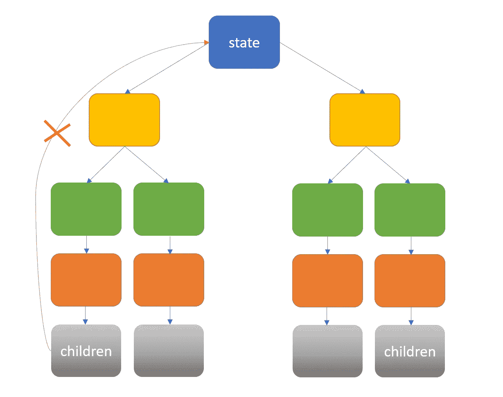

React Component Tree Structure

想象一下，您有一个(灰色)子组件，它比(蓝色)父组件低 4 层，并且您需要已经在父组件中获取的用户数据。通常，React developer 只会将它传递到 props 中的组件行(蓝色→黄色→绿色→橙色→灰色),以到达子组件 props 对象。

这导致不必要的 props 对象处理，因为中间层组件不需要其组件 props 中的用户数据。自从 React Hooks 诞生以来，现在我们可以通过使用 **useContext hook** 直接跨组件的不同层共享数据，而无需 props drilling。

在 src 下创建一个新文件夹，并将其标记为 **store** 。创建 2 个文件来设置用户数据的共享。我将它命名为`UserContext.tsx`和`UserProvider.tsx`。

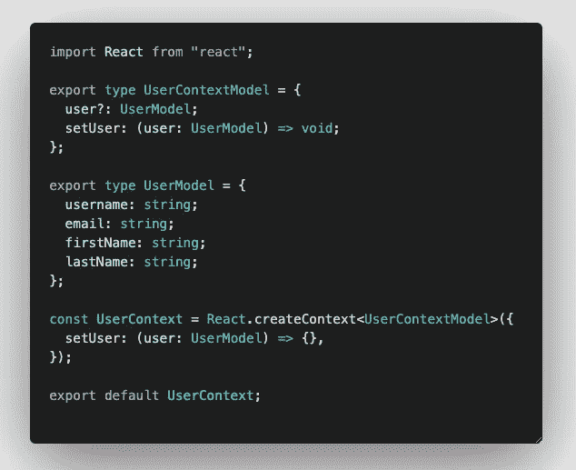

UserContext.tsx

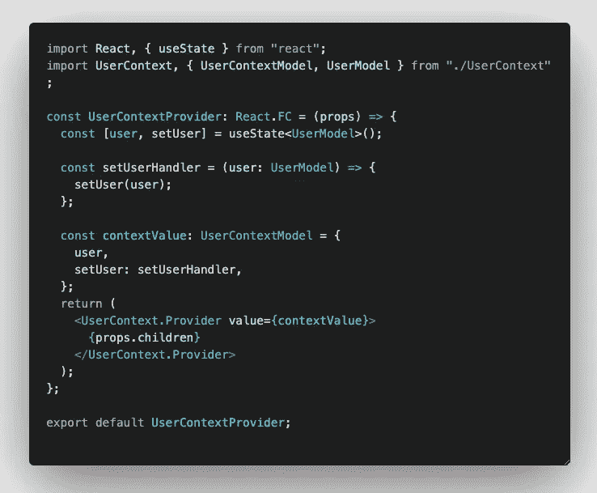

UserProvider.tsx

添加 **UserContextProvider** 来包装你的`app.tsx`文件中的应用组件

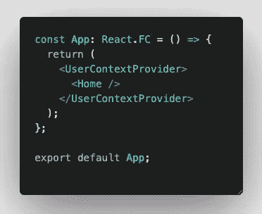

App.tsx

现在，在您的子组件文件中，您可以应用 **useContext hook** 来获取您之前在设置文件中定义的用户数据，而不是访问 props 来获取用户数据。

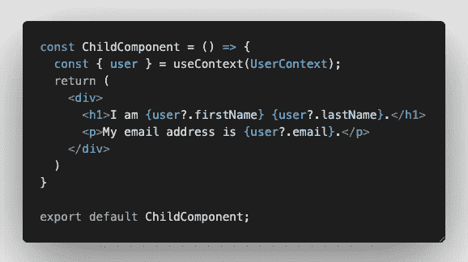

ChildComponent.tsx

# 2.包含 useState 挂钩，而不是对 this.state 使用基于类的组件

现在是 2022 年，请不要落后于 React 开发的旧状态。使用功能组件而不是基于类的组件。用`useState hook`代替`this.state`来保持部件状态。

不要再这样了。❌

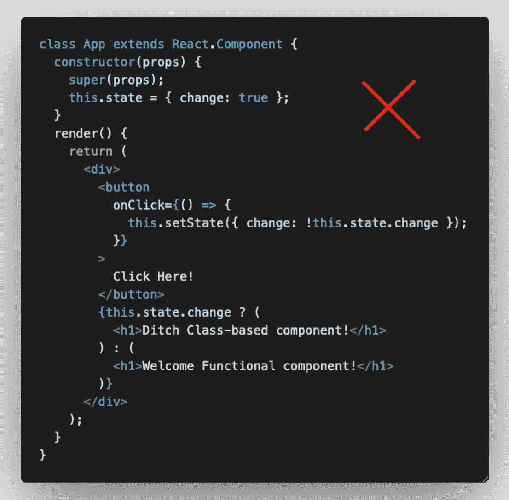

而是这样做。✅

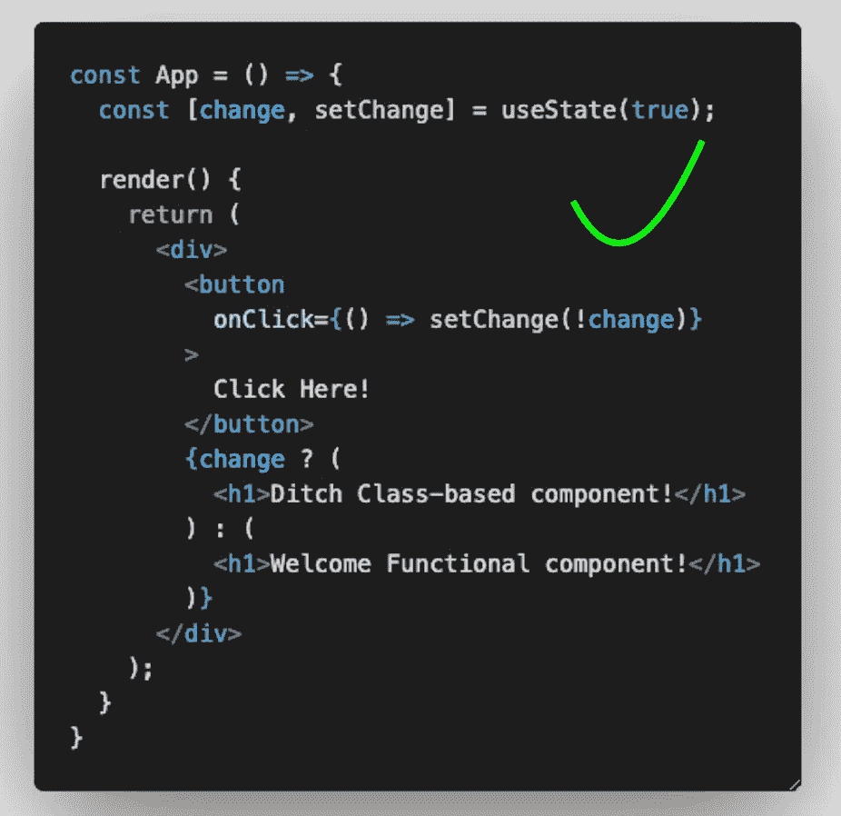

# 3.保持组件小，用于单一用例。

将重复的代码重构为可重用的组件。将大的组件分割成大的组件。

不要再这样了。❌:这是 HTML 开发人员在一个 HTML 文件中编写所有内容的传统方式。

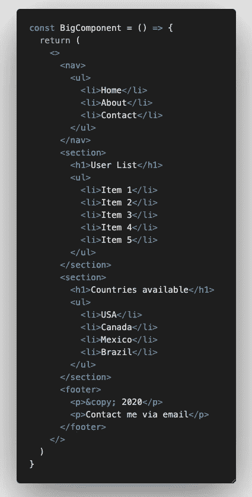

相反，做这个✅，做一个大家都喜欢的现代 React 开发人员。😎将它们拆分成单独的组件。

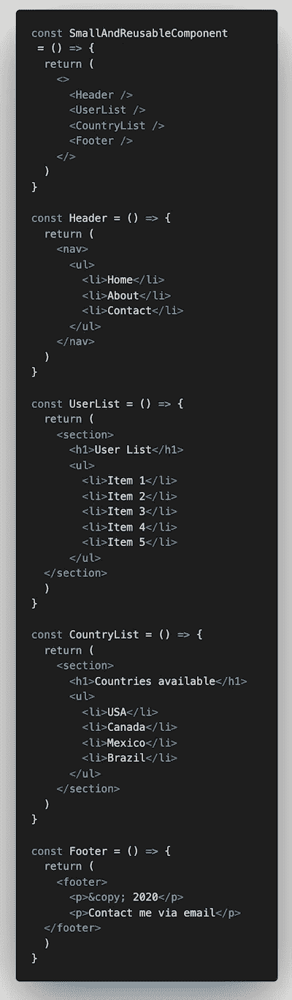

# 4.记住你的功能组件

如果你知道显示的数据不会经常改变，记住你的功能组件，这意味着它总是用相同的道具重新渲染。当其他连接的组件发生变化时，这将有助于跳过重新呈现您的组件。这将提高您的应用程序的性能。

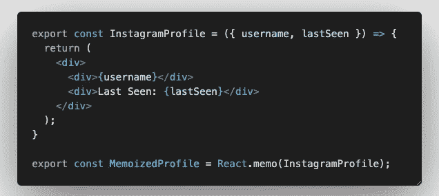

例如，您的用户名和 lastSeen 在您使用应用程序的过程中并没有发生太大的变化，那么您应该记住它，即使您的父组件属性发生变化，React 也不会重新呈现它。

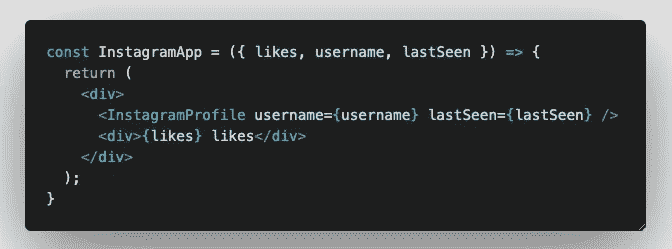

Every new like will trigger a re-render of both InstagramApp and InstagramProfile ❌

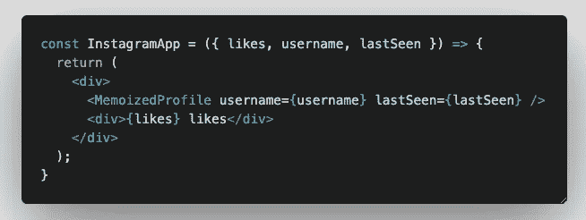

Every new like will not trigger a re-render of MemoizedProfile component 🌈

经验法则:

1.  如果你的道具经常改变，不要忘记你的组件。
2.  只使用它来优化性能，不要使用它来防止重新渲染。
3.  不懂怎么用就不要用。如果你记住了一个积极的道具变化组件，它会带来更多的伤害而不是帮助。

# 5.使用 TypeScript 而不是 JavaScript

TypeScript 是 JavaScript 的超集。我们都知道 JavaScript 的问题在于它是松散的类型实现，当出现输入错误时容易出现 bug 和错误。对于 TypeScript，它提供了对静态类型检查和大多数 IDE 上智能感知的神奇支持。

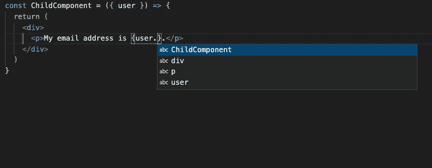

Missing IntelliSense on JavaScript

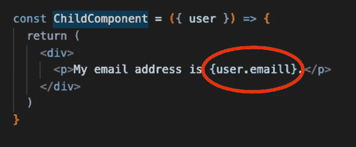

Missing type check, missed out typo on JavaScript

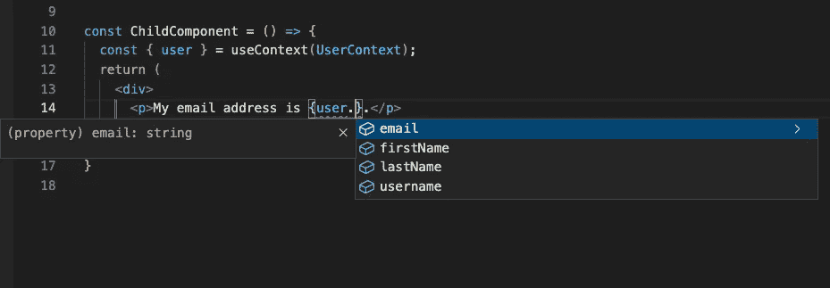

IntelliSense on Typescript

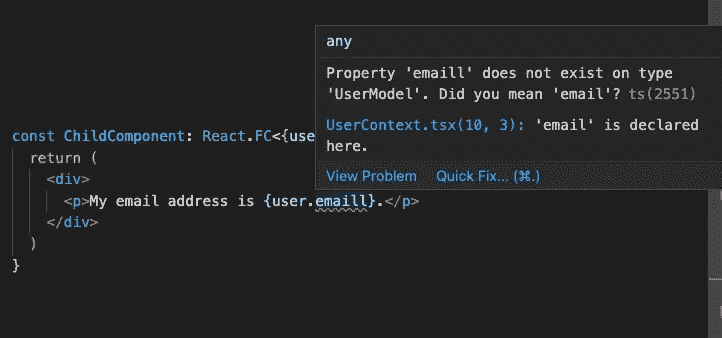

Type check on Typescript

# 结论

希望这篇文章能够推动您在 2022 年的 React 开发之旅中前进。我知道 React 变化非常快，有时很难跟上 React 已经实现的最新变化。

但是，要知道，这些变化将使您和您的应用程序受益，当您的应用程序变得更有性能，最重要的是更新您的 React 知识和 React 开发习惯时，您肯定会从这些变化中获益。如果你认为 React 开发者在 2022 年需要知道其他重要的实践，请在下面的评论中告诉我。我也很想学。干杯。

 [## 用我的推荐链接- DevJo 加入媒体

### 作为一个媒体会员，你的会员费的一部分会给你阅读的作家，你可以完全接触到每一个故事…

medium.com](https://medium.com/@devjo/membership) 

*更多内容请看*[***plain English . io***](http://plainenglish.io/)*。报名参加我们的* [***免费周报***](http://newsletter.plainenglish.io/) *。在我们的* [***社区***](https://discord.gg/GtDtUAvyhW) *获得独家获得写作机会和建议。*